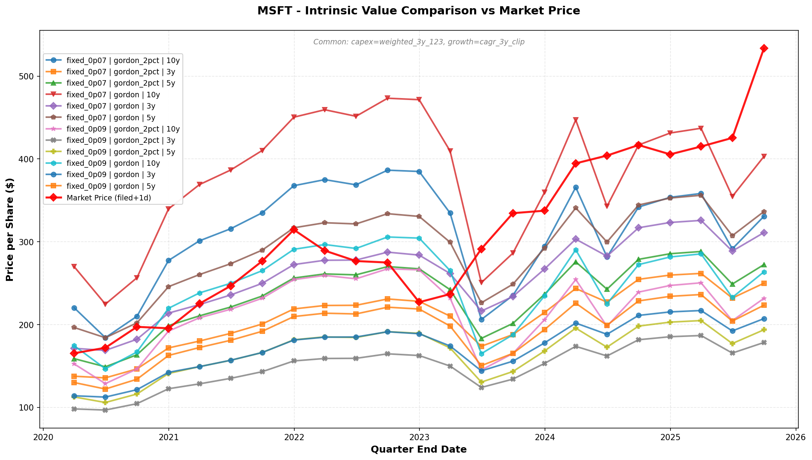

# DCF Valuation Framework

Production-grade DCF valuation framework with ETL pipeline, policy-based
architecture, and backtesting capabilities.

> **Disclaimer**: This is a valuation tool for research and analysis purposes.
> Investment decisions are the sole responsibility of the investor. This tool
> does not constitute financial advice.

## Requirements

- Python >= 3.9 (tested with 3.12)
- Dependencies managed via `pyproject.toml`

### Installation

```bash
# Create virtual environment
python3.12 -m venv venv
source venv/bin/activate

# Production (runtime dependencies only)
pip install -e .

# Development (includes pytest, linting tools, etc.)
pip install -e ".[dev]"
```

## Quick Start

```bash
# 1. Data ingestion
python -m data.bronze.update --tickers-file example/tickers/bigtech.txt \
  --sec-user-agent "${your_name} valuation research (${your_email})"

# 2. Build pipeline
python -m data.silver.build && python -m data.gold.build

# 3. Run valuation
python -m valuation.run --ticker AAPL --as-of 2024-09-30

# 4. Batch valuation
python -m valuation.analysis.batch_valuation \
  --tickers-file example/tickers/bigtech.txt \
  --as-of-date 2024-09-30 \
  --output output/valuation/bigtech.csv -v
```

### Scenario Experimentation + Visualization

Compare multiple valuation scenarios systematically:

```bash
# 1. Generate scenario configs (Grid Search)
python -m valuation.analysis.generate_grid_configs \
  --discount fixed_0p07 fixed_0p09 \
  --terminal gordon gordon_2pct \
  --n-years 3 5 10 \
  --output-dir scenarios/my_experiment

# 2. Run backtest with all scenarios
python -m valuation.analysis.backtest_from_configs \
  --ticker AAPL \
  --start-date 2020-01-01 \
  --end-date 2025-12-31 \
  --config-dir example/scenarios \
  --output output/valuation/bigtech.csv

# 3. Visualize comparison
python -m valuation.analysis.plot_prices \
  --tickers-file example/tickers/bigtech.txt \
  --start-date 2020-01-01 \
  --end-date 2025-12-31 \
  --config-dir example/scenarios \
  --output-dir output/analysis/price_charts
```

**Example Output:**



*Figure: MSFT intrinsic value across 12 scenarios (2×2×3 grid:
discount × terminal × n_years). Common policies shown in subtitle,
differences in legend.*

## DCF Model

This framework implements a **two-stage discounted cash flow (DCF) model**
based on Owner Earnings to estimate intrinsic value per share.

### Methodology

#### Stage 1: Explicit Forecast Period (N years)

- Projects Owner Earnings (OE = CFO - CAPEX) with declining growth rates
- Accounts for share buybacks/dilution
- Discounts each year's OE per share to present value

#### Stage 2: Terminal Value

- Applies Gordon Growth Model for perpetual growth beyond forecast period
- Assumes stable, low terminal growth rate (typically 2-3%)

### Key Formula

```text
IV = Σ(OEPS_t / (1+r)^t) + TV / (1+r)^N

Where:
  OEPS_t = Owner Earnings per Share in year t
  r = Discount rate (required return)
  TV = Terminal Value using Gordon Growth
  N = Forecast period length
```

### Key Assumptions

- **Cash flow proxy**: Owner Earnings (CFO - CAPEX) instead of Free Cash Flow
- **Growth path**: Initial growth rate that fades linearly to terminal rate
- **Share dynamics**: Incorporates historical buyback/dilution rates
- **Multiple scenarios**: Policy-based architecture allows testing different
  assumptions

For theoretical background, see
[Discounted Cash Flow (Wikipedia)](https://en.wikipedia.org/wiki/Discounted_cash_flow).
The DCF method has been used since the 1800s and was formally established by
Irving Fisher (1930) and John Burr Williams (1938).

## Architecture

### Data Pipeline (Bronze → Silver → Gold)

```text
Bronze (Raw)         Silver (Normalized)      Gold (Analytical)
├─ SEC filings    →  ├─ metrics_quarterly  →  ├─ valuation_panel  (latest)
└─ Stock prices      └─ companies             └─ backtest_panel   (all PIT)
```

### Valuation Framework

```text
Domain Types (FundamentalsSlice, MarketSlice)
       ↓
Policies (CAPEX, Growth, Fade, Shares, Terminal, Discount)
       ↓
DCF Engine (pure math)
       ↓
ValuationResult (IV, diagnostics)
```

## Project Structure

```text
valuation/
├── README.md              # This file
├── PROJECT_STRUCTURE.md   # Detailed structure
│
├── data/                  # ETL pipeline
│   ├── README.md         # Data pipeline docs
│   ├── bronze/           # Raw data ingestion (SEC, Stooq)
│   ├── silver/           # Normalized metrics (quarterly)
│   │   └── README.md     # Silver layer details
│   └── gold/             # Analytical panels
│       └── README.md     # Gold layer details
│
├── valuation/            # Valuation framework
│   ├── README.md        # Framework docs
│   ├── run.py           # Single valuation
│   ├── domain/          # Typed domain objects
│   ├── engine/          # Pure DCF math
│   ├── policies/        # Estimation policies
│   ├── scenarios/       # Scenario configs
│   └── analysis/        # Analysis tools
│       ├── README.md    # Analysis docs
│       ├── batch_valuation.py       # Multi-company
│       ├── backtest_from_configs.py # Config-based backtest
│       ├── generate_grid_configs.py # Grid search generator
│       ├── plot_prices.py           # Scenario visualization
│       └── sensitivity.py           # Sensitivity tables
│
├── scenarios/           # JSON scenario configs
│   ├── README.md       # Scenario documentation
│   ├── base/           # Core scenarios (default, conservative, aggressive)
│   ├── capex_experiments/   # CAPEX method variations
│   └── discount_experiments/  # Discount rate sensitivity
│
└── results/             # Output files (CSV, charts)
```

## Key Features

- **Policy-based architecture**: Easy experimentation with different methodologies
- **PIT (Point-in-Time)**: Only uses data available at backtest date
- **JSON config scenarios**: Version-controlled, reproducible experiments
- **Grid search**: Automatic generation of scenario combinations
- **Multiple CAPEX methods**: Raw, 3yr weighted, intensity clipping
- **Batch processing**: Valuation for entire stock lists
- **Visualization**: Compare scenarios with intelligent legend (differences only)
- **Sensitivity analysis**: 2D tables (discount × growth rates)
- **Full diagnostics**: Every policy returns value + detailed diagnostics

## Data Coverage

**Supported**: 31 tickers across industries (Tech, Consumer, Industrial,
Healthcare, Energy, Materials, Telecom, Retail)

**Not supported**: Financial services (Banks, Insurance) - different
valuation approach needed

## Configuration

```python
from valuation.scenarios.config import ScenarioConfig

config = ScenarioConfig(
    name='custom',
    capex='weighted_3yr',     # or 'ttm', 'intensity_clipped'
    growth='cagr',            # CAGR with 4% threshold, 0-18% clip
    fade='linear',            # Linear fade to terminal
    shares='avg_change',      # 5yr average share change
    terminal='perpetuity',    # Gordon growth at 3%
    discount=0.10,            # 10% discount rate
    n_years=10,               # 10-year explicit forecast
)
```

## Documentation

- **[PROJECT_STRUCTURE.md](PROJECT_STRUCTURE.md)**: Complete project
  structure and entry points
- **[data/README.md](data/README.md)**: ETL pipeline details
  (Bronze/Silver/Gold)
- **[valuation/README.md](valuation/README.md)**: Valuation framework
  and policies
- **[valuation/analysis/README.md](valuation/analysis/README.md)**:
  Analysis tools usage
- **[scenarios/README.md](scenarios/README.md)**: Scenario configuration
  and grid search

## Development

### Adding New Policies

1. Create policy in `valuation/policies/`
2. Register in `valuation/scenarios/registry.py`
3. Use in `ScenarioConfig`

See [valuation/README.md](valuation/README.md) for details.

### Pre-commit Hooks

```bash
# Formatting and linting
yapf, pylint, mypy

# Run manually
pre-commit run --all-files
```
