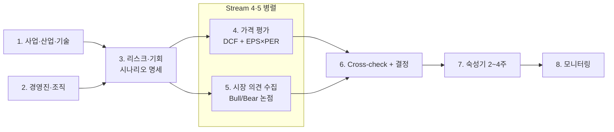

# Deep Dive Playbook — 통합 (Buffett + Fisher 트랙)

Shallow Dive Phase 11에서 "Deep 진입" 판정을 받은 종목을 1~4주 집중 분석하여 편입 여부를 판단한다. 트랙 배정은 Shallow Phase 9에서 확정되어 인계되며, Deep은 **트랙 confirmed 상태**로 시작한다.

**Shallow와의 차이:** Shallow는 정량 데이터 + 체크리스트 + Track Assignment를 agent가 자동 수행. Deep은 그 결과물을 출발점 삼아 사람이 대화하며 판단. **자동화가 아니라 이해가 목적**.

**메타 원칙 — 이 playbook은 살아있는 문서**: 실전 Deep Dive를 돌릴 때마다 각 Stream의 회고를 누적, 누적 임계 도달 시 Stream 뼈대 개정. Stream 1 (제품·산업·기술)이 가장 얇은 상태로 시작해 도메인 사례가 쌓이면 가장 크게 자란다.

## 사용법

```text
# 전체 Deep Dive 시작
"playbook/DEEP_DIVE.md를 읽고, research/shallow-dive/{TICKER}_{name}.md를 참고하여
 {TICKER} {회사명}에 대해 Deep Dive를 시작하자."

# 단일 Stream 호출
"playbook/deep-dive/02_management.md를 {TICKER}에 대해 실행해줘."
```

## 사전 조건

- Shallow Dive 완료 — `playbook/SHALLOW_DIVE.md` Phase 11에서 Deep 진입 판정
- 트랙 배정 (Phase 9): Buffett형 / Fisher형 — Deep 진입 시 인계
- 1층위 자료 접근: DART/EDGAR 공시, IR 사이트, 주주서한 5~10년치, 컨콜 전사 8~12분기, 경영진 인터뷰·저서
- `knowledge/` 디렉토리 프레임워크 숙지

## 산출물 구조

```text
research/{buffett|fisher}/deep-dive/{TICKER}_{회사명}.md       ← 본문 (Stream 1-6 통합)
research/{buffett|fisher}/deep-dive/{TICKER}_maturation.md     ← 숙성기 캘린더 (Stream 7 라이브)
research/{buffett|fisher}/deep-dive/{TICKER}_monitoring.md     ← 모니터링 (Stream 8 분기 라이브)
research/{buffett|fisher}/deep-dive/{TICKER}_shallow_locked.md ← Anchoring 차단용 Shallow 산출 사본 (PR 2)
```

작업 중 Stream별로 별도 임시 파일을 만들 수 있으나, 최종적으로는 본문에 통합한다. 트랙 디렉토리 분리는 PR 4에서 통합 vs 유지 결정 예정.

---

## Stream 의존도 그래프



| Stream | 입력 | 선행 | 병렬 | 출력 |
| --- | --- | --- | --- | --- |
| 1. 사업·산업·기술 | 기업 IR·산업 리서치·전문가 자료 | 없음 | 2와 병렬 | 매출 mix·파이프라인·산업 10년 전망·기술 변곡점 지도 |
| 2. 경영진·조직 | 주주서한·컨콜·인터뷰·내부자 거래 | 없음 | 1과 병렬 | 형용사 리스트·Fisher 15 정성 평가·공언-결과 매핑 |
| 3. 리스크·기회 | 1·2 산출물 | 1·2 완료 | — | 리스크/기회 매트릭스 + Bull/Base/Bear 시나리오 명세 |
| 4. 가격 평가 | 3 시나리오 | 3 완료 | 5와 병렬 | 트랙별 IV/CAGR + Reverse 역산 |
| 5. 시장 의견 수집 | 외부 (애널리스트·SA·컨센서스) | 3 권장 (시나리오 명세 후 비교 가능) | 4와 병렬 | Bull/Bear 논점 ≥ 3 each + 동의/반대 매핑 |
| 6. Cross-check + 결정 | 4·5 산출물 | 4·5 완료 | — | IV vs 시장가 괴리 설명·가설 누락 점검·편입/워치/탈락·분할매수 계획 |
| 7. 숙성기 | 6 결정 초안 | 6 완료 | — | 2~4주 캘린더·종료 체크리스트·최종 결정 |
| 8. 모니터링 | 7 통과 후 | 7 완료 | — | 분기 갱신 — 해자 건강도·15조건 약화·매도 트리거 |

**핵심 흐름**:

- Stream 1·2가 사업·경영진 이해의 본체 (병렬)
- Stream 3에서 리스크·기회 통합 → Bull/Base/Bear 시나리오 명세 도출 (Stream 4 입력)
- Stream 4와 5는 병렬 — Stream 4의 IV 산출이 Stream 5 시장 의견에 anchored되지 않게 분리
- Stream 6에서 Cross-check (IV vs 시장가 괴리, 가설 누락 점검) + 편입 결정 + 분할매수 계획 통합

## 트랙별 가중치 표

| Stream | Buffett 트랙 강조 | Fisher 트랙 강조 |
| --- | --- | --- |
| 1-A. 사업·산업·기술 | 해자 작동 메커니즘, 경쟁 지형 | 다음 세대 파이프라인, 기술 변곡점 |
| 1-B. 해자 분석 | **상태 HIGH + 방향 유지** (해자 완성기) — ROIC 지속 가정 본체 | **상태 LOW/MED + 방향 강화** (해자 형성·확장기) — N+1차항 정당화 |
| 2. 경영진·조직 | **자본배분 의사결정** (M&A·바이백·배당·R&D ROI) + 1분 테스트 | **형용사 누적**·Fisher 15 정성 10개·공언-결과 매핑 |
| 3. 리스크·기회 | 해자 위협 vs 방어 | N+1차항 흔들림 요인 |
| 4. 가격 평가 | **종목 특성별 도구 선택** (1순위 + 2순위, OR 결합) — Buffett 트랙은 자사주 매입 heavy 시 DCF 주력 권장 | **종목 특성별 도구 선택** — Fisher 트랙은 EPS·PER 가능 시 EPS×PER 주력 권장. 단 도구 선택은 종목 특성이 본체 |
| 5. 시장 의견 수집 | 애널리스트 콘센서스·Seeking Alpha | 동급 풀스택 피어 분석가 |
| 6. Cross-check + 결정 | OR 결합 매수 가능 (한 도구만 통과해도 OK) | OR 결합 매수 가능 |
| 7. 숙성기 | 2~4주 시간 필터 (트랙 무관 공통) | 2~4주 시간 필터 (트랙 무관 공통) |
| 8. 모니터링 | 매도 트리거: 해자 + **가격 (IV의 1.5배 초과 시 일부 매도)** | 매도 트리거: **해자만**, 가격 무관 |

**Note**: PR 1.5에서 Stream 4 트랙별 분기 제거 (사용자 결정). 도구 선택은 트랙이 아닌 **종목 특성 진단** (자본 집약도·이익 안정성·자사주 매입 비중·산업 특성)에 따름. Stream 6 결정 룰도 OR 결합으로 통일 (양 도구 중 하나라도 매수 가능 → 매수 가능).

## 충돌 우선순위 룰

```text
편입 충돌 시 우선순위:
1. Stream 2 핵심 3조건 (#9 두터운 경영진, #14 나쁜 일에도 소통, #15 이해상충) 중 1개라도 FAIL → 모든 다른 신호 무시, 탈락
2. Stream 4 가격 평가 < 매수금지 임계 → 모든 다른 신호 무시, 매수 금지
3. 위 2개 통과 후 → Stream 1·2·3 + Stream 6-A cross-check 종합으로 편입/워치/탈락
4. 매도 결정 → Stream 8의 해자/형용사만, 가격 무관 (단 Buffett 트랙은 가격도 보조)
```

## Anchoring 차단 시스템 (PR 2에서 보강 예정)

본질: Shallow Phase 9 (트랙 배정) + Phase 10 (시나리오·확률·CAGR) + Phase 8 (리스크 톱3) 산출을 Deep 진입 시 그대로 보면 본인이 Deep에서 새로 발견할 것에 무의식 정렬됨. **트랙은 인계받되 정량·정성 결론은 차단**.

PR 2에서 다음을 박는다:

- 차단 매트릭스 (Stream 1 → Phase 5 차단, Stream 2 → Phase 4 차단, Stream 3 → Phase 8 차단, Stream 4 → Phase 10 차단, Stream 6 → Phase 11 차단)
- Shallow 산출 사본 작성 의무 (`{TICKER}_shallow_locked.md`)
- 각 Stream 종료 후 비교 의무 (회고에 일치/불일치 기록)
- 불일치 임계 (Stream 4: ±20% IV 또는 ±3%p CAGR)
- 트랙 재배정 트리거 (4축 중 ≥ 2개 다른 트랙 신호)

## 회고·개선 사이클 (PR 2에서 보강 예정)

PR 2에서 다음을 박는다:

- 회고 표준 형식 (필요했던 것·부족했던 것·없어도 됐던 것·차단 결과·개정 포인트)
- 누적 임계: 단일 Stream 회고 ≥ 3건 + 동일 결손 ≥ 2회 → 뼈대 개정 PR 트리거 / 회고 ≥ 5건 → 강제 검토
- 메타 회고 요약 (이 파일 하단)

---

## 공통 원칙

1. **한 종목 한 트랙** — 트랙은 Shallow Phase 9에서 확정. Deep 중 재배정은 별도 절차 (Stream 2 또는 4 종료 후 4축 중 ≥ 2개 다른 신호 시)
2. **자료 1층위 → 2층위 역방향** — 공시·전사본부터 읽고 간접 자료로 검증
3. **확신은 형용사 누적** — 한 번의 조사가 아님. 주주서한·컨콜·간접 증거의 반복 관찰로 형성
4. **속도는 정보 수집만 압축, 확신 형성은 시간 필터 필요** — 숙성기 (Stream 7)를 생략하지 말 것
5. **매수 금지 기준은 엄격, 매수 적기는 없음** — Stream 4의 트랙별 PASS 컷오프 / 분할매수로 운영
6. **매도는 가격이 아닌 해자 건강도** — Stream 8 원칙 (Buffett 트랙은 가격 보조 허용)
7. **Stream 1의 미완성성을 숨기지 말 것** — 경영진(Stream 2)에만 확신이 쏠리면 반쪽 Deep Dive. Stream 1이 얇다면 **얇은 이유와 남은 불확실성을 리포트에 명시**
8. **동시 Deep Dive 2~4개 한도** — 형용사 축적은 시간 함수

---

## Stream 1줄 요약

| # | Stream | 1줄 요약 |
| --- | --- | --- |
| 1 | 사업·산업·기술 | 매출 mix 분해 + 다음 세대 파이프라인 + 산업 10년 전망 + 기술 변곡점 지도 |
| 2 | 경영진·조직 | 주주서한·컨콜 1층위 통독 + Fisher 15 정성 10개 + 형용사 누적 + 공언-결과 매핑 |
| 3 | 리스크·기회 통합 | 1·2에서 도출한 리스크/기회 매트릭스 + Bull/Base/Bear 시나리오 명세 |
| 4 | 가격 평가 | 트랙별 IV/CAGR (DCF + EPS×PER cross-check) + Reverse 역산 + 매수금지 필터 |
| 5 | 시장 의견 수집 | 외부 Bull/Bear 논점 ≥ 3 each + 동의/반대 매핑 (Stream 4와 병렬, anchoring 차단) |
| 6 | Cross-check + 결정 | IV vs 시장가 괴리 설명 + 가설 누락 점검 + 편입/워치/탈락 + 분할매수 계획 |
| 7 | 숙성기 | 2~4주 시간 필터 + 분기 컨콜 실시간 관찰 + 종료 체크리스트 |
| 8 | 모니터링 | 분기 갱신 — 해자 건강도 + 15조건 약화 + 형용사 업데이트 + 매도 트리거 |

각 Stream 파일은 `playbook/deep-dive/0X_*.md`.

---

## 4갈래 결정 (Stream 6 출력)

| 결과 | 의미 |
| --- | --- |
| 편입 | Stream 4 트랙별 PASS + Stream 2 핵심 3조건 PASS + 6-A 가설 누락 점검 통과. 분할매수 시작 |
| 워치리스트 | 핵심 3조건은 PASS이나 다른 조건 미충족. 진입 조건 명시 |
| 탈락 (가격) | Stream 4 매수 금지 (안전마진 < 0 또는 낙관 CAGR < 4%) |
| 탈락 (질) | 핵심 3조건 (#9·#14·#15) 중 1개라도 FAIL |

분할매수 계획 (편입 시):

- 초기 1/3: Stream 6 확정 즉시
- 다음 1/3: -15% 또는 분기 KPI 재확인 시
- 마지막 1/3: -25% 또는 형용사 추가 누적 시

---

## 전체 회고 요약

각 Stream 파일에 종목별 회고가 누적되며, 큰 그림 발견은 여기에 1줄 요약 누적.

| 날짜 | TICKER | 핵심 발견 | Stream | 개정 후보? |
| --- | --- | --- | --- | --- |
| _PR 3 ADBE 재분석부터 채움_ | | | | |

---

## 변경 이력

- **2026-04-30 v1**: 신규 통합 작성. 기존 `playbook/buffett/DEEP_DIVE.md` (Section 1-7)와 `playbook/fisher/DEEP_DIVE.md` (Stream A-F)를 통합. 8 Stream 분할 구조 (메타 + `deep-dive/01_~08_*.md`). Buffett 트랙에 숙성기(Stream 7) 신설, Fisher 트랙에 시장 의견 수집(Stream 5)·Cross-check(Stream 6) 신설. Acceptance Criteria·Anchoring 차단·회고 시스템은 PR 2에서 보강.

## Legacy 안내

- `playbook/buffett/DEEP_DIVE.md`: DEPRECATED. 본 통합 playbook 참조
- `playbook/fisher/DEEP_DIVE.md`: DEPRECATED. 본 통합 playbook 참조
- 트랙 specific 철학: `playbook/{buffett,fisher}/PHILOSOPHY.md` (유지)
- Fisher 보조 문서: `playbook/fisher/PIPELINE.md`·`EXPLORATION_PIPELINE.md`·`GROWTH_INVESTING_DISCUSSION.md` (유지)
- Legacy 산출물: `research/{buffett,fisher}/deep-dive/` (보존)
