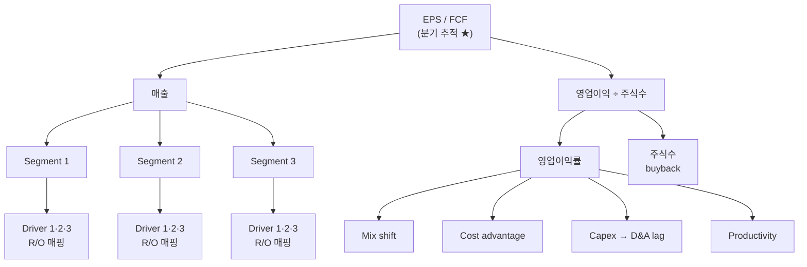

# Stream 3: 리스크·기회 통합 + 시나리오 명세

**입력**: Stream 1·2 산출물
**산출**: 리스크/기회 매트릭스 (확률 × 영향) + Bull/Base/Bear 시나리오 명세 (Stream 4의 입력)
**선행**: Stream 1·2 완료
**작업 시간**: 반나절 ~ 1일

## 3-근간 철학

Stream 1·2에서 산발적으로 나온 리스크와 기회를 **한 곳에 모아 시나리오로 변환**하는 단계. 이 매트릭스가 Stream 4(가격 평가)와 Stream 8(모니터링)의 입력이 된다. 시나리오는 판단이 아닌 **조건부 서술** — "어떤 조건이 실현되면 어떤 결과"를 명시.

리스크와 기회는 **대칭적**으로 다룬다. 리스크만 나열하면 과도하게 보수적이 되고, 기회만 나열하면 과도하게 낙관적이 된다.

## 3-뼈대 작업

### 1. 리스크/기회 전수 정리

| 항목 | 출처 Stream | 종류 (사업/경쟁/경영진/매크로/밸류에이션) | 확률 (1-5) | 영향 (1-5) | 시나리오 귀속 |
|---|---|---|---|---|---|
| | 1/2 | | | | bull/base/bear |

분류 5개 카테고리 전수: 사업·경쟁·경영진·매크로·밸류에이션.

**확률 weight 룰 (중요)**:

- Bear weight ≥ 25% (default 30%) — 확증편향 (Confirmation Bias) 방지
- Bear weight 0%로 잡으면 본인이 사고 싶은 종목 근거만 찾는 패턴
- "내가 이 종목을 사고 싶어서 분석하나?" self-check 필수

### 2. Driver Tree — 재무 결과 통합 frame

**문제**: 리스크·기회 항목이 30-40개+ 되면 분기 monitoring 비현실적.

**해결**: 모든 항목이 결국 **재무 결과 (EPS·매출·마진·FCF)** 로 통합. Driver Tree로 매핑.

#### Driver Tree 구조 (Mermaid)



종목별 segment·driver 채워서 완성. ASCII 대안:

```text
                    EPS / FCF (분기 추적 ★)
                  ┌───────┴────────┐
                매출            영업이익 ÷ 주식수
        ┌───┬───┼────┬───┐         │
     세그먼트별 매출 분해              │
                                    │
   각 segment의 driver (리스크·기회 leaf로 매핑)
```

#### Segment별 Driver 매핑 표

각 매출 segment의 driver와 리스크·기회 매핑:

| Segment | Driver | 영향 risk·opp ID | Verify 가능성 |
| --- | --- | --- | --- |
| (segment 1) | (driver 1·2·3) | (R/O 번호) | ✓/△/✗ |
| (segment 2) | | | |

**Verify 등급**:

- ✓ 분기 10-Q 직접 공시
- △ 경영진 멘트 또는 외부 추정
- ✗ 미공시

#### 마진 Driver

| Driver | 영향 risk·opp | 메커니즘 |
| --- | --- | --- |
| Mix shift | | |
| Cost advantage 변화 | | |
| Capex 가속 → D&A | | |
| Productivity | | |

#### Cascade (상관관계 매핑)

핵심 cascade 시각화 — 한 driver 변화가 다른 항목에 어떻게 전파:

```text
[원인] → [매개] → [결과]
```

예시 (GOOGL case):

```text
TPU 우위 → Cloud cost ↓ → Cloud 마진 ↑ → 매출 mix shift → 영업이익률 ↑ → FCF ↑

Capex 가속 → D&A 가속 (2-3년 lag) → 영업이익률 압박. 단 OCF엔 D&A 환원 → FCF 영향 작음

Search 매출 둔화 → AIO sponsored buffer → 안 되면 → Combined thesis-breaker
```

### 3. Bull/Base/Bear 시나리오 명세 — 적응형 Period

**문제**: 5년 single timeline이 thesis의 timing mismatch 못 잡음 (단기 catalyst 1-2y, 장기 트랜지션 5-10y, terminal 10y+).

**해결**: 종목 상황에 맞춰 **적용 가능한 period만 선택 + skip한 period의 rationale 명시**.

#### 4-Period 구조 (default)

| Period | 역할 | DCF 매핑 |
| --- | --- | --- |
| **단기 (1-2년)** | 분기 catalyst·모멘텀 | DCF Year 1-2 |
| **중기 (3-5년)** | 본격 explicit period | DCF Year 3-5 |
| **장기 (5-10년)** | Wide moat 트랜지션 등 | DCF Year 6-10 |
| **Terminal (10년+)** | 영구 가정 | DCF Terminal Gordon growth |

#### Period 선택 룰

- **Default**: 4-Period 전체 작성
- **Skip 가능**: 본인 confidence 매우 낮은 period (예: paradigm shift 가능성, cycle 자체 등). **Rationale 명시 필수**
- **참고 예시 (강제 X)**: tech disruption sectors는 장기 skip 가능, 사이클러컬은 mid-cycle terminal, early-stage는 단기만 등 — 상황에 맞게 본인 판단

#### 4-Period × Bull/Base/Bear 매트릭스

각 period 별 **현실화 트리거** (qualitative) + 시나리오 명세:

| 변수 | 1-2y (catalyst) | 3-5y (explicit) | 5-10y (long-term) | Terminal |
| --- | --- | --- | --- | --- |
| **Bull** | | | | |
| 매출 CAGR | | | | |
| 영업이익률 | | | | |
| 재투자율 | | | | |
| Terminal g | — | — | — | |
| 현실화 트리거 | | | | |
| **Base** | | | | |
| 매출 CAGR | | | | |
| 영업이익률 | | | | |
| 재투자율 | | | | |
| Terminal g | — | — | — | |
| 현실화 트리거 | | | | |
| **Bear** | | | | |
| 매출 CAGR | | | | |
| 영업이익률 | | | | |
| 재투자율 | | | | |
| Terminal g | — | — | — | |
| 현실화 트리거 | | | | |

#### Period별 Confidence 명시

- 단기 (1-2y): high confidence (이미 데이터 있음)
- 중기 (3-5y): medium
- 장기 (5-10y): low (Productivity·Wide 트랜지션 불확실)
- Terminal: 매우 low

→ 가정 정확도가 낮아질수록 안전마진 buffer 강화. **Confidence very low인 period는 skip 정당화 가능** (위 종목 유형별 적용 표 참조).

#### 시나리오 명세 작성 시 주의

- Stream 4 valuation의 직접 입력이 됨
- **수치 sanity check은 Stream 4-Main에서**. Stream 3는 frame + qualitative trigger 중심
- 핵심 frame: "Bullish on company but bearish on price" 가능성 인정 (Multiple compression risk)

### 4. Monitoring Plan (Driver Tree 기반)

#### Top metric (분기 5분 — 정확 verify)

각 segment의 핵심 재무 metric 4-5개:

| # | 지표 | 어디서 (분기) | 시간 |
| --- | --- | --- | --- |
| 1 | Segment 매출 YoY% (각 매출 segment) | 10-Q 1페이지 | 30초 |
| 2 | 핵심 segment Op Margin | 10-Q segment table | 30초 |
| 3 | EPS (diluted) | 10-Q 1페이지 | 30초 |
| 4 | FCF (OCF - Capex) | 10-Q 2개 라인 | 1분 |
| 5 | Capex 가이던스 (다음 분기 + 연간) | 어닝콜 | 2분 |

→ **분기당 5분, IR PDF 1페이지로 끝**

#### Driver Tree 진단 (이상 신호 발생 시만)

분기 Top metric 중 이상 신호 (예: 매출 +60% → +30% 둔화) 발생 시 → Driver Tree 따라 진단 → 30-40개 risk·opp 매핑

#### 외부 보고 (연 1-2회)

산업·산업분석 외부 자료 (예: SemiAnalysis, NBER, McKinsey, Synergy)

#### Total Time

| 주기 | 시간 |
| --- | --- |
| 분기 IR Top 5 | 5분 × 4 = 20분/년 |
| Driver Tree 진단 (이상 시) | 30분 × 1-2 = 60분/년 |
| 외부 보고 | 30분 × 2 = 60분/년 |
| **합계** | **~2-3시간/년** |

### 5. 누락 검증

이전 Stream 표제어를 grep하여 매트릭스에 누락된 항목 확인.

## 3-Acceptance Criteria

PR 2에서 보강 예정. 초안:

- [ ] 모든 Stream에서 언급된 리스크·기회 항목 누락 없이 수집
- [ ] 분류 5개 카테고리 전수
- [ ] 각 항목에 확률 × 영향 스코어 (5점 척도)
- [ ] **Bear 확률 weight ≥ 25%** (확증편향 방지)
- [ ] **Driver Tree** — segment별 driver 매핑 + cascade 작성
- [ ] **시나리오 명세 (적응형 Period × Bull/Base/Bear)** — 종목 유형에 맞게 적용 가능한 period 선택 (4-Period 전체 또는 일부). 각 시나리오 실현 조건 + 현실화 트리거 명시. Skip한 period rationale 명시 (Stream 4의 입력)
- [ ] **Monitoring Plan** — Top metric (분기 5분) + Driver Tree 진단 + 외부 보고 routine
- [ ] 누락 검증 — 이전 Stream 표제어 grep 일치

**PASS**: 7개 모두 충족.

## 3-Anchoring 차단

PR 2에서 보강 예정. 차단 대상: **Shallow Phase 8 (1차 가설 + 리스크·기회 톱3)**. Stream 3 종료 후 비교, Shallow 톱3가 Deep 매트릭스에 모두 포함되어 있는지 확인 (놓친 항목 발견 시 Deep 보강).

## 3-트랙별 분기

거의 없음. 시나리오 명세는 트랙 무관 (Stream 4에서 트랙별 가치평가 도구가 다를 뿐, 입력 시나리오는 공통).

- Buffett 트랙 무게: 해자 위협 vs 방어, 매크로/금리 영향
- Fisher 트랙 무게: N+1차항 흔들림 요인, 산업 변곡점 시점

## 3-회고 블록

PR 2에서 표준화.

---

## 원천 마이그레이션

- **Buffett 트랙**: `playbook/buffett/DEEP_DIVE.md` Section 5 (위기/기회 통합 매트릭스)
- **Fisher 트랙**: `playbook/fisher/DEEP_DIVE.md` Stream D 일부 (위험·기회 전수 정리 + 조건부 시나리오 서술)
- **재배치**: 기존 Fisher Stream D는 "위험·기회 + 편입 결정 초안"의 통합이었으나, **시나리오 명세 = Stream 3, 결정 = Stream 6**으로 분리됨
- **Driver Tree + 4-Period 시나리오 + Monitoring Plan**: 본인 GOOGL Deep Dive (2026-05-03) 학습 case로 도입. 39개 risk·opp 통합 + 5년 single timeline 한계 해결
