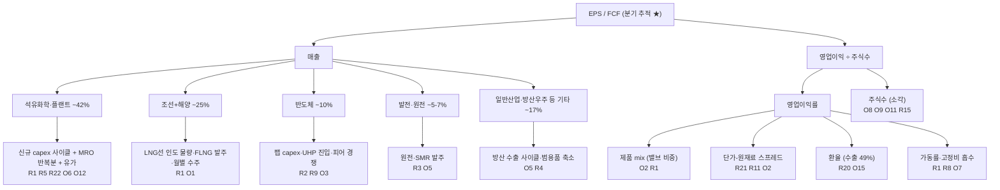

# 하이록코리아(013030) Deep Dive — 2026-07-04

기준일: 2026-07-04 | 트랙: 버핏형 (Shallow 2026-07-01 인계) | 현재가 31,950원, 시가총액 3,760억원
프로토콜: `playbook/DEEP_DIVE.md` 8-Stream | Anchoring 차단: Stream 작업자는 Shallow 산출물(`013030_shallow_locked.md`) 및 상호 산출물(4↔5) 미열람 상태로 독립 작성, 비교는 회고 §에서만 수행

## 결정 요약 (Stream 6 초안 — Stream 7 숙성기 후 확정)

> **탈락 (질), 초안.** 사업의 질(해자 MEDIUM-HIGH, ROIC 15%+, 무차입 48년)과 자본배분 실행력(3년 연속 자사주 취득-전량소각 −13.6%, 35년 연속 배당, 밸류업 공시)은 실측으로 우수하나, **핵심 3조건 중 #9(두터운 경영진) FAIL** — 임원층 6인·승계 백지·이사회 위원회 0 — 과 **#15(이해상충) 조건부 FAIL** — 가족법인 연 95.5억 거래·최대주주 주식담보 104만주 — 이 충돌 우선순위 룰 1번을 발동시킨다. 가격 축도 독립적으로 미달: 확률가중 IV 39,971원, 안전마진 +25.1%로 매수 가능 컷(30%)에 못 미치는 **회색**. 질과 가격 두 게이트가 동시에 미달하므로 결론의 강건성은 높다. 재방문 트리거 5종(승계·거버넌스 개선 / 특별환원 / 가격 30,747원 이하 / 마진 레벨업 입증 / 승계 이벤트)을 정의하고 모니터링 모드로 전환한다.

| Stream | 핵심 산출 | 한 줄 |
| --- | --- | --- |
| 1. 사업·산업·해자 | 해자 상태 MEDIUM-HIGH / 방향 유지 | 승인·MRO 락인 + 원가우위의 완성형 해자, 단 차세대 성장축(UHP·수소)엔 해자 부재. 수주 선행지표 감속(BtB 0.95) |
| 2. 경영진·조직 | 핵심 3조건 #9 FAIL / #14 조건부 PASS / #15 조건부 FAIL | 자본배분 실행력 우수하나 개선의 동기가 외압(행동주의·기관), 승계 공백·가족법인 구조 미해소 |
| 3. 리스크·기회 | R28·O16, Bear 30%, Driver Tree·cascade 7 | 최대 분기점 = 현행 OPM 27.5%가 구조 레벨업(O2)인가 업사이클 정점(R24)인가 — 다음 다운턴 GP가 판별 |
| 4. 가격 평가 | IV 39,971원 (+25.1%) → 회색 | 가치의 지배 변수는 사업이 아니라 현금 인정률 — 지배구조 디스카운트의 가격표가 시총의 34% |
| 5. 시장 의견 | Bull 5 · Bear 6, 커버리지 사실상 1개사 | 시장은 "현금을 주주가 못 받는다"(N1)를 가격에 반영 — 우리 Reverse 역산과 일치 |
| 6. Cross-check + 결정 | 누락 2건 보강(R27·R28) 후 탈락(질) 초안 | 질·가격 이중 미달. 재방문 트리거 5종 |

---

## Part I — Stream 1: 제품·산업·기술 + 해자 분석

- 기준일: 2026-07-04
- 트랙: 버핏형 (해자 완성기 가정 검증이 본체 → 1-B에 무게)
- Anchoring 차단: Shallow Dive 산출물(`research/shallow-dive/013030_하이록코리아.md`, `013030_shallow_locked.md`) 일체 미열람. 본 분석은 2025 사업보고서 원문, DART 10년 재무 데이터팩, 외부 웹 리서치만으로 독립 수행함.
- 표기 원칙: 수치는 [공시]·[추정]·[외부]를 구분 표기. 확인 불가 항목은 "확인 불가"로 명기.

---

### 0. 회사 한 줄 정의

1977년 설립(부산), 계장용(instrumentation) 관이음쇠(tube fitting)와 밸브를 다품종 소량 주문 생산하는 전문업체. 석유화학·조선해양·발전·반도체 등 장치산업의 유체 제어 라인에 들어가는 필수 안전 부품을 만들며, 2000년 상호를 '협동금속'에서 브랜드명과 같은 '하이록코리아'로 변경. 연결 매출 2,146억(2025), 영업이익률 27.5%, 무차입 순현금. 종속법인은 판매법인 3개(Hy-Lok USA 휴스턴·Hy-Lok Europe 네덜란드·Hy-Lok China 상해 60%). [공시: 2025 사업보고서]

---

### 1-A. 사업·산업·기술 이해

#### 1-A-1. 매출 분해 (두 축 + 추적 가능성 구분)

##### 축 1: 제품 기준 (별도재무제표, 공시)

5개년 실측: 2023-2025는 2025 사업보고서(rcept 20260312001217), 2021-2022는 FY2023 사업보고서(rcept 20240314000793, 제44기·제45기 열) 원문을 DART에서 추가 수집해 확정. 두 공시의 겹치는 연도(2023) 수치가 일치함을 확인(합계 1,707억). [공시]

| 품목 | 용도 | 2021 (억원) | 2022 (억원) | 2023 (억원) | 2024 (억원) | 2025 (억원) | 2025 비중 | 5년 방향 |
| --- | --- | --- | --- | --- | --- | --- | --- | --- |
| Hy-Lok Fitting | 계장용 정밀 관이음쇠 (발전·석유화학·조선해양·반도체) | 507 | 692 | 669 | 661 | 781 | 40.5% | +54% (2022 급증 후 횡보, 2025 재확대) |
| Hy-Lok Valve | 배관·계기장치용 조절 밸브 | 461 | 510 | 575 | 637 | 714 | 37.0% | +55% (5년 연속 매년 증가) |
| Bite Type Fitting | 유압·공압 배관용 물림식 이음쇠 | 103 | 133 | 143 | 132 | 123 | 6.4% | 2023 정점 후 축소 |
| Pipe Fitting | 물림식·용접형 배관 이음쇠 | 31 | 42 | 42 | 29 | 32 | 1.6% | 정체 |
| 기타 (모듈·상품) | 모듈 제품 및 상품 | 292 | 323 | 278 | 269 | 280 | 14.5% | 유지 |
| 합계 (별도) | — | 1,395 | 1,701 | 1,707 | 1,727 | 1,931 | 100.0% | +38.4% (4년) |

핵심 관찰:

- 성장은 고부가 2개 축(Hy-Lok Fitting + Hy-Lok Valve)에 집중. 두 품목 합산 비중 69.4%→70.7%→72.9%→75.1%→77.5%로 5년 연속 상승 — mix 고급화가 일회성이 아닌 구조적 추세임을 5개년 실측으로 확인.
- 밸브는 5년 내내 한 해도 꺾이지 않고 증가(461→714억) — 업사이클 수혜를 넘어 품목 자체의 구조 성장.
- 저부가 범용품(Bite Type, Pipe Fitting)은 의도적/자연적 축소 — 제품 mix 고급화가 GP마진 레벨업(아래 1-B proxy)의 미시적 근거.
- 밸브는 피팅 대비 개당 단가가 약 12~22배(내수 기준 118,638원 vs 5,311원)인 고부가 품목으로, 밸브 비중 상승이 곧 매출 질 개선. [공시]

##### 축 2: 공시 기준 — 내수/수출 (별도) + 지역별 (연결)

별도 기준 내수/수출 (공시, 5개년 — 2021-22는 FY2023 사업보고서 원문):

| 구분 | 2021 | 2022 | 2023 | 2024 | 2025 | 2025 비중 |
| --- | --- | --- | --- | --- | --- | --- |
| 내수 (억원) | 747 | 861 | 880 | 896 | 982 | 50.9% |
| 수출 (억원) | 647 | 840 | 828 | 831 | 948 | 49.1% |

연결 기준 지역별 외부고객 매출 (감사보고서 주석 4. 영업부문 정보, 공시):

| 구분 | 2024 | 2025 |
| --- | --- | --- |
| 국내 (억원) | 1,383 | 1,570 |
| 해외 종속법인 경유 (억원) | 522 | 576 |
| 연결 합계 (억원) | 1,905 | 2,146 |

판매법인별 매출 (공시, 2025):

| 법인 | 소재지 | 지분 | 매출 (억원) | 순이익 (억원) |
| --- | --- | --- | --- | --- |
| Hy-Lok USA | 미국 휴스턴 | 100% | 321 (+15.4% YoY) | 30.8 |
| Hy-Lok Europe | 네덜란드 | 100% | 136 (+14.8% YoY) | 10.8 |
| Hy-Lok China | 중국 상해 | 60% | 120 (−4.8% YoY) | 12.1 |

- 미주·유럽 법인은 두 자릿수 성장, 중국 법인만 역성장 — 중국 로컬 경쟁·시장 침체의 신호로 해석 (아래 위협 매핑과 연결). [공시 + 해석]
- 판매 경로: 해외영업 48% / 본사(대형 프로젝트·대리점) 35% / 지역사무소 17%. 46개국 120여개 대리점망. 영업인력 63명. [공시]
- 연결 매출의 10% 이상을 차지하는 단일 외부고객 없음 — 고객 분산 확인. [공시: 감사보고서 주석]

##### 축 3: 전방산업 기준 (외부 애널리스트 추정 — 회사 공시 아님)

회사는 전방산업별 매출을 공시하지 않는다. 아래는 증권사 3개 출처의 추정치 교차 대조다. 핵심 수치(석유화학 ~41-42%, 반도체 ~9-10%)는 3개 출처가 일치하고, 조선/해양은 분류 방식이 갈린다. [외부·추정]

| 전방산업 | 알파증류소 (정수아, 2026-04-10, FY2025) | 한국투자증권 (김건우, 2026-05 — 뉴스프라임 인용, FY2025) | 대신증권 (박장욱, 2025-09-20) | 종합 판단 |
| --- | --- | --- | --- | --- |
| 석유화학 | 41.6% | 41.6% | 41% | ~41-42% (3개 출처 일치) |
| 조선 | 13.4% ('조선해양'으로 표기) | 13.4% | 조선/해양 합산 26% | 조선 ~13% |
| 해양플랜트 | 별도 미구분 (기타에 포함 추정) | 11.6% | 〃 | ~11-12% |
| 반도체 | 10.0% | 10.0% | 9% | ~9-10% (2026년 들어 "두 자릿수 중반"까지 확대 — 한투 코멘트) |
| 발전 (원전 포함) | 4.8% | — | 7% | ~5-7% |
| 기타 (철도·우주항공·의료 + 범용 제품) | 18.5% + 14.5% | — | 17% | ~17-33% (분류 차이 큼) |

교차검증에서 드러난 사실 2가지:

1. **조선+해양 합산 노출은 약 25-26%로, 알파증류소 표의 '조선해양 13.4%'를 그대로 읽으면 절반 가까이 과소평가된다.** 한투(조선 13.4% + 해양 11.6%)와 대신(조선/해양 26%)이 상호 정합. 알파증류소의 13.4%는 조선(신조선)만이고 해양플랜트가 기타로 밀려 들어간 것으로 추정. → 1-A-5 전망과 1-B-3 위협 매핑의 사이클 민감도 입력값을 합산 ~25%로 상향 반영함.
2. 알파증류소 분해는 합계가 102.8%로 내부 부정합이 있어(항목 중복 추정) 단독 인용하기엔 품질이 낮음.

한계: 3개 출처 모두 회사 IR 설명자료에서 파생됐을 가능성이 높아, 이 교차검증은 "수치의 재현성" 확인이지 독립 검증은 아니다. 회사 공시 부재라는 근본 한계는 유지.

##### 분기별 추적 가능 지표 — 공시 vs 추정

| 지표 | 성격 | 출처·주기 |
| --- | --- | --- |
| 연결 매출·영업이익·순이익 | 공시 | 잠정실적 공정공시 (분기, 익월 초순) |
| 제품별 매출 (5개 품목) | 공시 | 분기·반기·사업보고서 |
| 내수/수출 분해 (별도) | 공시 | 분기·반기·사업보고서 |
| 수주금액 (월별 총액) | 공시 | 분기·반기·사업보고서 "수주상황" |
| 가동률 (품목별) | 공시 | 분기·반기·사업보고서 |
| 제품별 평균단가 (내수/수출) | 공시 | 사업보고서 (연 1회) |
| 전방산업별 매출 비중 | 추정 | 애널리스트 추정 (제품 mix + 수주 코멘트 기반). 회사 미공시 |
| 글로벌 경쟁사 대비 점유율 | 추정 불가 | 회사도 "객관적 시장점유율 확인 자료 없음"이라 공시 |

#### 1-A-2. 수주·가동률·단가 — 선행 신호 실측 [공시]

수주 (별도, 2025 월별): 연간 수주 1,836억 vs 매출 1,931억 → book-to-bill 0.95. 월별 수주가 1월 185억 → 6월 168억 → 9월 135억 → 12월 120억으로 하반기 내내 감소 추세. 2026 Q1 실적(매출 541억 +10.4% YoY, 영업이익 157억 +23.6% YoY)은 아직 견조하나, 수주 선행지표는 감속을 가리킨다. 분기보고서 수주 잔량·월별 수주가 Stream 8 모니터링 1순위 후보.

가동률 (품목별, 2023→2024→2025):

| 품목 | 2023 | 2024 | 2025 |
| --- | --- | --- | --- |
| Hy-Lok Fitting | 81% | 75% | 89% |
| Hy-Lok Valve | 75% | 71% | 75% |
| 전체 | 72% | 66% | 68% |

- 주력 Hy-Lok Fitting 가동률 89%는 사실상 풀가동권. 2025년 유형자산 취득 100.8억(토지 27.4억 + 건설중자산 순증 44억 포함)은 증설 진행의 정황 증거이나, 공시상 "설비의 신설·매입 계획: 해당사항 없음"이라 공식 증설 계획은 확인 불가. CNC(피팅)·MCT(밸브) 간 라인 호환이 가능한 유연 생산 체제라 품목간 능력 전용 여지 있음. [공시 + 추정]

단가 추이 (총평균법, 원/개, 2023→2024→2025):

| 품목 | 내수 | 수출 |
| --- | --- | --- |
| Hy-Lok Fitting | 5,131 → 5,509 → 5,311 | 8,811 → 9,365 → 9,422 |
| Hy-Lok Valve | 85,849 → 115,836 → 118,638 | 48,287 → 53,005 → 60,133 |

- 밸브 내수 단가 2년 +38%, 수출 +25%. 같은 기간 주원재료 스테인리스강 매입단가는 9,075 → 10,396 → 10,430원(+15%)에 그침 → 원가 전가를 넘어서는 단가 상승 = mix 고급화 + 가격결정력의 합성 증거. 단 총평균법 산출이라 순수 가격 인상과 mix 효과를 분리할 수 없음. [공시 + 해석]
- 원재료 구조: 매입액 593억 중 스테인리스강 52.6%, 상품·기타 41.3%, 황동 4.8%, 카본스틸 1.3%. 범용 원자재로 복수 거래처에서 조달. [공시]

#### 1-A-3. 다음 세대 파이프라인 (N+1 / N+2 / N+3)

중요 전제: 회사 공시상 "신규사업 등의 내용 및 전망 — 해당사항 없음"이며, R&D는 "대규모 프로젝트 개발이 아닌 고객 요구에 따른 연중 수시 개발" 체제다(연구인력 26명, R&D비 55.6억 = 매출의 2.88%). 즉 **회사가 공표한 제품 로드맵은 존재하지 않는다.** 아래 N+1~N+3은 공시된 단서(인증·매출 교두보)와 외부 보도로 재구성한 추정 파이프라인이다. [추정]

| 구분 | 후보 | 근거 (사실) | 성숙도 판단 (추정) |
| --- | --- | --- | --- |
| N+1 (상업화 초입) | 수소충전소용 고압 밸브·피팅 | 수소충전소용 고압밸브 인증 완료 보도 (월간수소경제). 회사 소개상 LNG·수소를 미래 에너지 사업 분야로 명시 | 인증 확보 단계. 매출 기여 미미 (별도 품목 분해 없음 → 확인 불가) |
| N+1 (상업화 진행) | LNG선·특수선용 고부가 밸브 | 조선+해양 합산 비중 ~25% [외부 추정, 3개 출처 교차], 밸브 단가·비중 동반 상승 [공시] | 이미 매출화. 2026-28 조선 슈퍼사이클 인도 물량 + 해양플랜트(FLNG) 발주와 동행 |
| N+2 (교두보 보유) | 반도체용 피팅·밸브 고도화 (UHP 방향) | 반도체 비중 약 10% [외부 추정]. 단 SEMI 표준 대응 UHP 최상위 제품 보유 여부는 확인 불가 (경쟁사 비엠티는 삼성전자 UHP 다이어프램 밸브 공식 등록 공급사) | 교두보는 있으나 UHP 최상위 세그먼트 진입 증거 없음 |
| N+3 (옵션) | 원전(SMR)·CCUS·우주항공·방산용 특수 피팅 | 회사가 적용 분야로 원전·항공·우주·방산 명시 [공시]. 발전 비중 4.8% [외부 추정] | 구체적 제품·인증 확인 불가. 산업 성장 시 옵션 가치 |
| 인접 확장 (진행) | 모듈·서브시스템 (피팅 단품 → 조립품) | '기타 모듈 및 상품' 매출 280억(14.5%) 유지 [공시] | 단품→모듈 가치사슬 상향 시도로 해석 |

- M&A 파이프라인: 공시·보도상 없음. 48년간 합병 이력 "해당사항 없음" [공시]. 순현금 약 1,960억(현금성 1,912억 + 단기금융 50억)의 용처가 Stream 2 자본배분의 핵심 질문.
- 버핏형 관점 요약: 파이프라인이 얇은 것 자체는 해자 완성기 기업의 전형이나, R&D 절대액(55.6억)과 연구인력(26명) 규모로는 UHP·수소 같은 기술 변곡점 쪽 옵션이 "저비용 옵션" 수준임을 인지해야 함.

#### 1-A-4. 산업 구조

##### 공급사슬 위치

소재(스테인리스 봉재·단조품 — 특수관계사 하이록단조(주) 존재, 거래 규모는 Stream 2에서 확인 요) → **하이록코리아 (정밀가공 CNC/MCT·조립·시험)** → 판매 (직판 35% + 지역사무소 17% + 해외법인·대리점 48%) → EPC·조선소·팹 시공사·기자재 업체 → 최종 운영사 (정유·화학사, 선주, 발전사, 팹 운영사).

수요 성격의 이중 구조: ① 신규 프로젝트(수주 사이클 타는 부분) + ② 기설치 기반 MRO(유지보수 자재 — "한번 납품 후 유지보수 자재가 꾸준히 발생" [공시]). ②가 다운사이클 방어의 원천.

##### 5 Forces 전수 평가

| Force | 강도 | 근거 |
| --- | --- | --- |
| 1. 기존 경쟁자 간 경쟁 | 중간 | 공급자 승인 보유사 간 제한경쟁입찰 [공시]. 글로벌: Swagelok(연매출 약 $2B, 비상장)·Parker Hannifin — 프리미엄 포지션. 국내: 디케이락(매출 1,288억, OPM 8.6% [외부])·비엠티(반도체 특화)·한선엔지니어링(S-LOK, 비상장). 하이록 OPM 27.5% vs 국내 피어 중앙값 11.7% [외부] — 파괴적 가격전이 없다는 실측 증거 |
| 2. 신규 진입 위협 | 낮음 | 공급자 승인(General Vendor List) 취득에 시스템 인증 + 누적 거래실적 필요 [공시]. 안전 critical 부품 특성상 무실적 신규업체 채택 유인 없음. 48년 축적 노하우·다품종 소량 생산 체계 |
| 3. 공급자 교섭력 | 낮음 | 주원재료가 범용 원자재(스테인리스강·황동·카본스틸), 복수 거래처 장기 계약 [공시]. 원재료 매입 593억 / 별도매출 1,931억 = 약 31% |
| 4. 구매자 교섭력 | 중간~높음 | 구매자는 대형 조선소·EPC·대기업으로 규모 비대칭. 제한경쟁입찰이 가격 상한 형성 [공시]. 완화 요인: 승인업체 풀이 좁음 + 피팅·밸브는 프로젝트 총원가의 극히 일부인데 누유·파손 시 실패 비용은 막대 → 가격보다 신뢰 우선. 10% 이상 단일 고객 없음 [공시] |
| 5. 대체재 위협 | 낮음 | 기계식 튜브피팅의 기능적 대체재는 용접 이음이나, 계장 라인(소구경·고압·해체와 재조립 필요)에는 부적합. 유체 제어 자체를 대체할 기술 없음. 산업 레벨 대체 위협 사실상 부재 |

##### 경쟁 지형 (세그먼트별)

| 경쟁사 | 국적·형태 | 규모 | 포지션·가격대 | 하이록과의 관계 |
| --- | --- | --- | --- | --- |
| Swagelok | 미국, 비상장 | 연매출 약 $2B, 직원 약 5,500명, 200개 판매센터 [외부] | 글로벌 1위. 프리미엄 가격. UHP·수소(FK 시리즈)·스마트 계장까지 전 세그먼트 선도 | 상위 프리미엄 시장에서 기준점(First choice). 하이록은 '승인된 저비용 대안' |
| Parker Hannifin (Autoclave 포함) | 미국, 상장 | 모션&컨트롤 종합 대기업 | 글로벌 2위권. 초고압(Autoclave)·항공 강점 | 종합 플랫폼형 경쟁자 |
| Fujikin (태광후지킨 포함) | 일본, 비상장 | 확인 불가 (비공개) | 반도체 UHP 밸브·MFC 특화 글로벌 강자. 수소·우주 확장 [외부] | 반도체 세그먼트에서 하이록의 상위 기술 장벽 |
| Ham-Let | 이스라엘 (2021년 UCT가 $351M에 인수) [외부] | 인수 당시 매출 약 $2억 내외 추정 | 반도체·산업 겸용. UCT 산하에서 반도체 서브시스템에 통합 | 전문업체가 플랫폼에 흡수된 사례 (Figma 패턴 참고 사례) |
| 디케이락 (105740) | 한국, 상장 | 매출 1,288억, OPM 8.6% [외부]; 3Q25 매출 376억 +52% YoY, OPM 17.8% [외부] | 오일&가스 50%+, 미주·중동 수출 급성장. 항공·방산·반도체 확장 선언 | 국내 직접 경쟁. 수익성 격차 크나 성장률은 최근 디케이락 우위 |
| 비엠티 (086670) | 한국, 상장 | FY2025 순이익 192.8억 (+376.5% YoY) [외부] | Superlok 브랜드. 반도체 UHP 국내 1위, 삼성전자 UHP 다이어프램 밸브 등록 공급사 [외부]. 글로벌 반도체 튜빙·피팅 top5에 Superlok 포함 (top5 합산 점유 35%) [외부] | 반도체 UHP 세그먼트에서 하이록보다 앞선 국내 피어 |
| 한선엔지니어링 (S-LOK) | 한국, 비상장 | 확인 불가 | 피팅·밸브 + 수소 모듈 | 국내 후발 경쟁 |

시장점유율: 회사 공시 "경쟁업체 중 기업공개된 회사가 없고 협회도 없어 객관적 점유율 확인 자료 없음". 외부 리포트의 "글로벌 3위권" 표현 [외부: 알파증류소]은 검증 불가한 서술로 취급. 글로벌 계장용 V&F 시장 $3.7~4B [외부] 대비 하이록 매출($1.6억 상당)은 약 4% 내외라는 산술은 가능하나 시장 정의(분모)에 따라 크게 달라짐 — 시장점유율의 함정 유의.

##### 진입장벽·전환비용의 구조적 위치

- 진입장벽: ① 공급자 승인 제도(시스템 인증 + 누적 실적, 취득에 수년), ② 안전 critical 신뢰재 특성, ③ 다품종 소량 커스텀 생산 노하우, ④ 46개국 대리점·A/S망. [공시 + 해석]
- 전환비용: ① 프로젝트 스펙인(설계 단계에 브랜드 지정) 후 변경 비용, ② 기계식 피팅은 브랜드 간 부품 혼용이 보증되지 않아(업계 관행: 타사 페룰 혼용 시 보증 거부) 기설치 기반의 MRO가 원 공급사에 귀속, ③ 승인 리스트 재심사 비용. — ②는 업계 일반 관행으로서 서술하며 하이록 개별 보증정책 원문은 확인 불가.

#### 1-A-5. 산업 성장 경로 10년

##### 산업 자체 성장률 (외부 리서치 ≥2개 인용 의무 — 7개 확보, 출처 등급 구분)

계장용 밸브·피팅 시장 규모·CAGR은 리서치 하우스별 편차가 크다 (시장 정의 차이). 출처 품질 주의: 이 니치 시장은 최상위 리서치 하우스·학술 논문의 커버리지가 사실상 없어, 인지도 있는 전문 하우스(MarketsandMarkets — Tier 1급)를 기준점으로 삼고 나머지는 범위 확인용으로만 쓴다.

| 출처 (등급) | 시장 정의 | 규모·전망 | CAGR |
| --- | --- | --- | --- |
| **MarketsandMarkets (전문 하우스, 기준점)** | Instrumentation valves & fittings | $4.1B(2024) → $8.9B(2036) | 6.6% (2025-36) |
| Credence Research (중위) | Instrumentation valve & fitting | $3.57B(2024) → $5.44B(2032) | 4.80% |
| StratView Research (중위) | Instrumentation valves & fittings | $3.83B(2022) → $5.0B(2028) | 4.4% |
| 360iResearch (중위~하위) | Instrumentation valve & fitting | $3.70B(2024) → $4.93B(2030) | 4.90% |
| Straits Research (하위, SEO형) | Instrumentation valves & fittings | 2031년 $4.74B | 3.17% |
| Maximize Market Research (하위, SEO형) | Instrumentation valves & fitting | 2030년 $4.13B | 2.86% |
| Verified Market Reports (하위, SEO형 — 참고치로 강등) | Instrumentation tube fittings & valves | 2030년 $7.2B | 6.5% (2024-30) |

종합 판단: 7개 출처 중앙값 ~4.8%, 시장 규모 현재치는 $3.6~4.1B로 수렴. 산업 기저 성장률은 연 3~5% (기준점 MarketsandMarkets의 6.6%는 상단 시나리오)로 잡는 것이 보수적으로 타당. 축소 산업 아님. 대체 산업 위협 없음 (유체 제어는 물리적 필수 기능). 성장의 질은 전방 mix에 좌우.

##### 전방산업별 10년 전망

| 전방 | 하이록 노출 [추정] | 10년 전망 | 근거 [외부] |
| --- | --- | --- | --- |
| 석유화학·플랜트 | ~42% | 완만 성장 후 정체. 아시아·중동 중심 capex 지속 (아시아 신증설 capex $291B, 435.75mtpa 전망 — GlobalData), 미국 ~$60B 계획. 단 중국 자급률 상승·서구 크래커 폐쇄로 신규보다 MRO 중심으로 이동 | GlobalData, MEED, Mordor(O&G capex $681B→$831B, CAGR 4.06%) |
| 조선+해양플랜트 (LNG선·특수선·FLNG) | ~25% (조선 ~13% + 해양 ~12%) | 2026-2029 강세 확실시: LNG선 발주 2026년 115척(+24%, Clarkson), 수주잔고 400척+ (현존 선대의 약 50%), 2026-2030 인도 234척, 20년 이상 노후 LNG선 247척(2030)의 교체 수요. 한국 조선소가 고부가 LNG선 지배. 해양플랜트도 중국 에너지 수입처 다변화로 붐 — 해양플랜트 시장 2030년까지 연 8%, FLNG는 연 13% 성장 전망, 삼성중공업 FLNG 점유율 50% [외부: 대신증권]. 2030년대 초 사이클 정점 통과 위험 | Clarkson/AJU Press, Riviera, Argus, 대신증권(박장욱) |
| 반도체 (UHP) | ~9-10% | 구조 성장: 반도체 UHP 밸브 $1.63B(2024)→$2.56B(2033) CAGR 5.1%; UHP 전체 $2.5B(2025)→$4.2B(2033) CAGR 7% — 단 두 수치 모두 SEO형 하위 출처라 참고치. "sub-3nm 팹 신규 툴의 62%가 UHP 지정"이라는 정량은 동급 단일 출처로 확인 불가 처리 (방향성 자체는 Swagelok ALD7 등 선도사 제품 라인업으로 정성 방증) | Global Growth Insights, Data Insights Market (모두 하위 출처 — 정량 신뢰도 낮음) |
| 수소·CCUS | 미미 (인증 단계) | 높은 성장률·낮은 기저: 수소충전소 1,100개소(2025)→10,000개소+(2030) 전망, 극저온 수소 안전밸브 시장 $158M→$380M CAGR 13.1%. 취성 대응 소재로 원가 40-60% 상승 → 고부가·고장벽 | IntelMarketResearch, Dataintelo, IndexBox |
| 원전·SMR | ~5% 내 일부 | 2030년대 개화: SMR 설치용량 312.5MW(2025)→912.5MW(2030) CAGR 23.9% (기저 극소) vs 시장액 기준 CAGR 3.0% 전망도 병존 — 전망 분산 매우 큼 | Mordor, MarketsandMarkets |
| 방산·우주·철도 등 | ~17-18% (기타산업, 분류 편차 큼) | 한국 방산 수출 사이클과 동행 (정성) | 확인 불가 (정량 자료 없음) |

10년 종합 시나리오 (분석자 판단):

- 2026-2029: 조선 슈퍼사이클 인도 + 해양플랜트(FLNG) 발주 + 석유화학 MRO + 미주 에너지 capex로 순풍. 단 조선+해양 합산 노출이 ~25%(교차검증 후 상향)라 이 사이클이 꺾일 때의 진폭도 기존 인식(~13%)보다 크게 잡아야 함. 수주 book-to-bill 0.95와 월별 수주 감소는 사이클 내 단기 조정 가능성 시사.
- 2030-2035: 조선 사이클 완화를 반도체 UHP·수소·SMR이 대체해야 하는 구간. **하이록의 현 포지션은 이 교체 성장축(UHP·수소) 쪽 증거가 얇다** — 이것이 10년 시계의 핵심 리스크.
- 산업 축소·대체 위협: 없음. 다만 전방이 화석연료 인프라에서 에너지전환 인프라로 이동하는 mix 전환이 10년 주제.

#### 1-A-6. 기술 변곡점 지도 (후보 3개 + 회사 위치)

| 변곡점 | 내용 | 지배 기술·선도자 | 도전자 | 하이록 위치 | 도래 시점 |
| --- | --- | --- | --- | --- | --- |
| ① UHP 세대 전환 | sub-3nm 팹의 가스 공급계가 파티클 저감형 UHP 다이어프램·벨로우즈 밸브로 세대 교체. ("신규 툴의 62%가 UHP 지정"이라는 정량은 SEO형 단일 출처라 확인 불가 처리 — 방향성만 채택.) SEMI 표준·표면처리·클린룸 제조가 요구되는 별도 기술 체계 | Swagelok(ALD7 등), Fujikin, Entegris, VAT, CKD [외부] | 비엠티(Superlok — 삼성전자 등록 공급사), Valex 등 | 주변부~초입. 반도체 매출 교두보(~9-10% [추정], 2026년 "두 자릿수 중반"으로 확대 중 [외부: 한투]) + 카탈로그 레벨 UHP 다이어프램 밸브(DV 시리즈, 유럽 유통망에서 반도체용으로 판매 [외부: Hy-Lok D GmbH]) 확인. 단 SEMI 인증·주요 팹 등록 공급사 증거는 여전히 없음 → 최상위 세그먼트에서는 관찰자 | 진행 중 (2025-2030) |
| ② 수소 취성 대응 소재·고압화 | 700bar+ 수소 환경에서 수소 취성(embrittlement) 대응 — 고니켈 316L·인코넬 등 특수소재 + 전용 인증(EC79, KGS 등). 소재 원가 40-60% 상승분이 진입장벽이자 마진 원천 [외부] | Swagelok(FK 시리즈), High Pressure Equipment 등 [외부] | 국내: 하이록·비엠티·한선 모두 인증 경쟁 중 | 초기 진입 확인 — 수소충전소용 고압밸브 인증 완료 [외부: 월간수소경제]. 매출화는 미미 (확인 불가) | 2027-2035 (충전소 10배 확대 구간) |
| ③ 스마트 계장·디지털화 | 센서 내장 밸브, 예지보전, AI 기반 유체 시스템 모니터링. 부품 판매→데이터 서비스로 가치 이동 가능성 | Swagelok·Emerson·Parker가 투자 중 [외부] | — | 확인 불가 (공시·보도 무). 현재로선 비참여 | 2028+ (완만) |

변곡점 종합: 세 후보 모두 "기존 제품을 무효화"하는 파괴가 아니라 "신규 고부가 세그먼트가 열리는" 유형. 따라서 하이록의 기존 해자(승인·MRO 락인)를 직접 침식하지는 않지만, 산업의 성장분이 변곡점 쪽에 집중될수록 하이록의 상대 지위는 서서히 희석된다. 버핏형으로 재해석하면: 현 해자의 방어력과 별개로, 성장 재투자처가 마땅치 않은 "성숙 캐시카우" 성격이 강화되는 방향.

#### 1-A-7. 외부 자료 출처 (≥3개 의무 — 충족)

시장 규모·성장:

1. MarketsandMarkets — Instrumentation Valves and Fittings Market ($4.1B 2024 → $8.9B 2036, CAGR 6.6%). <https://www.marketsandmarkets.com/Market-Reports/instrumentation-valve-fitting-market-26405086.html>
2. Credence Research — Instrumentation Valve and Fitting Market (CAGR 4.80%). <https://www.credenceresearch.com/report/instrumentation-valve-and-fitting-market>
3. StratView Research — Instrumentation Valves and Fittings Market (CAGR 4.4%). <https://www.stratviewresearch.com/1147/instrumentation-valves-and-fittings-market.html>
4. 360iResearch — Instrumentation Valve & Fitting Market Size 2025-2030. <https://www.360iresearch.com/library/intelligence/instrumentation-valve-fitting>
5. Straits Research — Instrumentation Valves and Fittings Market to 2031. <https://straitsresearch.com/report/instrumentation-valves-and-fittings-market>
6. Maximize Market Research — Instrumentation Valves and Fitting Market (2024-2030). <https://www.maximizemarketresearch.com/market-report/global-instrumentation-valves-and-fitting-market/7793/>
7. Verified Market Reports — Instrumentation Tube Fittings and Valves Market (SEO형 하위 출처, 참고치). <https://www.verifiedmarketreports.com/product/instrumentation-tube-fittings-and-valves-market/>
8. Global Growth Insights — Semiconductor UHP Valves Market (하위 출처, 참고치). <https://www.globalgrowthinsights.com/market-reports/semiconductor-ultra-high-purity-uhp-valves-market-116174>
9. Data Insights Market — UHP Stainless Steel Fittings for Semiconductor (하위 출처, 참고치). <https://www.datainsightsmarket.com/reports/ultra-high-purity-stainless-steel-fittings-for-semiconductor-257949>
10. GMInsights — Semiconductor Tubing and Fittings Market (top5: Swagelok, Nippon Steel, Orion, Superlok, Valex 합산 35%). <https://www.gminsights.com/industry-analysis/semiconductor-tubing-and-fittings-market>
11. IntelMarketResearch — Cryogenic Hydrogen Pressure Relief Valve Market (하위 출처, 참고치). <https://www.intelmarketresearch.com/cryogenic-hydrogen-pressure-relief-valve-market-7363>
12. Dataintelo — H2 Embrittlement-Resistant Valves Market (하위 출처, 참고치). <https://dataintelo.com/report/h2-embrittlement-resistant-valves-market>

전방 사이클:

1. AJU Press — Korea's shipbuilders to extend order growth streak in 2026 (Clarkson 115척 전망). <https://www.ajupress.com/view/20251217152538088>
2. Riviera — Will there be enough LNG carriers by 2030? <https://www.rivieramm.com/news-content-hub/news-content-hub/will-there-be-enough-lng-carriers-by-2030-86238>
3. Argus Media — LNG supply growth outstrips carrier orderbook to 2030. <https://www.argusmedia.com/en/news-and-insights/latest-market-news/2767075-lng-supply-growth-outstrips-carrier-orderbook-to-2030>
4. GlobalData — Petrochemicals Capacity and Capital Expenditure Outlook to 2030. <https://www.globaldata.com/store/report/petrochemicals-capacity-and-capital-expenditure-market-analysis/>
5. Mordor Intelligence — Oil and Gas CAPEX Market. <https://www.mordorintelligence.com/industry-reports/global-oil-and-gas-capex-industry>
6. Mordor Intelligence — SMR Market. <https://www.mordorintelligence.com/industry-reports/small-modular-reactor-smr-market>

경쟁사·회사:

1. IncFact / Forbes — Swagelok 연매출 약 $2B, 직원 약 5,500명. <https://incfact.com/company/swagelok-solon-oh/>, <https://www.forbes.com/companies/swagelok/>
2. PR Newswire — UCT Completes Acquisition of Ham-Let ($351M, 2021). <https://www.prnewswire.com/news-releases/uct-completes-acquisition-of-ham-let-israel-canada-ltd-301259989.html>
3. 알파증류소 (정수아, 2026-04-10) — 하이록코리아 Buy 56,000원, 전방 비중·피어 비교. <https://www.xn--9v2b23mi6ckvf86n.com/report/480>
4. 대신증권 (박장욱, 2025-09-20, Issue & News) — 전방 비중 (석유/화학 41%, 조선/해양 26%, 반도체 9%, 발전 7%, 기타 17%), 해양플랜트 시장 연 8%·FLNG 연 13% 성장 전망. <http://money2.daishin.co.kr/PDF/Out/intranet_data/Product/ResearchCenter/Report/2025/09/55179_Issue_Hy-lok_Fin.pdf>
5. 뉴스프라임 (2026-05-20) — 한국투자증권 김건우 리포트 인용: 석유화학 41.6%·조선 13.4%·해양 11.6%·반도체 10.0%, 반도체 비중 2026년 "두 자릿수 중반"으로 확대. <https://www.newsprime.co.kr/news/article/?no=734062>
6. 증권플러스 인사이트 — 기업 탐구: 하이록코리아 1부. <https://insight.stockplus.com/articles/664>
7. 월간수소경제 — K-HYDROGEN 저장·운송 부문 (수소충전소용 고압밸브 인증). <https://www.h2news.kr/news/articleView.html?idxno=13846>
8. 비엠티 공식 (Superlok, 삼성전자 UHP 등록 공급사). <https://www.superlok.com/kr/index.php?pCode=business>
9. Fujikin 공식 — 사업 영역. <https://www.fujikin.co.jp/en/company/business.html>
10. Hy-Lok D Vertriebs GmbH (독일 유통, HANSA-FLEX 그룹) — DV 시리즈 UHP 다이어프램 밸브 (반도체용) 카탈로그 페이지. <https://www.hy-lok.de/en/products/bellow-valves-and-diaphragm-valves/diaphragm-valves-for-ultra-high-purity-applications-semi-conductor-industry>

1층위 원천: 2025 사업보고서 (DART rcept 20260312001217), FY2023 사업보고서 (DART rcept 20240314000793 — 2021-22 제품별·내수/수출 분해), 감사보고서 주석(영업부문·종속기업), DART 10년 연결재무 데이터팩.

---

### 1-B. 해자 분석 (버핏 트랙 본체)

#### 1-B-1. 해자 종류 6종 전수 평가

| 해자 유형 | 작동 메커니즘 (본 종목) | 정량 proxy | 상태 | 방향 | 근거 |
| --- | --- | --- | --- | --- | --- |
| 브랜드 | 안전 critical B2B 신뢰재 — 'HY-LOK' 브랜드로 상호까지 통일(2000). 실패 비용이 막대한 부품이라 검증된 브랜드가 반복 지정됨 | 밸브 단가 2년 +25~38% [공시], GP마진 40% 유지 | MEDIUM | 유지~강화 | 글로벌 제조사 리스트에 등재되는 인지도 [외부]. 단 Swagelok 대비 '프리미엄'이 아닌 '승인된 대안' 포지션 — 가격 프리미엄 해자는 아님 |
| 네트워크 효과 | 사실상 부재 — 46개국 120개 대리점은 유통 자산이지 사용자 양면 네트워크가 아님 | — | LOW | 유지 | 대리점망은 원가·전환비용 해자의 보조 인프라로 재분류 |
| 전환비용 | ① 공급자 승인(vendor list) 재취득 비용, ② 설계 스펙인 후 변경 비용, ③ 기계식 피팅의 브랜드 간 혼용 비보증 관행 → 기설치 기반 MRO가 원 공급사에 귀속 | 고객 retention 미공시 → 대용: MRO 반복 매출 서술 [공시] + 48년 누적 승인·실적 | HIGH | 유지 | 회사의 핵심 해자. "한번 납품 후 유지보수 자재가 꾸준히 발생" [공시]. 2018-19 다운사이클에도 매출 1,243억 밑으로 안 깨진 하방 경직성이 실측 증거 |
| 원가우위 | 부산 집적 생산 + CNC/MCT 라인 호환 유연 생산 + 다품종 소량 노하우 + (부분) 관계사 단조 조달. 저원가국 생산으로 Swagelok 대비 가격 우위, 국내 피어 대비 규모·숙련 우위 | OPM 27.5% vs 디케이락 8.6% [외부] vs 피어 중앙값 11.7% [외부]. GP 28.6%→40.0% (5년) | MEDIUM-HIGH | 강화 | 동일 산업 내 압도적 마진 격차가 지속 — 운영 효율성의 예측 가능성 원칙상 지속 개연성 높음 |
| 수직통합 | 후방: 특수관계사 하이록단조(주) (지분 7.02% 보유 주주, 단조 소재 — 거래 규모 확인 필요·Stream 2 연계). 전방: 판매법인 3개국 직영 | 자체 판매법인 경유 매출 576억(27%) [공시] | LOW-MEDIUM | 유지 | 통합의 폭이 좁음. 하이록단조 거래는 해자(소재 적시 확보)와 거버넌스 리스크(내부거래)의 양면 |
| 규제·법적 | 특허 해자 없음 (사업보고서에 '특허' 언급 0건 — 기계식 피팅 원천특허는 만료된 성숙 기술). 대신 인증·승인 체계(선급, ASME, KGS 등)가 준규제 진입장벽으로 기능 | 승인·인증은 목록 미공시 → 정성 평가 | MEDIUM | 유지 | 규제가 회사를 보호하는 방향 (신규 진입 차단). 규제 변화 위험 낮음 |

#### 1-B-2. 정량 proxy 5년 실측 (2021-2025, 연결) [공시: DART]

| proxy | 2021 | 2022 | 2023 | 2024 | 2025 | 해석 |
| --- | --- | --- | --- | --- | --- | --- |
| ROIC | 8.1% | 15.9% | 17.1% | 15.8% | 16.8% | 업사이클 진입 후 15%+ 안착. 해자 결과 지표로서 합격권. 단 2018-20 (3.9~6.6%) 사이클 저점 실측 존재 — "구조적 15%"가 아니라 "사이클 평균 ~10-12%"일 가능성 유의 |
| GP margin | 28.6% | 34.8% | 40.6% | 39.8% | 40.0% | 5년간 +11.4%p 레벨업. mix 고급화(밸브·수출) + 단가 인상. 2016-17 호황기(31.4~31.6%)보다도 높음 → 사이클만으로 설명 안 되는 구조 개선 |
| FCF / NI | 1.29 | 0.43 | 0.44 | 0.92 | 0.74 | 2022-23 급락은 업사이클 운전자본(채권·재고) 소요로 해석 — 회계 품질 문제 신호는 아님 (CFO/NI도 동반 하락 후 2024-25 정상화). 10년 누계 기준 합산 FCF/합산 NI = 2,403억/2,865억 = **0.84** (연도별 비율의 단순평균은 1.10이나 2020년 이상치 3.32에 왜곡됨 — 누계 기준이 실질 현금전환율) |
| CAPEX / 매출 | 2.2% | 2.6% | 3.5% | 2.0% | 4.6% | 자본 light (10년 평균 3.0%). 2025년 4.6%는 토지 취득+증설 투자. 유지 CAPEX는 감가상각(연결 44.7억 = 매출의 2.1%) 수준 |
| 발행주식수 | 13,613,232 | 13,613,232 | 12,856,050 | 12,295,442 | 11,768,144 | 3차례 이익소각 (757,182 + 560,608 + 527,298주) 누적 −13.6%. 희석 없음 + 실질 환원. 버핏형 가점 |

주: ROIC = 영업이익×(1−0.22)/(총자산−유동부채−현금성−단기금융상품) [데이터팩 산식]. 주식수는 사업보고서 '주식의 총수' 및 자본금 변동 주석 실측.

보조 실측 — 사이클 진폭 (버핏형 검증의 핵심): 2018 조선·플랜트 다운사이클에서 매출 −32%(2017년 정점 1,827억 → 2018년 1,243억), OPM은 19.4%(2017) → 8.7%(2018)로 하락 (OPM 정점은 2016년의 21.0%, 이때 매출 1,771억). 영업적자까지는 가지 않았고 배당을 유지했다. 해자가 "이익의 하방"을 지키는 게 아니라 "생존과 지위"를 지키는 유형임을 보여준다. [공시: 데이터팩 10년 재무]

#### 1-B-3. 해자 위협 vs 방어 대칭 매핑 (≥3쌍 의무 — 5쌍)

| # | 위협 (약화 요인) | 출처 | 방어 (강화 요인) | 출처 | 판정 |
| --- | --- | --- | --- | --- | --- |
| 1 | UHP 세대 전환에서 소외 — 반도체 고성장분을 Fujikin·비엠티·Swagelok이 선점 | 1-A-6 변곡점 ① | R&D 수시 개발 체제 + 반도체 매출 교두보(~10%) | 1-A-3 | 방어 열세. R&D 55.6억·인력 26명으로 UHP 최상위 스펙 개발은 역부족 추정. 성장 옵션 상실 위험 (기존 해자 침식은 아님) |
| 2 | 글로벌 프리미엄사(Swagelok·Parker)의 아시아 가격 공세 + 중국 로컬 저가 부상 | 1-A-4 경쟁 지형, 중국법인 매출 −4.8% [공시] | 원가우위 (OPM 27.5% = 가격 인하 여력) + 승인·MRO 락인 + 46개국 대리점망 | 1-B-1 | 방어 유효. 단 중국 시장에서는 이미 밀리는 정황 (법인 매출 역성장) |
| 3 | 전방 사이클 다운턴 (2018 실증: OPM 19.4%→8.7%) — 수주 book-to-bill 0.95 + 월별 수주 감소가 조기 경보. 교차검증 결과 조선+해양 합산 노출 ~25%(당초 인식 13%의 약 2배)로 사이클 민감도 상향 | 1-A-1 축 3, 1-A-2 수주 [공시+외부] | 9개 전방 다변화 + MRO 반복 매출 + 무차입 순현금 약 1,960억 (매출의 91%) | 1-A-4, B/S [공시] | 방어 유효 (생존·지위 방어). 단 이익 진폭 자체는 못 막음 — 조선해양 노출 상향으로 진폭 가정도 상향 필요. 밸류에이션에 사이클 조정 필수 (Stream 3·4 인계) |
| 4 | 국내 피어 추격 — 디케이락 미주 오일&가스 +52% 급성장, 비엠티 반도체 UHP 선점 | 경쟁 지형 [외부] | 국내 최다 공급자 승인 + 48년 누적 실적 + 압도적 수익성 (재투자 여력) | 1-B-1 [공시] | 기존 영역 방어 유효. 단 신규 세그먼트(UHP·항공방산)에서는 선점 우위 없음 — 영역별 승부 |
| 5 | 구매 단위의 상향 이동 — 부품 단품 → 모듈·서브시스템 구매로 전환 시 시스템 통합사(UCT류)에 종속 | Figma 트래킹 (아래) | 자체 모듈 매출 280억(14.5%) 확보로 가치사슬 상향 대응 중 | 1-A-1 [공시] | 진행형. 현재는 위협 낮음, 반도체 쪽에서 이미 현실화된 패턴이므로 모니터링 |
| (참고) | 규제 변화 | — | 관계법령·정부 규제 "해당사항 없음" [공시] — 규제 위협 자체가 낮은 산업 | — | 해당 낮음 |

#### 1-B-4. "Figma 사례" 트래킹

하이록의 입장: 종합 플랫폼이 아닌 **전문 부품업체** (계장용 피팅·밸브 특화). 따라서 두 방향을 본다.

- 종합 플랫폼의 잠식 위협: Parker·Emerson·Swagelok 같은 종합 유체제어 플랫폼이 "부품+모듈+서비스" 번들로 프로젝트를 통째 수주하면, 하이록은 입찰 기회 자체를 잃을 수 있다. 현재 국내 조선·플랜트에서는 승인 관행상 부품 단위 입찰이 유지되어 위협 낮음. 3-5년 시계에서 스마트 계장(변곡점 ③)이 번들화를 가속할 수 있음.
- 더 뾰족한 전문업체의 세그먼트 탈취 (진짜 Figma 패턴): **반도체 UHP에서 이미 현실화.** UHP만 파는 전문 계열(Fujikin, 비엠티 Superlok, Valex, Entegris)이 반도체 팹 세그먼트를 사실상 가져갔고, 하이록은 범용 산업용에서 반도체 주변부만 점유. Ham-Let이 UCT(반도체 서브시스템 플랫폼)에 $351M에 인수된 사례 [외부]는 이 세그먼트에서 부품사가 독립 생존보다 플랫폼 흡수로 귀결됨을 보여준다. 수소에서도 동일 패턴 반복 가능(수소 전용 밸브 전문사 등장 시) — 하이록의 수소 인증 선점이 방어 수단.
- 결론: 기존 영역(석유화학·조선 MRO)에서는 Figma 위협 낮음. 성장 영역(반도체·수소)에서는 하이록이 '잠식당하는 종합' 쪽 입장이며, 이는 해자 '방향' 평가를 강화로 못 올리는 핵심 근거.

#### 1-B-5. See's 테스트 (프랜차이즈 3조건)

| 조건 | 충족? | 근거 |
| --- | --- | --- |
| 1. 소비자가 필요로 하거나 욕망한다 | YES | 유체 제어 필수 안전 부품. 프로젝트 총원가 대비 극히 작으나 누유·파손 시 실패 비용(플랜트 정지·안전사고)이 막대 → "10대 소년의 시즈 캔디" 구조와 유사한 가격 비민감성 존재 |
| 2. 소비자 마음속에 대체재가 없다 | UNCERTAIN (영역별 상이) | 신규 프로젝트 입찰: 승인 리스트 내 복수 공급사 존재 (Swagelok이 오히려 First choice) → 대체재 있음. 기설치 기반 MRO: 브랜드 혼용 비보증 관행으로 사실상 대체재 없음 → 이 절반만 프랜차이즈 |
| 3. 가격 규제가 없다 | YES (단서) | 정부 가격 규제 없음 [공시]. 단 제한경쟁입찰 구조가 시장적 가격 상한으로 작동. 그럼에도 밸브 단가 +25~38%/2년, GP 40% 실측은 실질적 가격결정력 보유 증거 |

판정: **부분 프랜차이즈.** 설치 기반(installed base) MRO 매출에서는 3조건 충족에 가깝고, 신규 프로젝트 시장에서는 '승인된 소수 공급사 중 하나'로 프랜차이즈 미달. 시즈 캔디형 완전 프랜차이즈가 아니라 "좁은 시장의 승인 과점 + 락인" 조합.

#### 1-B-6. 해자 등급 종합

| 차원 | 평가 |
| --- | --- |
| 상태 (가장 강한 해자 기준) | MEDIUM-HIGH — 전환비용(승인·스펙인·MRO 락인) HIGH + 원가우위 MEDIUM-HIGH의 결합. 단일 해자로 HIGH는 아님 (프리미엄 브랜드·특허·네트워크 부재) |
| 방향 (다수 해자의 시간 추세) | 유지 — 원가·마진 축은 강화 (GP +11.4%p/5년, 소각 −13.6%), 기술 변곡점 축은 약화 (UHP·스마트 계장 소외). 상쇄되어 종합 '유지' |
| 종합 평가 1줄 | "기존 전방(석유화학·조선·발전 MRO)에서는 승인·락인·원가의 3중 해자가 완성되어 ROIC 15%+를 지탱하나, 산업의 차세대 성장축(UHP·수소·스마트 계장)에서는 해자가 없어 10년 시계의 성장 재투자 스토리는 얇다 — 전형적 '성숙 캐시카우 + 저비용 옵션' 구조" |

버핏형 결론 (Stream 6 인계용): "해자 구축이 완료되어 현금 회수기에 진입했는가"라는 버핏 질문에 대한 답은 **조건부 YES**. ① 해자 완성 증거: ROIC 15%+ 4년 지속, GP 구조 레벨업, 자본 light(CAPEX/매출 3%), 주식수 감소, 무차입. ② 조건: (a) 이 ROIC는 사이클 평균이 아닌 업사이클 수치 — 2018-19 저점(ROIC 4-7%)의 재현 가능성을 밸류에이션이 흡수해야 함. (b) 성장 재투자처 부족 → 순현금 1,960억의 배분(환원 vs 사장)이 기업가치의 관건으로, Stream 2 자본배분 평가가 이 종목 논지의 절반을 차지함. (c) 수주 선행지표 감속(book-to-bill 0.95, 월별 수주 하락)은 단기 사이클 경보.

---

### Acceptance Criteria 자가 점검 (13항)

1-A (7항):

- [x] 매출 mix 100% 분해 — 제품 기준(별도 5개 품목, **2021-2025 5개년 실측** — FY2023 사업보고서 원문 추가 수집으로 보완 완료) + 공시 기준(내수/수출 5개년 + 연결 지역별 + 법인별) 두 축 (완전 충족)
- [x] 분기별 추적 가능 지표 — 공시(잠정실적·제품별 매출·수주·가동률) vs 추정(전방 비중·점유율) 표로 구분
- [x] 파이프라인 N+1(수소 고압밸브·LNG선 밸브), N+2(반도체 UHP 방향), N+3(SMR·CCUS·우주방산) — 단, 회사 공식 로드맵 부재로 전량 재구성 추정임을 명시 (≥3개 충족)
- [x] 산업 10년 CAGR 정량 — 외부 리서치 7개 인용, 출처 등급 구분 (기준점 MarketsandMarkets 6.6%, 중앙값 ~4.8%, 종합 판단 3~5%)
- [x] 5 Forces 5개 항목 전수 작성
- [x] 기술 변곡점 후보 3개 (UHP 세대 전환·수소 취성 소재·스마트 계장) + 각 변곡점에서 회사 위치 명시. 정량 근거 중 검증 불가분("62%")은 확인 불가로 강등
- [x] 외부 자료 출처 28개 (≥3 충족)

1-B (6항):

- [x] 해자 6종 전수 평가 (메커니즘 + proxy + 상태 + 방향 + 근거)
- [x] 정량 proxy 5년 추이 표 (ROIC·GP·FCF/NI·CAPEX/매출·주식수, 2021-2025 실측)
- [x] 위협 vs 방어 대칭 매핑 5쌍 (≥3 충족)
- [x] Figma 사례 식별 — 전문 부품업체 입장, 반도체 UHP에서 잠식 패턴 이미 현실화 + Ham-Let/UCT 인수 참고 사례
- [x] See's 테스트 3조건 평가 (YES / UNCERTAIN / YES(단서) → 부분 프랜차이즈)
- [x] 해자 등급 종합 1줄 (상태 MEDIUM-HIGH / 방향 유지)

---

### 회고: 자료가 얇았던 곳 (보수 반영 후 상태)

1. ~~제품별 매출의 5년 추이~~ **해소**: FY2023 사업보고서(rcept 20240314000793) 원문을 DART에서 추가 수집해 2021-22 제품별·내수/수출 분해를 실측 — 축 1·축 2 모두 5개년 완성. 겹치는 2023년 수치의 양 공시 간 일치 확인.
2. ~~전방산업별 매출 비중 단일 출처~~ **부분 해소**: 한국투자증권(김건우, 뉴스프라임 2026-05-20 인용)·대신증권(박장욱, 2025-09-20) 2개 출처를 추가 확보해 3개 출처 교차 대조 완료. 석유화학 ~41-42%·반도체 ~9-10%는 일치. 부수 발견: 조선+해양 합산 노출이 ~25-26%로 당초 표(13.4%)의 약 2배 — 1-A-5·시나리오 입력값 상향 반영. 남은 한계: 3개 출처 모두 회사 IR 파생 가능성이 높아 독립 검증은 아님.
3. 하이록의 UHP 실체 **일부 진전**: 독일 유통망(Hy-Lok D GmbH) 카탈로그에서 반도체용 UHP 다이어프램 밸브(DV 시리즈) 존재 확인 — 제품 라인은 있음. 단 SEMI 인증·주요 팹 등록 공급사 증거는 여전히 없어 "최상위 세그먼트 진입" 판단은 불변. 회사 IR 직접 질의가 필요한 최우선 질문.
4. 공급자 승인 리스트 실물: "국내 최다 승인" 주장 [공시]의 정량 검증 불가 (승인 개수·주요 고객사 목록 미공시). 경쟁 우위의 핵심 증거인데 회사 서술에 의존.
5. 하이록단조(주) 내부거래: 특수관계사 단조 조달의 규모·단가 적정성 미확인 — Stream 2 특수관계자 거래 분석으로 인계.
6. Swagelok·Fujikin 수익성: 비상장이라 마진 비교 불가. "하이록 OPM이 글로벌 대비도 우위인가"는 답하지 못함 (국내 피어 대비만 확증).
7. 시장점유율: 회사·외부 모두 신뢰할 분모 없음. "글로벌 3위권" [외부] 표현은 검증 불가로 기각하고 채택하지 않음.
8. 수주잔고(백로그): 사업보고서는 월별 수주 flow만 공시하고 기말 잔고 stock은 미공시 — 분기보고서에서 추적 체계 구축 필요 (Stream 8 인계).
9. 도메인 방법론 축적용 메모: 계장 부품업은 "인증·승인 리스트, book-to-bill, 품목별 단가/가동률, MRO 비중"이 핵심 추적 변수인데 이 중 MRO 비중이 미공시라 해자 강도(전환비용)의 정량화가 막힌다. 동종 도메인 재방문 시 IR에 MRO/신규 비중을 최우선 질의할 것.

---

## Part II — Stream 2: 경영진·조직 검증

기준일: 2026-07-04 | 트랙: 버핏형 (자본배분 의사결정 분석이 본체) | 작성: Stream 2 담당 (Shallow 산출물 원천 차단 상태에서 독립 작성)

### 0. 자료 층위 제약과 확신도에 미치는 영향

한국 코스닥 중소형주로서 프로토콜이 의무화한 1층위 자료(주주서한 5~10년, 컨콜 Q&A 전사 8~12분기)가 **존재하지 않는다**. 대체 1층위로 사용한 자료는 다음과 같다.

- DART 2025 사업보고서 전문(제48기, 2026-03-12 제출, rcept 20260312001217) — MD&A, 이사회 의사록 요약, 주총 의사록 요약, 임원·보수·특수관계자 주석
- DART OpenAPI 원시 데이터 2021-2025 (배당·보수·자기주식·임원·최대주주)
- 기업가치 제고 계획 자율공시 원문 (2026-03-20, rcept 20260320900919)
- 최근 3년 공시 목록 (자기주식 신탁·소각, 대량보유, 담보계약 변경 보고)
- 언론 보도 (2023 쿼드자산운용 행동주의, 2013 최대주주 변경), 증권사 콥데이 후기 (2026-05 대신증권)
- 2층위: 잡플래닛·블라인드·잡코리아 직원 평판, 하이록단조 기업정보

**확신도 영향**: 경영진의 "각본 없는 말"을 관측할 채널이 없어, 말의 일관성 검증은 공시 문서의 반복 문구와 행동(자본배분) 기록으로 대체했다. 이는 (a) 형용사 리스트의 일관성 판정 기준을 원전 기준(주주서한 3년 + 컨콜 4분기)에서 "공시 3개년 이상 + 외부자료 교차"로 완화할 수밖에 없었고, (b) Fisher #14(나쁜 일 소통) 판정의 확신도를 구조적으로 낮춘다. 이 스트림의 결론은 **행동 증거(자본배분·공시 이력) 위주로는 확신도 중상, 말·소통 증거로는 확신도 낮음**으로 읽어야 한다.

**절차적 유보**: (a)의 형용사 일관성 기준 완화는 플레이북 개정 없이 이 스트림이 단독으로 적용한 것이다. 자료 부존재라는 사유는 투명하게 선언했으나, 완화 기준 자체의 타당성(공시 3개년+외부자료 교차가 원전 기준의 유효한 대체인지)은 **Stream 6 cross-check에서 재승인받아야 하며**, 재승인 전까지 §6 형용사 리스트의 "충족" 판정은 잠정으로 취급한다. 자료 분량 의무(주주서한 5~10년+컨콜 8~12분기) 미충족도 마찬가지로 Stream 6에서 구조적 예외로 수용할지 명시적으로 판단해야 한다.

### 1. 1층위 통독 요약

#### 1.1 회사·경영진 기본 구조 (사업보고서 원문 확정)

- 1977-07-28 부산에서 '협동공업사'로 설립 (창업주 문영훈), 1989-12-09 코스닥 상장, 2000년 하이록코리아로 상호 변경. 계장용 관이음쇠(피팅)·밸브 전문 — 48년 단일 사업.
- 경영진 (2025 사업보고서 임원현황):
  - 문영훈 (1933-12생, 92세): 창업주, **미등기** 상근 회장, "경영지원" 담당, 재직 48년, 지분 4.56%, 보수 4.72억 원/년 (미등기임원 1인 = 문영훈)
  - 문휴건 (1962-07생): 대표이사 부회장, 최대주주 본인 22.44%, 재직 36년, 등기이사 연임 11회, **하이록단조(주) 대표이사 겸직**, 한국외대 경영학과
  - 문창환 (1959-03생): 대표이사 사장, 특수관계인, 재직 48년(설립 시기부터 근무), 지분 0.85%, 연임 4회, 사업보고서 작성책임자·내부회계관리자
  - 송기춘 (1961-05생): 전무·사내이사, 기술연구소장, 재직 37년 — 유일한 비(非)가족 사내이사
  - 나민호 (1961-02생): 사외이사 1인, 대신증권 지점장 출신, 5년차
  - 김태석: 상근감사, SC제일은행 지점장 출신, 3년차 (임기 2026-05 만료, 2026 주총에서 주정원(하나은행 지점장 출신) 선임 후보 공시)
- 승계 이력: 2005-01 문휴건 대표이사 취임(2세) → 2013-03-08 문영훈이 50만 주 장내 매도하며 최대주주가 문휴건으로 변경(증여가 아닌 장내 매도로 지분율 역전) → 2016-03 대표이사가 문영훈·문휴건에서 문휴건·문창환으로 변경.[^1][^2] 2021 주총에서 사내이사 정지희(지분 2.06%, 가족 추정 — 촌수 확인 불가) 임기만료 퇴임.
- 특수관계인 합계 39.86% (문휴건 22.44 + 하이록단조 7.02 + 문영훈 4.56 + 정지희 2.06 + 문정숙 1.85 + 문해숙 0.95 + 문창환 0.85 + 김윤희 0.13). 기관: FMR(피델리티) 9.99%, 국민연금 5.25%, 우리사주조합 1.55%. 소액주주 37.70% (10,202명, 2023년 7,975명에서 증가).

#### 1.2 MD&A(이사의 경영진단 및 분석의견) 통독 — 톤과 실질

- 2025 MD&A는 재무제표 수치 재기술 + 표준 문구("연구개발과 원가절감에 역량 집중", "신규 거래처 확보", "전사적 품질개선") 중심. 어려웠던 해에 대한 자기 반성이나 실패 인정 서술은 **없다**. 예측정보 주의 문구는 보일러플레이트.
- 반복 테마 (3개년 일관): ① 원가 경쟁력·생산 효율 ② 품질·공급자 승인 기반 진입장벽 ③ 전방산업(석유화학·조선·LNG·반도체) 투자 사이클 수혜 ④ 배당 연속성. 말의 화려함이 없는 대신 과장도 없는, 건조한 제조업 서술.
- "신규사업 등의 내용 및 전망 — 해당사항 없음", "설비의 신설·매입 계획 — 해당사항 없음"으로 기재하면서 실제로는 2025년 건설중인자산 64.6억(기초 20.7억)·토지 27.4억 취득이 진행 중 — **하고 있는 투자조차 설명하지 않는 과묵함/공시 불친절**이 특징.

#### 1.3 이사회·주총 기록 통독

- 이사회: 4인(사내 3 + 사외 1), 의장 = 대표이사 겸직, 이사회 내 위원회 없음, 사외이사후보추천위 없음. 2025년 개최 6회, 전원 출석률 100%, **전 안건 만장일치 가결** — 거수기형 이사회의 전형적 외형.
- 2025년 이사회 의결 6건: 임원보수 책정(1월), 재무제표·배당 승인(2월), 주총 소집(2월), 자기주식 신탁 150억(2월), 대표이사 선임(3월), 자기주식 소각(9월) — 자본배분 안건이 절반.
- 주총 의사록: 2023 제45기 주총에서 "주주는 회사의 보다 적극적인 주주가치 제고 노력의 필요성을 촉구" 기록. 2024 주총에서 사외이사 역할에 대한 주주 발언 기록. 이후 안건은 모두 가결.
- 소수주주권 행사 기록 (사업보고서 자체 공시): 쿼드자산운용이 2023-01~04에 주주명부 열람·등사 청구, 주주제안(비상근감사 2인), **이사회의사록 열람·등사 청구(목적: "당사와 기타특수관계자와의 거래에 관한 사실관계 확인")**, 총회 검사인 선임 신청을 연쇄 행사.

#### 1.4 과거 위기 대응 3건

| 위기 | 상황 | 회사의 대응 (공시로 확인된 행동) | 평가 |
| --- | --- | --- | --- |
| 2018-19 조선·플랜트 다운사이클 | 매출 1,827억(2017)→1,243억(2018, -32%), 영업이익률 19.4%(2017)→8.7%(2018) (사이클 고점은 2016년 21.0% — 데이터팩 §B) | 배당총액 유지·소폭 증가(FY2017 58억→FY2018 73억→FY2019 68억, 성향 52.8%까지 상승 용인). CAPEX 58억→26억→21억으로 축소. 무차입 유지. 감원 여부는 당시 데이터 미확보로 확인 불가 | 배당 방어 + 투자 긴축의 보수적 대응. 위기에서 주주환원을 깎지 않은 기록 |
| 2020 COVID | 순이익 65억으로 급감 (2016 대비 1/5) | 배당총액 64억 유지 → **배당성향 121.7%** 용인 (DART alotMatter 원시 데이터 확인). 2020-11 **자기주식 신탁 100억 체결** — 주가 저점(평균 취득단가 13,119원)에서 매수 | 위기 국면의 자사주 매수 타이밍이 사후적으로 탁월 (현재가 31,950원, +144%). 배당 연속성 실증 |
| 2023 쿼드자산운용 행동주의 | 쿼드(4.98%)가 내부거래·저평가·감사 독립성 공격, 감사 2인 주주제안 | 정관 변경(이사·감사 수 축소)으로 주주제안 안건 폐기 — **방어 우선**. 동시에 2023-02 자사주 757,182주 전량 소각(상장 후 최초급), DPS 600→1,050원(+75%), 이후 매년 신탁·소각 반복, 2024-05 IR 개최 재개, 2026-03 밸류업 공시 | 소통 대신 방어를 택했으나, 요구의 실질(소각·배당)은 상당 부분 수용. "말은 지고 행동은 이기는" 이중적 대응 |

#### 1.5 내부자 거래·지분 이동

- 문휴건: 2023-08, 2023-11 **"최대주주 변경을 수반하는 주식담보제공계약 체결" 공시** 2건(기재정정 포함). 사업보고서 주석 확정: 보유 264만 주 중 **1,040,000주(보유분의 39%, 발행주식의 8.8%)를 본인과 하이록단조(주)의 운영차입금 담보로 IBK기업은행·대신증권에 제공, 담보설정액 130.6억 원**. 이후 2024-11, 2024-12, 2025-05, 2025-11, 2025-12, 2026-04, 2026-05 대량보유 보고 반복 — 보고 사유는 "주식담보계약 연장에 관한 변경보고"로 파악됨(씽크풀 공시 요약).[^3] 지분율 자체는 22.44%로 불변.
- 최대주주 일가의 장내 매수·매도(승계 목적 외)는 최근 3년 관측 안 됨. 김윤희(0.13%)의 임원·주요주주 보고 1건(2026-04) — 세부 확인 불가, 규모상 미미.
- 대표이사가 회사의 은행 여신에 **연대보증 제공** (기업은행 6억, 하나은행 USD 840만) — 자기 신용을 회사에 제공하는 방향의 관여 (긍정 방향).
- 기관 수급: 피델리티 9.99%(2024-03 보고 개시, 2025-02 증액), 베어링자산운용 5%대(2025-09 신규), 국민연금 5.25% — 외부 기관의 지분 축적이 진행 중이며, 2023년 행동주의 전례와 결합하면 주주환원 압력은 구조적으로 유지될 전망.

### 2. 경영진 신뢰성 1분 테스트

#### 2.1 프로토콜 5항목

| 항목 | 관측값 | 판정 |
| --- | --- | --- |
| CEO 자사주 보유 | 문휴건 22.44% (시가 약 840억 원) — 자기자본 투입 매우 큼. 단 보유분의 39%가 본인·가족법인 차입 담보 | 양호 (담보는 감점) |
| CEO 보상 구조 | 문휴건 총 6.93억(급여 6.02 + 상여 0.91), 문창환 5.36억. 상여는 "임직원들과 동일한 기준으로 노사 협의로 결정된 성과급 기준" — 주가·장기성과 연동 없음, 스톡옵션 없음. 순이익 508억 대비 등기이사 총보수 14.1억 = 2.8% | 과다하지 않음. 절제된 고정급형. 장기 인센티브 부재는 배당(지분 22.44%)이 사실상 대체 |
| 가족·관계자 경영진 비율 | 사내이사 3인 중 2인 가족 + 미등기 상근회장(창업주) 가족 = 실질 경영진의 3/4이 가족. 92세 창업주가 상근 보수 4.72억 수령 | 경고 — 이해상충 신호 |
| 회계 일관성 | 10년 CFO/NI 평균 약 1.0 (2022-23 0.57-0.58은 재고·채권 증가, 2024-25 1.0·0.93 회복). 무형자산 78억(총자산의 1.6%). 자본잉여금 238억 vs 이익잉여금 4,202억 — 이익으로 성장한 이상적 자본 구성. 법인세율 22.7%(정상범위). 분기 순이익 115/112/137/144(2025) — 4분기 몰아넣기 없음. 감사의견 3년 연속 적정(안경회계법인), 강조사항 없음 | PASS |
| 법적·규제 분쟁 | 사업보고서 "제재 등 — 해당사항 없음", "중요한 소송사건 — 해당사항 없음". 뉴스 검색에서도 형사·규제 이력 미발견 | PASS |

#### 2.2 원전(경영진_지배구조.md) 5체크

| # | 체크 | 관측값 | 판정 |
| --- | --- | --- | --- |
| 1 | 연간 ROE | 11.1% (2025), 3년 평균 11.3% — "10% 이상 기본" 충족. 단 순현금 1,962억(자기자본의 43%)이 ROE를 구조적으로 희석 — 영업 ROE는 훨씬 높음 (ROIC 16.8%) | 기본 이상 |
| 2 | ROA | 10.2% (508억/4,981억) — "10% 이상 좋음". ROE≈ROA (무차입) | 좋음 |
| 3 | 재무상태표 | 현금 풍부(시총의 52%), 매출채권 +0.6% vs 매출 +12.6% (건전), 무형자산 미미, 자본잉여금 비중 5% | PASS |
| 4 | 영업외·일회성 | 금융수익(이자) 위주, 4분기 패턴 없음, 메자닌 0 (2010년 CB 전환이 마지막) | PASS |
| 5 | 배당 여부 | **35년 연속 결산배당** (1991~2025, 사업보고서 명기) | PASS |

**1분 테스트 종합**: 재무 신뢰성은 상위권. 결격은 없고, 별표(경계)는 가족 집중 지배구조와 최대주주 주식담보 2건.

### 3. 직원·내부 평가 + 결격사유 검증

#### 3.1 직원 만족도 (2층위)

| 지표 | 관측값 | 출처 | 해석 |
| --- | --- | --- | --- |
| 잡플래닛 평점 | **2.5 / 5.0** (리뷰 168건) | 잡플래닛[^4] | 국내 제조업 평균(약 2.8~3.0) 하회. 상세 항목은 403 차단으로 확인 불가 |
| 블라인드 평점 | **2.2 / 5.0** (38건). 항목별: 경영진 **1.6**, 사내문화 1.7, 워라밸 1.7, 급여·복지 2.2, 커리어 2.0 | 블라인드[^5] | 경영진 점수가 최저 항목. "고인물", "꼰대", "비전 부족", "고령화된 조직", "열악한 전산장비", "술 강요" 등 부정 키워드 |
| 잡코리아 리뷰 | 응답자 75% "경영진 신뢰도 낮다", 75% "새로운 기술을 배울 수 없다". 긍정: 정시퇴근, 합리적 연봉 인상률, 휴가비 | 잡코리아[^6] | 표본 적음(공식 분석 불가 표기) |
| 평균 근속연수 | **14.02년** (남 14.3 / 여 12.4) | 2025 사업보고서 | 매우 김 — 장기 근속 코어의 정량 증거. 평점과 상반되는 신호. 단 최근 1년 퇴사율 14~18%(아래 행)와 공존하므로 "전사적 저이직"으로 일반화는 불가 |
| 1인 평균급여 | 78.5백만 원 (남 81.3 / 여 61.7) | 2025 사업보고서 | 부산 소재 중견 제조업 기준 양호 |
| 직원수 추이 | 518(2021)→526→505→476(2024)→492(2025) | DART empSttus | 최대 실적기(2023-24)에 -50명. 구조조정 공시는 없음 — 자연감소+채용 억제 추정 (확인 불가) |
| 이직률 (원 기준: 링크드인 5년 추세) | **5년 추세는 확보 불가.** 최근 1년 스냅샷만 확보: 오픈샐러리(고용·산재보험 기반) 입사율 17.4%·퇴사율 18.0%(임직원 466명 기준). 타 집계(원티드인사이트 계열)는 입사 15.3%·퇴사 14.5% 수준 — 출처 간 편차 존재 | 오픈샐러리[^11] | 연 14~18% 퇴사율과 평균 근속 14년의 공존은 "단기 이탈층 + 장기 근속 코어"의 이중 구조 시사 (추정 — 직급·직군별 분해 불가) |
| 내부 승진 비율 (원 기준: 링크드인) | **확보 불가** — 링크드인 프로필 표본 부족 (부산 소재 생산직 중심 조직) | — | 간접 증거: 등기임원 전원이 내부 장기근속(36~48년) 출신, 외부 영입 임원 0. 내부 승진 관행 자체는 존재하나 '비율' 정량화 불가 |
| CEO 승인율 (원 기준: 글래스도어) | **확보 불가** — 글래스도어에 하이록코리아(Hy-Lok Corporation) 리뷰 자체가 부재 (2026-07 검색으로 확인) | 글래스도어 검색 | 블라인드 '경영진' 항목 1.6/5.0으로 대체 — 방향은 부정 |
| 우리사주 | 2024년 자기주식 192,627주(49.5억, 직원 1인당 약 1천만 원 상당) **무상출연**. 조합 보유 1.55% | 2025 사업보고서 주석 | 직원 주주화 — 이례적으로 큰 직원 환원 |
| 조직문화 제도 | 유연근무 미도입, 육아휴직 사용률 낮음(남성 0~10%) | 2025 사업보고서 | 전통 제조업 문화 |

종합: **"오래 다니지만 애사심은 약한" 회사.** 근속·급여·우리사주 출연은 상위권 신호인데 익명 평점(특히 경영진 항목 1.6)은 하위권. 해석: 고용 안정성과 금전 보상은 지키지만, 상명하복·고령화 문화와 비전 제시 부족이 내부 불만의 축. Fisher #7(노사관계)은 "분쟁 없음·고근속" 기준으로는 통과하나 #9(두터운 경영진)의 부정 증거와 연결된다.

#### 3.2 결격사유 5종 검증

| # | 카테고리 | 검증 내용 | 판정 |
| --- | --- | --- | --- |
| 1 | 노사 분쟁 | 파업·쟁의 보도 없음(뉴스 검색). 사업보고서에 노동조합 언급 없음(조직 여부 자체 확인 불가). 성과급을 "노사 협의"로 결정한다는 기재 존재 | PASS (분쟁 증거 없음) |
| 2 | CEO·임원 형사·민사 | 횡령·배임·내부자거래 보도·판례 검색 결과 없음 | PASS |
| 3 | 차별·괴롭힘 | 소송·언론 보도 없음. 익명 리뷰의 "갑질·술 강요" 언급은 소송화된 바 없음 | PASS (리뷰 수준 불만 존재) |
| 4 | 회계 부정 | 재무제표 재작성(restatement) 이력 없음. 2024-03-25 [첨부정정] 사업보고서·감사보고서 — **원문 대조 완료**: 정정 전(2024-03-14, rcept 20240314000793)·후(2024-03-25, rcept 20240325000794) 감사보고서 XML 전문을 diff한 결과, 정정사유는 "내부회계관리제도 운영실태보고서 미첨부"(운영실태보고서 이미지 1건 추가 첨부 + 관련 문구 보완)이며 **재무수치·감사의견 변경 없음**. 감사의견 연속 적정 | PASS (원문 대조로 확정) |
| 5 | 규제 제재 | 사업보고서 "제재 등 — 해당사항 없음". 금융당국·공정위 제재 보도 없음 | PASS |

**결격사유 5종 모두 PASS.** 즉시 탈락 트리거 없음. 단, 결격사유와 별개로 #15(이해상충)에서 다룰 구조적 경계 항목(가족법인 내부거래·주식담보)이 존재한다.

### 4. 공언-결과 매핑 (2층위 교차검증)

| # | 경영진 공언 (1층위 원문) | 검증 자료 (행동·결과) | 일치 여부 |
| --- | --- | --- | --- |
| 1 | "최근 10년 동안 배당성향을 20% 이상으로 유지하고 있습니다" + "30년 이상 꾸준히 매 결산기 이익배당… 배당의 연속성 유지" (사업보고서 배당정책) | 배당성향 22.8~33%(2021-25), 위기해인 FY2019 52.8%·FY2020 121.7%로도 배당총액 유지. 35년 연속 배당 | **일치** — 위기 국면 포함 실증 |
| 2 | "주주의 배당예측가능성 제고를 위한 배당기준일 명시" (2023-03 정관 변경 사유) | 2025-12 배당기준일 안내 자율공시 → 2026-02-20 배당 결정 공시 → 기준일 2026-03-31 (先확정 後기준일 실행). 사업보고서 배당절차 개선 이행표에 2025년분 "예측가능성 제공 O" | **일치** — 공언 2년 후 완전 이행 |
| 3 | 자기주식 신탁 목적: "주가안정 및 주주가치 제고" (신탁계약 공시·주석) | 2023-02 757,182주, 2024-11 560,608주, 2025-09 527,298주 — 취득분 **전량 소각** (한국 상장사에서 드문 관행). 신탁 이행률 99.0~99.9% | **일치** — 요식행위가 아닌 실소각 |
| 4 | "원가 경쟁력 강화 및 생산 효율 개선" (MD&A 3개년 반복 + 2026 밸류업 공시) | GP마진 28.6%(2021)→40.0%(2025), 영업이익률 12.9%→27.5%. 단 환율·믹스 기여를 분리 못함 | **대체로 일치** (기여 요인 분해 불가) |
| 5 | "매년 기계장치의 신규 취득과 유지보수에 지속적인 투자를 통해 생산량을 확대" (사업보고서) | CAPEX 10년 연속 집행(21억~100억), 2025년 100억으로 확대, 생산실적 15,910→16,516천 개, 주력 Hy-Lok Fitting 가동률 75→89% | **부분 일치** — 투자는 지속되나 생산능력 자체는 정체(24,266→24,416천 개), 확장 투자는 2025년에야 개시 |
| 6 | "신규 거래처를 확보하여 지속적인 매출 신장" (MD&A 반복) | 매출 1,467억(2021)→2,146억(2025), 수출 +14.1%(2025). 거래처 수 데이터는 미공시 | **결과 일치** (인과 검증 불가) |
| 7 | 밸류업 공시: "별도기준 배당성향 25~35% 목표" (2026-03-20) | 공시 시점 직전 연도(2025) 별도 성향 31.6%로 이미 범위 내 — 목표라기보다 현상 유지 약속 | **판정 유보** (첫 해, 이행 관찰 필요. 목표의 야심 수준은 낮음) |

추적 가능 공언 7건 중 일치 4, 대체로/부분 일치 2, 유보 1. **"말한 것은 지키고, 말하지 않은 것은 하지 않는다"** — 공언의 신뢰도는 높으나 공언 자체가 보수적·최소한임.

### 5. Fisher 15 평가

#### 5.0 정량 5개 (#1·3·5·6·10) — Deep 시점 숫자 재확인 (뼈대 §3 주석 이행)

뼈대 §3 주석("정량 5개는 Deep 시점에 숫자 업데이트하며 재확인")에 따른 명시적 재확인. 수치는 데이터팩(DART CFS)·2025 사업보고서 원문 기준.

| # | 기준 | Deep 시점 확인 수치 | 재확인 결과 |
| --- | --- | --- | --- |
| 1 | 시장 잠재력 (매출 성장 여력) | 매출 1,467억(2021)→2,146억(2025), 4년 CAGR 10.0%. 단 10년(2016→2025) CAGR은 2.2% — 사이클 진폭이 성장처럼 보일 위험. 2026 컨센서스 2,238억(+4.3%) | 수치 확인 완료 — 구조 성장 vs 사이클의 판별은 Stream 1(사업·산업) 관할 |
| 3 | R&D 효율 | 연구개발비 46.8억(2023)→52.9억(2024)→55.6억(2025), 매출액 대비 2.73%→3.06%→2.88% (사업보고서 원문 '연구개발비용' 표) | 금액 3년 연속 증가 확인. 비율은 3% 선 등락 — "3년 연속 증가"는 금액 기준임을 명확화 |
| 5 | 이익률 | 영업이익률 27.5%(2025), 3년 연속 25%+ (2023 27.5 / 2024 26.3 / 2025 27.5). 10년 레인지 8.7~27.5% | 수치 확인 완료 — 현재 이익률은 사이클 상단임을 부기 (2018년 저점 8.7% 실측) |
| 6 | 이익률 개선 노력 | GP마진 28.6%(2021)→40.0%(2025). MD&A '원가 경쟁력·생산 효율' 3개년 반복 + 2026 밸류업 공시에 동일 문구 재등장. 환율·믹스 기여 분해 불가 | 수치 확인 완료 — 개선 실적은 실재, 노력 vs 외생 요인 분해는 불가 (§4 #4와 동일 한계) |
| 10 | 원가분석·회계 통제 | CFO/NI 10년 평균 약 1.0, 분기 순이익 115/112/137/144(2025)로 몰아넣기 없음, 감사의견 3년 연속 적정, 내부회계관리제도 운영실태보고서 제출 (2024 첨부정정으로 보완 — §3.2 #4 원문 대조 확정) | 수치 확인 완료 |

주: Shallow 단계 판정과의 대조는 anchoring 차단(Shallow 산출물 열람 금지)으로 이 스트림에서 수행하지 않는다 — 워크플로 task #6(anchoring 비교 회고)에서 수행. 여기서는 Deep 시점 숫자의 독립 재확인만 기록한다.

#### 5.1 정성 10개 전수 평가

| # | 기준 | 1층위 근거 | 2층위 근거 | 판정 |
| --- | --- | --- | --- | --- |
| 2 | 신제품·공정 개발 의지 | R&D 조직 26명(신제품개발 16 + 공정개선 9), R&D비 55.6억(매출의 2.88%, 3년 연속 증가). 정관 사업목적에 반도체 초청정·수소연료전지차·항공우주 초저온 라인업 명시 | 대신 콥데이: 반도체·조선·해양 등 전방 다변화가 실적 견인[^7] | PASS (혁신형이 아닌 고객대응형 개발 — 강도는 중간) |
| 4 | 평균 이상 영업 역량 | "국내 최다 공급자 승인(General Vendor List)" 자기 기술, 해외법인 3개(미·중·유럽) + 대륙별 대리점망, 수출 비중 49% | 글로벌 경쟁사(Swagelok·Parker) 대비 소수 승인업체 지위 — 경쟁사 비교 데이터는 Stream 1 몫 | PASS (수주형 B2B에서 승인 개수가 영업력의 대리 지표) |
| 7 | 노사관계 | 분쟁·파업 이력 없음, 성과급 노사 협의 결정, 우리사주 무상출연 49.5억 | 평균 근속 14년(장기) vs 잡플래닛 2.5·블라인드 2.2(불만) | 조건부 PASS (분쟁 없음 + 고근속이나 만족도 낮음) |
| 8 | 임원 간 관계 | 부자·형제형 공동대표 20년+(2005~), 등기임원 이탈 0 (2021-2025 동일 6인), 이사회 만장일치 | 임원 간 갈등 보도 없음 | PASS (다만 "갈등이 없는" 것이 "건강한 토론이 있는" 것과 동일하지 않음 — 관측 불가) |
| 9 | 두터운 경영진 (depth) | 임원층 전체가 6인(등기 5 + 미등기 1). 경영총괄 2인은 64·67세, 창업주 92세 상근. 3세 또는 전문경영인 후계 공시 전무. 미등기 임원층(부사장·상무급) 사실상 부재. 이사회 내 위원회 0 | 블라인드 "고인물·비전 부족", 잡코리아 "새 기술 못 배움 75%" — 내부 인재 육성 신호 약함. 내부승진 데이터(링크드인) 확보 불가 | **FAIL** |
| 11 | 산업 특화 경쟁력 | 공급자 승인 제도(취득에 수년) + 누적 거래실적이 진입장벽 — 사업보고서가 명시적으로 서술 | 48년 축적. Stream 1과 연계 | PASS |
| 12 | 장기적 시각 | 무차입 경영(차입금의존도 0%), 35년 연속 배당, 48년 단일 사업 외길, 위기마다 투자 긴축+배당 방어의 동일 패턴 | 단기 이익 부풀리기 신호(4분기 패턴·컨센서스 조성) 없음. 애널리스트 커버리지 자체가 희박했음 | PASS |
| 13 | 대량 증자로 주주이익 훼손 | 상장 후 유상증자 0회. 마지막 주식수 증가는 2010년 CB 전환(181.8만 주). 이후 메자닌 0. 오히려 2023-25년 발행주식수 13.6% 소각 | 자본잉여금/자기자본 5.2% | **PASS (만점)** |
| 14 | 나쁜 일에도 소통 | 주주서한·컨콜 부재. MD&A는 실패 서술 없는 보일러플레이트. 2018 매출 -32% 당시 소통 기록 확인 불가. 2023 행동주의에는 소통 대신 정관 변경 방어. 반면: 2024-05·2026-05 IR 개최, 콥데이 참석, 밸류업 공시, 분기 잠정실적 공정공시 정착 | 대신증권 콥데이 후기(2026-05) — 기관 대상 설명 활동은 재개·유지 중 | **조건부 PASS** (구조적으로 소통 채널이 얇고 역사적으로 소극적. 2023 이후 개선 추세는 인정하되 '나쁜 일이 생겼을 때'의 검증 기회가 아직 없음) |
| 15 | 이해상충 의심 여지 없음 | ① 하이록단조(문휴건 대표 겸직, 2010 설립, 매출 37.9억 = 사실상 전액 하이록코리아향)·협동정공(지배주주 소유, 매입 57.7억/년)과 연 95.5억 매입 거래 (COGS의 7.4%) ② 하이록단조가 상장사 지분 7.02% 보유 — 가족 지배력 보강 구조 ③ 최대주주 주식 104만 주를 본인·하이록단조 차입 담보 제공 ④ 92세 창업주 미등기 상근회장 보수 4.72억 ⑤ 쿼드 주장 "회사 보유 계열사 지분을 문휴건에게 저가 매각(2세 승계 지원)"[^8] — 시점·가격 확인 불가 | 쿼드의 이사회의사록 열람 청구 목적이 "특수관계자 거래 사실관계 확인"이었음. 거래는 주석에 전량 공시되고 규모는 제한적이나 "아무런 의심의 여지가 없는가"라는 원문 기준으로는 명백히 아님 | **조건부 FAIL** (탈락급 규모는 아니나 의심 여지 존재 — 모니터링 필수) |

정성 10개 중 PASS 6, 조건부 PASS 2, FAIL 1(#9), 조건부 FAIL 1(#15). **원전 Acceptance 기준(10개 중 7개 PASS AND 핵심 3조건 모두 PASS)에 미달** — 핵심 3조건 판정은 §9 참조.

### 6. 형용사 리스트

근거 없는 형용사는 만들지 않는다. 아래 6개는 모두 복수 연도·복수 자료에서 반복 확인된 것이다.

| 형용사 | 근거 (자료 인용) | 일관성 |
| --- | --- | --- |
| 보수적인 (재무적으로) | 무차입 48년·차입금의존도 0%(사업보고서 3개년), 유동비율 1,390%, CAPEX 매출의 2~5%, 메자닌 0, M&A 0 | 높음 — 10년 재무 전 구간 |
| 약속을 지키는 (배당에서) | 35년 연속 배당(사업보고서), 성향 121.7%로도 유지(FY2020, DART), 배당절차 개선 공언 → 2년 내 이행(공시 체인) | 높음 — 위기 3회 관통 |
| 한 우물을 파는 | 48년 피팅·밸브 단일 사업, "신규사업 — 해당사항 없음"(사업보고서 반복), 문어발 확장·타법인 투자 사실상 0 (출자 3건 전부 판매법인) | 높음 |
| 폐쇄적인 (지배구조에서) | 이사회 4인 중 가족 2 + 사외 1, 위원회 0, 의장=대표 겸직(사업보고서), 주주제안을 정관 변경으로 폐기(2023 주총 의사록·아시아경제[^8][^9]), 사외이사·감사가 연속으로 지역 금융기관 지점장 출신 | 높음 |
| 소통에 인색한 | 주주서한·컨콜 0, MD&A 보일러플레이트, 진행 중 투자도 "해당사항 없음" 기재, IR 연 1회(공시 목록) | 높음 — 단 2024년 이후 개선 방향 |
| (외압 이후) 주주환원에 성실해진 | 2023 행동주의 전 환원율 FCF의 25%(2021) → 이후 57~78%(2023-25), 3년 연속 취득-전량소각, 밸류업 공시 | 중간 — 3년 관측, 자발성 여부 미검증 |

형용사 PASS 기준(5개 중 4개 이상 일관성 충족) 대비: 6개 중 5개가 높은 일관성 — **형식 기준 충족**. 단 확신을 주는 형용사(보수적·약속 이행)와 확신을 깎는 형용사(폐쇄적·소통 인색)가 공존하는 프로파일이며, "창의적인", "위기 대응이 기민한", "잘못을 인정하는" 같은 공격형 형용사는 **근거를 찾지 못했다**.

### 7. 자본배분 의사결정 분석 (버핏 트랙 본체) — 7건

| # | 의사결정 | 시점 | 규모 | 사후 ROI (측정 가능 범위) | 평가 |
| --- | --- | --- | --- | --- | --- |
| 1 | 배당 정책 진화: DPS 500→600→1,050→1,150→1,350원(2021→2025), 성향 33.0%(2021)→22.8%(2022)→30.7%(2025) — 성향은 2022년이 저점, DPS 인상이 이익 급증을 후행 | 2021→2025 (급증은 2023) | 연 64억→159억 | 배당수익률 3.5~4.0%. 2023년 +75% 인상은 쿼드 행동주의 직후 — 반응적 | 긍정. 저PBR 국면에서 현금 환원 확대는 옳은 방향. 자발성은 낮았음 |
| 2 | 자기주식 신탁 취득 ① | 2020-11~2021-05 | 100억 (757,182주, 평균 13,119원) | 현재가 대비 +144%. COVID 저점 매수 — 타이밍 탁월. 단 2년 보유 후 2023-02에야 소각 | 취득은 A+, 소각 지연으로 A- (소각 결정이 행동주의와 동시) |
| 3 | 자기주식 신탁 취득 ②③④ + 3년 연속 전량 소각 | 2023-11~2025-09 | 150억+50억+150억. 소각 누적 1,845,088주 = 구주의 13.6% | 취득단가 25,705~28,412원 vs 현재가 31,950원 (+12~24%). PBR 0.7~0.8에서의 소각 = 주당 내재가치 증대 (내재가치>시가 전제) | 우수. 한국형 "매입 후 보유" 함정 회피 — 원전이 요구하는 "소각까지 하는" 진짜 환원 |
| 4 | 현금 적재 (순현금 유보) | 구조적 (2023 단기금융상품 1,285억→현금성으로 재배치) | 순현금 1,962억 = 시총의 52%, 자기자본의 43% | 금융수익률 약 4%(금융수익 79억/평잔 2,000억) vs 본업 ROIC 16.8% — 자본 절반이 저수익 자산. ROE를 11%에 묶는 주범 | 부정. 피셔 원전의 "불필요한 유동자산을 안전판으로 사용" 사례. 다만 최근 3년 환원율 57~78%로 신규 적재는 멈춤 — 기존 누적분 처분 계획 부재 |
| 5 | CAPEX 확대 | 2025년 (10년 평균 매출비 2.9% → 4.6%) | 100.8억 (토지 27.4 + 기계 19.6 + 건설중 50.4) | 측정 불가 (진행 중). 주력 가동률 89% 도달이 배경. 정작 사업보고서에는 "설비 신설 계획 해당사항 없음" 기재 | 방향 합리적 (수요 대응). 공시 불투명은 감점. 역사적으로 과소투자 성향 — 성장 야심이 작다 |
| 6 | 하이록단조·협동정공 특수관계 거래 유지 | 하이록단조 2010 설립 이래 | 매입 연 95.5억 (COGS 7.4%) + 임대수입 4.0억. 단조 매출 37.9억은 사실상 전액 내부거래[^10] | 회사→가족법인 방향 이익 이전 가능성. 가격 적정성 검증 불가. 단조는 상장사 지분 7.02% 보유·최대주주 담보 차입 — 지배 보조 장치 | 부정. 규모는 제한적이나 버핏 기준 "주주 재산의 신탁자" 정신과 충돌. 해소(합병·거래 내부화) 요구가 2023 행동주의 핵심이었고 미이행 |
| 7 | 이사 보수 한도 인상 15억→20억 + 우리사주 무상출연 | 2025 주총 / 2024-09 | 한도 +5억 (실지급 14.6억, 한도의 73%) / 자사주 192,627주(49.5억) 직원 출연 | 보수: 순이익 508억 대비 총 14.6억 — 과다 아님. 우리사주: 직원 1인당 약 1천만 원, 조합 지분 1.55% | 중립~긍정. 스톡옵션 없는 고정급 체계에서 한도 인상은 용인 범위. 우리사주 출연은 노사관계 투자로 이례적 규모. 92세 미등기 회장 보수 4.72억은 의전비용 성격 — 감점 |

#### 자본배분 종합 (버핏 트랙 판정)

- **잘하는 것**: 자사주 저점 매수 감각(2020), 취득-전량소각 원칙(2023-), 무증자·무차입, 배당 연속성. "번 돈을 주주에게 돌려주는가"에 대한 답은 2023년 이후 명확히 YES (FCF의 57~78%).
- **못하는 것**: ① 누적 순현금 1,962억의 용처 부재 — 재투자 계획도, 특별 환원 계획도 없음. 자본 효율에 대한 경영진의 언어 자체가 공시에 없다. ② 성장 재투자에 대한 소극성 — ROIC 16.8% 사업에 CAPEX를 매출의 3%만 태워 옴. ③ 가족법인 거래 미해소.
- **의사결정의 주체성**: 2023년 이후의 개선(소각·배당 확대·밸류업·IR)이 행동주의+기관 지분 축적이라는 외압과 정확히 동기화되어 있다. 이는 "경영진이 훌륭해서"가 아니라 "압력 구조가 작동해서"일 가능성이 높다. 거꾸로 말하면 피델리티 9.99%+국민연금 5.25%+베어링 5%가 유지되는 한 이 압력 구조는 지속된다 — 소액주주 입장에서 환원 지속성의 실질 담보는 경영진의 선의가 아니라 이 지분 구조다.

### 8. Acceptance Criteria 자가 점검

| 기준 | 요구 | 실적 | 판정 |
| --- | --- | --- | --- |
| 자료 분량 (주주서한 5-10년, 컨콜 8-12분기) | 의무 | **자료 자체가 부존재** — 사업보고서 3개년 통독 + DART 원시 5개년 + 공시 3년 + 언론·평판으로 대체 | **미충족 (구조적)** — 확신도 하향으로 반영. 플레이북 의무 기준 위반이므로 Stream 6에서 구조적 예외 수용 여부를 명시 판단할 것 |
| 형용사 일관성 (≥3년 AND ≥4분기) | 형용사 5개 중 4개 | 6개 중 5개가 공시 3개년+ 및 외부자료 교차 확인 (대체 기준) | 잠정 충족 (대체 기준하) — **스트림 단독 완화이므로 Stream 6 재승인 필요 (§0 절차적 유보)** |
| Fisher 정성 10개 | ≥7 PASS AND 핵심 3조건 모두 PASS | PASS 6 + 조건부 PASS 2 / #9 FAIL, #15 조건부 FAIL | **미충족** |
| 정량 5개 재확인 (뼈대 §3 주석: #1·3·5·6·10 숫자 업데이트) | Deep 시점 재확인 | §5.0 표로 5개 전수 재확인 완료 | 충족 |
| 공언-결과 매핑 | ≥5건 + 판정 | 7건 (일치 4, 부분 2, 유보 1) | 충족 |
| 자본배분 의사결정 | ≥5건 + ROI | 7건 + 측정 가능 범위 ROI | 충족 |
| 결격사유 5종 | 전수 검증 | 5종 모두 PASS (#4 회계부정은 2024 첨부정정 전후 원문 diff 대조로 확정 — §3.2) | 충족 |
| Anchoring 차단 후속 (Shallow Phase 4 경영진 프로필과 비교) | Stream 2 종료 후 비교 | 이 스트림에서는 **미수행** — Shallow 산출물 열람 금지가 유지되는 상태에서 작성됐으므로, 비교는 **워크플로 task #6(본문 통합 + anchoring 비교 회고)로 이연** | 이연 (task #6에서 수행) |

직원 평가 지표 원 기준 대비: 링크드인 기반 2종(이직률 5년 추세·내부 승진 비율)은 확보 불가 — 최근 1년 퇴사율 스냅샷(14~18%)·근속연수·직원수 추이로 대체 (§3.1). 글래스도어 CEO 승인율은 리뷰 부재 확인 — 블라인드 경영진 1.6점으로 대체. **원 기준으로는 부분 충족**.

### 9. 핵심 3조건 판정 (#9 / #14 / #15)

#### #9 두터운 경영진 — FAIL

임원층 6인, 경영총괄 2인이 64·67세, 창업주 92세 상근, 3세·전문경영인 승계 계획 공시 전무, 위원회 0, 임원 부재층(부사장~상무) 공시상 부재. 버핏 원전 기준("슈퍼스타가 있어야만 돌아가는 사업은 훌륭한 사업이 아니다")과는 결이 다르게, 이 회사는 슈퍼스타 의존이 아니라 **가족 2인 의존 + 후계 공백**이다. 제품·공정 지식은 조직(근속 14년)에 체화되어 있어 급사 리스크가 사업을 즉사시키지는 않겠지만, 자본배분 권한은 전적으로 문휴건 1인에 집중되어 있다. 10년 시계에서 반드시 터지는 이벤트(승계)가 미공시 상태 — FAIL이 정직한 판정이다.

#### #14 나쁜 일에도 소통 — 조건부 PASS

감점: 소통 채널 자체가 얇고(컨콜·주주서한 0), 2023 행동주의 국면에서 설명 대신 정관 변경 방어를 택했다. 가점: 분기 잠정실적 공정공시를 매 분기 이행, 배당·소각·밸류업을 공시로 선약속-후이행, 2024년부터 IR·콥데이 재개, 35년 배당으로 "행동에 의한 소통"은 일관적. 결정적으로 2018-19 급락기의 소통 품질을 검증할 자료가 없어 FAIL 단정도 PASS 단정도 불가 — **조건부 PASS (낮은 확신도, 다음 다운사이클에서 검증 필요)**.

#### #15 이해상충 의심 여지 없음 — 조건부 FAIL

결격사유 5종(형사·회계부정·제재 등)은 전부 깨끗하다. 그러나 원문 기준은 "아무런 의심의 여지가 없는가"이고, 다음 4가지가 남는다: ① 가족법인 2개와 연 95.5억 매입 거래(가격 적정성 외부 검증 불가) ② 그 가족법인(하이록단조)이 상장사 지분 7.02%를 보유하고 최대주주가 그 법인 차입에 상장사 주식 104만 주를 담보 제공 — 가족법인 부실 시 오버행·지배권 리스크로 전이되는 구조 ③ 92세 미등기 상근회장 보수 4.72억 ④ 과거 계열사 지분 저가 매각 주장(언론 보도, 미검증). 규모가 작고(순이익의 수 % 수준) 전량 공시되어 있어 **즉시 탈락은 아니지만, "의심의 여지 없음"에는 명백히 미달**. 편입 시 특수관계자 거래 규모·담보 잔액을 분기 모니터링 항목으로 강제해야 한다.

#### 종합

핵심 3조건: **#9 FAIL / #14 조건부 PASS / #15 조건부 FAIL.** Fisher 프레임 순혈 기준으로는 Stream 2 통과 불가. 다만 이 종목의 트랙은 버핏형이고, 버핏 트랙의 본체인 자본배분 트랙레코드는 2023년 이후 뚜렷이 개선 중(전량 소각 원칙·배당 성향 공식화·외부 압력 구조의 상시화)이므로, Stream 6에서는 "경영진에 대한 신뢰"가 아니라 **"압력 구조가 담보하는 주주환원 + 낮은 가격"**의 프레임으로 판단할 것을 권고한다. 경영진 프리미엄은 줄 수 없고, 경영진 디스카운트(승계 공백·가족법인)를 시나리오에 명시적으로 반영해야 한다.

### 각주 (웹 출처)

[^1]: 사람인 기업정보 연혁 — 2005-01 문휴건 대표 취임, 2013-03 최대주주 변경, 2016-03 공동대표 변경. <https://www.saramin.co.kr/zf_user/company-info/view/csn/WXUxUGp3V1Y1T0NhaFJReTN0Z2luQT09>
[^2]: 중소기업신문, "하이록코리아: 문휴건 외 7인으로 최대주주 변경" (2013) — 문영훈 50만 주 장내 매도로 지분율 역전. <http://www.smedaily.co.kr/news/articleView.html?idxno=36346>
[^3]: 씽크풀 공시 요약 — 문휴건 대량보유 변경 보고 사유 "주식담보계약 연장에 관한 변경보고". <https://m.thinkpool.com/stockDiscuss/013030/cont/11741707>
[^4]: 잡플래닛 하이록코리아 — 평점 2.5, 리뷰 168건. <https://www.jobplanet.co.kr/companies/3978/reviews/하이록코리아>
[^5]: 블라인드 하이록코리아 — 평점 2.2 (38건), 경영진 1.6. <https://www.teamblind.com/kr/company/하이록코리아/>
[^6]: 잡코리아 하이록코리아 기업리뷰. <https://www.jobkorea.co.kr/Review/ServiceView?ucoNo=1907558>
[^7]: 대신증권 스몰캡 콥데이 후기, 박장욱, "하이록코리아 — 에너지 공급망 재편 수혜주" (2026-05-26). <https://file.alphasquare.co.kr/media/pdfs/market-report/하이록코리아에너지20260526대신증권>.
[^8]: 아시아경제, "'반격에 재반격' 하이록코리아…대주주 vs 쿼드운용 주총 격돌" (2023-03-08) — 내부거래·저가 매각·감사 19년 재직 주장, 쿼드 요구사항(계열사 합병, 자사주 소각, 배당성향 50%). <https://core.asiae.co.kr/article/2023030807004281387>
[^9]: 아시아경제, "쿼드운용 '하이록코리아 이사회가 주주제안 무력화 시도'" (2023-03-06). <https://core.asiae.co.kr/article/2023030616013993289>
[^10]: 잡코리아 하이록단조 기업정보 — 대표 문휴건, 2010-10 설립, 매출 37.9억(2025), 직원 35명. <https://www.jobkorea.co.kr/company/16152155>
[^11]: 오픈샐러리 하이록코리아 — 최근 1년 입사율 17.4%·퇴사율 18.0%, 임직원 466명 (고용·산재보험 기반, 2026-07 열람). <https://www.opensalary.com/company/?c=1213894> . 원티드인사이트(구 크레딧잡, 국민연금 기반) 계열 집계는 입사율 15.32%·퇴사율 14.47% — 집계 방식 차이로 출처 간 편차 존재, 연도별 추세 데이터는 양쪽 모두 미제공.

기타 1층위: DART 하이록코리아 제48기 사업보고서 (rcept 20260312001217), 기업가치 제고 계획 자율공시 (rcept 20260320900919), 네이트뉴스(밸류업 공시 보도, 2026-03-20) <https://news.nate.com/view/20260320n29240> , 더벨 "[국민연금 코스닥 투자 노트] 하이록코리아 오너2세 문휴건 대표 직면 과제 'ESG'" (2023-08-09, 유료 — 제목·리드만 확인) <https://www.thebell.co.kr/front/newsview.asp?key=202308091624299160103448>

---

## Part III — Stream 3: 리스크·기회 통합 + 시나리오 명세

- 기준일: 2026-07-04 | 트랙: 버핏형
- 입력: `stream1_business.md` (사업·산업·해자), `stream2_management.md` (경영진·자본배분), `deep_pack_013030.md` (10년 재무·배당·주가)
- Anchoring 차단: Shallow Dive 산출물·`stream5_market.md`(시장 의견) 일체 미열람. Shallow Phase 8 톱3와의 대조는 프로토콜에 따라 Stream 3 종료 후(통합 단계, task #6)로 이연.
- 역할: 이 문서는 Stream 4(가격 평가)와 Stream 8(모니터링)의 직접 입력. 수치 sanity check은 Stream 4-Main 관할 — 여기서는 frame + 조건부 서술(트리거) 중심.

### 1. 리스크·기회 전수 매트릭스

수집 원칙: Stream 1·2에 언급된 모든 리스크·기회를 ID로 등재하고, 리스크와 기회를 대칭적으로 다룬다(리스크만 나열 시 과보수, 기회만 나열 시 과낙관). 확률·영향은 1-5 척도(확률 5 = 사실상 확정, 영향 5 = 기업가치 30%+ 변동 요인).

#### 1.1 리스크 (R1-R26)

| ID | 항목 (근거 1줄) | 출처 | 카테고리 | 확률 | 영향 | 시나리오 귀속 |
| --- | --- | --- | --- | --- | --- | --- |
| R1 | 전방 사이클 다운턴 진입 — 수주 선행지표 감속 실측(book-to-bill 0.95, 월별 수주 185억→120억), 2018-19 실측 진폭 매출 −32%·OPM 8.7%. 조선+해양 노출 ~25%(당초 인식 13%의 2배, 3개 출처 교차)로 진폭 가정 상향 | S1 | 사업 | 4 | 5 | bear (완만형은 base) |
| R2 | UHP 세대 전환 소외 — 반도체 고성장분을 Fujikin·비엠티·Swagelok이 선점, SEMI 인증·주요 팹 등록 증거 없음 → 성장 옵션 상실(기존 해자 침식은 아님) | S1 | 사업 | 4 | 3 | base/bear |
| R3 | 수소·SMR·CCUS 매출화 실패 — R&D 55.6억·연구인력 26명으로 차세대 성장축 옵션이 "저비용 옵션" 수준, 공표 로드맵 부재 | S1 | 사업 | 3 | 3 | base/bear |
| R4 | 중국 시장 열세 — 중국법인 매출 −4.8%, 로컬 저가 경쟁·석유화학 자급률 상승 | S1 | 사업 | 4 | 2 | base |
| R5 | 석유화학 전방의 신규→MRO 전환 — 서구 크래커 폐쇄·중국 자급률 상승으로 신규 프로젝트 풀 축소 | S1 | 사업 | 3 | 3 | base |
| R6 | 구매 단위 상향(모듈·서브시스템화) → 시스템 통합사(UCT류) 종속 — Figma 패턴, 반도체에서 이미 현실화(Ham-Let 사례) | S1 | 사업 | 2 | 3 | bear |
| R7 | 스마트 계장·디지털화 비참여 — 번들화 가속 시 입찰 기회 자체 상실 (2028+ 완만) | S1 | 사업 | 2 | 2 | bear |
| R8 | 증설 계획 불투명 — 주력 Fitting 가동률 89% 풀가동권인데 공시상 "설비 신설 계획 해당사항 없음" → 물량 성장 상한 + 공시 불친절 | S1+S2 | 사업 | 3 | 2 | base |
| R9 | 국내 피어 추격 — 디케이락 미주 O&G +52% 급성장, 비엠티 반도체 UHP 선점(삼성전자 등록 공급사) | S1 | 경쟁 | 3 | 3 | base/bear |
| R10 | 글로벌 프리미엄사(Swagelok·Parker) 아시아 가격 공세 | S1 | 경쟁 | 2 | 3 | bear |
| R11 | 제한경쟁입찰 가격 상한 + 대형 구매자(조선소·EPC) 교섭력 — 마진 상방 제약 | S1 | 경쟁 | 3 | 2 | base |
| R12 | 승계 공백 (Fisher #9 FAIL) — 경영총괄 2인 64·67세, 창업주 92세 상근, 3세·전문경영인 계획 전무, 자본배분 권한 문휴건 1인 집중. 10년 시계에서 반드시 발생하는 이벤트가 미공시 | S2 | 경영진 | 4 | 4 | bear |
| R13 | 가족법인 내부거래 (Fisher #15 조건부 FAIL) — 하이록단조·협동정공 매입 연 95.5억(COGS 7.4%), 가격 적정성 외부 검증 불가, 2023 행동주의 요구(합병·내부화) 미이행 | S2 | 경영진 | 4 | 2 | base |
| R14 | 최대주주 주식담보 — 보유분의 39%(104만 주, 담보설정 130.6억)를 본인·하이록단조 차입 담보 제공 → 가족법인 부실 시 오버행·지배권 리스크 전이 구조 | S2 | 경영진 | 2 | 4 | bear |
| R15 | 주주환원의 외압 의존 — 2023 이후 개선이 행동주의·기관 지분(피델리티 9.99%+국민연금 5.25%+베어링 5%)과 동기화. 기관 이탈 시 환원 후퇴 위험 | S2 | 경영진 | 2 | 4 | bear |
| R16 | 순현금 1,962억(시총의 52%) 저수익 방치 — 금융수익률 ~4% vs 본업 ROIC 16.8%, ROE 11% 상한의 주범. 처분 계획 부재 | S2 | 경영진 | 4 | 3 | base (이미 현실) |
| R17 | 이사회 감시 기능 부재 — 4인(사외 1), 위원회 0, 의장=대표 겸직, 전 안건 만장일치, 주주제안을 정관 변경으로 폐기(2023) | S2 | 경영진 | 4 | 2 | base |
| R18 | 소통 채널 부재 (Fisher #14 저확신) — 컨콜·주주서한 0, 다운사이클 소통 검증 기회 없음 → 나쁜 국면에서 정보 공백에 의한 주가 과잉 반응 | S2 | 경영진 | 3 | 2 | bear |
| R19 | 조직 활력 저하 — 블라인드 2.2(경영진 1.6), "고인물·비전 부족", 직원수 감소 추세 → 신사업(UHP·수소) 인재 기반 제약, R3와 결합 | S2 | 경영진 | 3 | 2 | base |
| R20 | 원화 강세 — 수출 49% + 해외법인 매출 27%로 원화 환산 매출·마진 압박 | S1 | 매크로 | 3 | 3 | base/bear |
| R21 | 스테인리스강(니켈) 가격 급등 — 원재료 매입 593억(별도매출의 31%)의 52.6%. 완화 요인: 2년간 원가 +15% vs 단가 +25~38%의 전가력 실측 | S1 | 매크로 | 3 | 2 | base |
| R22 | 유가 급락 → O&G·석유화학 capex 축소 — 석유화학 ~42% + 해양 ~12% 노출의 공통 상류 변수. Bear 진입의 최상류 트리거 | S1 | 매크로 | 2 | 4 | bear |
| R23 | 금리 하락 → 금융수익(연 79억, 세전이익의 ~13%) 감소 | S2 | 매크로 | 3 | 1 | base |
| R24 | 피크 이익 함정 — PER 7.1배가 사이클 정점 EPS(OPM 27.5% = 10년 레인지 최상단) 기준. 2018-19 수준 이익 재현 시 실질 PER 20배+ | S3 종합 (S1 사이클 실측 + 데이터팩 밴드) | 밸류에이션 | 3 | 4 | bear |
| R25 | 밸류트랩 — 순현금 52%·PBR 0.82 디스카운트가 환원 가속 없이는 해소 안 됨(48년 현금 적재 관행), R16과 결합 시 장기 고착 | S3 종합 (S2 자본배분) | 밸류에이션 | 3 | 3 | base |
| R26 | Multiple compression — 2026 고가 46,150원(밸류업 기대) 대비 −31% 되돌림 실측. "Bullish on company but bearish on price" 가능성 상존 | S3 종합 (데이터팩 주가 밴드) | 밸류에이션 | 3 | 3 | base/bear |

#### 1.2 기회 (O1-O16)

| ID | 항목 (근거 1줄) | 출처 | 카테고리 | 확률 | 영향 | 시나리오 귀속 |
| --- | --- | --- | --- | --- | --- | --- |
| O1 | 조선 슈퍼사이클 2026-2029 — LNG선 발주 2026년 115척(+24%), 수주잔고 400척+, 2026-2030 인도 234척, FLNG 연 13% 성장. 노출 ~25% | S1 | 사업 | 4 | 4 | bull/base |
| O2 | 마진 구조 레벨업 (핵심 Bull 가설) — 밸브+피팅 비중 5년 연속 상승(69.4→77.5%), 밸브 단가 2년 +25~38%(원가 +15% 대비 초과 전가), GP 40%가 2016-17 호황기(31.4~31.6%)보다 8%p+ 높음 → 사이클만으로 설명 안 되는 구조 개선 | S1 | 사업 | 3 | 4 | bull |
| O3 | 반도체 비중 확대 — ~10%에서 2026년 "두 자릿수 중반"으로 확대 중(한투), UHP 다이어프램 밸브(DV 시리즈) 제품 라인 보유 | S1 | 사업 | 3 | 3 | bull |
| O4 | 수소 옵션 — 수소충전소용 고압밸브 인증 완료, 충전소 1,100→10,000개소+(2030) 전망, 소재 원가 +40~60%가 진입장벽이자 마진 원천 | S1 | 사업 | 2 | 3 | bull |
| O5 | SMR·CCUS·우주항공·방산 옵션 — 회사가 적용 분야로 명시, 산업 성장 시 옵션 가치 (기저 극소) | S1 | 사업 | 2 | 2 | bull |
| O6 | MRO 설치기반 락인의 하방 방어 — 2018 다운사이클에도 매출 1,243억 사수·배당 유지, 브랜드 혼용 비보증 관행으로 MRO가 원 공급사 귀속 | S1 | 사업 | 5 | 3 | base/bear 완충 |
| O7 | 증설에 의한 물량 성장 — 2025 CAPEX 100.8억(토지+건설중자산), 가동률 89% 해소 시 매출 상한 확장 | S1+S2 | 사업 | 3 | 2 | bull |
| O8 | 주주환원 가속 — 3년 연속 취득-전량소각(주식수 −13.6%), DPS 500→1,350원, 배당성향 25~35% 공식화(밸류업 공시), 공언-이행 트랙레코드 | S2 | 경영진 | 4 | 4 | base/bull |
| O9 | 순현금 1,962억의 특별환원·재배치 — 시총의 52%. 특별배당·대규모 소각·고ROIC 인수 어느 쪽이든 실행 시 주당가치 즉시 증대 | S2 | 경영진 | 2 | 5 | bull |
| O10 | 압력 구조 상시화 — 피델리티+국민연금+베어링+소액주주 1만명(증가 추세)이 환원 지속의 실질 담보. 2023 행동주의 전례 | S2 | 경영진 | 4 | 3 | base |
| O11 | 다운사이클 소각 가속 — 2020 저점 매수 실증(취득단가 13,119원, +144%). 다음 다운턴에서 반복 시 주당가치 방어 | S2 | 경영진 | 3 | 2 | bear 완충 |
| O12 | 석유화학·에너지 capex 순풍 — 아시아 신증설 $291B, 미국 ~$60B, O&G capex CAGR 4.06%, 산업 기저 성장 3~5% | S1 | 매크로 | 3 | 3 | base |
| O13 | 모듈·서브시스템 가치사슬 상향 — 모듈 매출 280억(14.5%) 교두보, 단품→조립품 단가 상승 경로 | S1 | 사업 | 2 | 2 | bull |
| O14 | 원가우위 기반 다운사이클 점유 확대 — OPM 27.5% vs 피어 중앙값 11.7%의 격차 = 가격 인하 여력으로 불황기 점유율 방어·확대 | S1 | 경쟁 | 3 | 3 | base/bear 완충 |
| O15 | 원화 약세 — 수출 49% 구조에서 환산 마진 순풍 (R20의 대칭) | S1 | 매크로 | 3 | 2 | bull |
| O16 | 저평가 해소 re-rating — PER 7.1배·PBR 0.82·배당수익률 4.23%에서 환원 가속·수급 개선 시 재평가. 2026년 고가 46,150원이 re-rating 탄력의 실증 | S3 종합 (데이터팩) | 밸류에이션 | 3 | 4 | bull |

#### 1.3 누락 검증 (grep 대조)

Stream 1·2 파일을 표제어 grep(34개 키워드)으로 전수 대조한 결과와 ID 매핑:

| 표제어 (출현 S1/S2) | 매핑 ID | 표제어 (출현 S1/S2) | 매핑 ID |
| --- | --- | --- | --- |
| 수주 (12/2)·book-to-bill (5/0) | R1 | 승계 (0/5) | R12 |
| 사이클 (16/5) | R1, R24, O1 | 담보 (0/11)·오버행 (0/1) | R14 |
| UHP (21/0) | R2, O3 | 하이록단조 (3/8)·내부거래 (2/4) | R13 |
| 수소 (14/1) | R3, O4 | 순현금 (4/3) | R16, O9 |
| SMR (5/0) | R3, O5 | 소각 (2/13)·배당 (1/19) | O8, O11 |
| 중국 (5/0) | R4 | 행동주의 (0/10)·피델리티·국민연금 | R15, O10 |
| MRO (14/0) | R5, O6 | 밸류업 (0/9) | O8, R26 |
| 모듈 (5/0) | R6, O13 | 이사회 (0/10) | R17 |
| 스마트 계장 (6/0) | R7 | 우리사주 (0/5) | R19 참고 (노사 투자 — 결격 아님) |
| 가동률 (6/2)·증설 (3/0) | R8, O7 | 환율 (1/2) | R20, O15 |
| 디케이락 (4/0)·비엠티 (9/0) | R9 | 스테인리스 (4/0) | R21 |
| Swagelok (15/1) | R10 | FLNG (4/0) | O1 |
| 제한경쟁 (3/0) | R11 | 원가우위 (3/0) | O14 |

누락 없음 확인. Stream 1 회고의 정보 한계 항목(MRO 비중 미공시, 수주잔고 stock 미공시, 승인 리스트 검증 불가)은 리스크 이벤트가 아닌 관측 한계이므로 매트릭스 대신 §4 Monitoring Plan의 추적 설계에 반영했다.

#### 1.4 카테고리 전수 + 확증편향 self-check

| 카테고리 | 리스크 | 기회 |
| --- | --- | --- |
| 사업 | R1-R8 (8) | O1-O7, O13 (8) |
| 경쟁 | R9-R11 (3) | O14 (1) |
| 경영진 | R12-R19 (8) | O8-O11 (4) |
| 매크로 | R20-R23 (4) | O12, O15 (2) |
| 밸류에이션 | R24-R26 (3) | O16 (1) |
| 합계 | 26 | 16 |

Self-check ("내가 이 종목을 사고 싶어서 분석하나?"): 낮은 PER·높은 환원·순현금이라는 매력적 표면이 확증편향을 유발하기 쉬운 프로파일이다. 이를 차단하기 위해 ① Bear weight를 default 30%로 유지(하향 조정 안 함), ② 현행 마진을 "구조적 레벨업"으로 단정하지 않고 Bull 가설(O2)로만 분류해 입증 책임을 트리거에 부과, ③ 피크 이익 함정(R24)을 밸류에이션 리스크 1순위로 명시했다.

#### 1.5 Stream 6 cross-check 보강 (R27·R28)

Stream 6에서 시장 의견(Stream 5)과 대조한 결과, 아래 2건이 본 매트릭스에 없어 보강한다 (프로토콜 6-A-2: "누락 발견 시 이전 Stream 보강 후 6-B 진입").

| ID | 항목 (근거 1줄) | 출처 | 카테고리 | 확률 | 영향 | 시나리오 귀속 |
| --- | --- | --- | --- | --- | --- | --- |
| R27 | 중동 분쟁의 양면성 — LNG 재편 수혜(B1)의 원인인 분쟁이 동시에 중동향 화학 플랜트 매출 지연을 야기(1Q26 이미 현실화, 대신증권 확인). 조기 종전 시 LNG 테마 자체가 약화되는 양방향 노출 | Stream 5 N3 (대신증권) | 매크로 | 3 | 2 | base/bear |
| R28 | 유동성 제약·만성 소외 — 120일 평균 거래대금 28억원, 커버리지 사실상 1개사(N.R). IV가 맞아도 실현(리레이팅)이 수급에 막히는 경로 리스크. 자사 실측 EV/EBITDA 2.0~2.9배의 배경 | Stream 5 N4 (대신·알파) | 밸류에이션 | 4 | 2 | base |

보강 영향 평가: R27은 C3(수주 flow 관측)로 이미 감시 대상에 포섭되고 진폭은 R1 범위 내 — 시나리오 수치·확률 변경 불요. R28은 Stream 4가 보조 도구(EV/EBITDA 실측 멀티플)로 이미 정량 반영 — IV 불변, 실현 경로 리스크로 Stream 6 결정문에 명시. 보강 후 총계: 리스크 28, 기회 16.

### 2. Driver Tree

#### 2.1 트리 구조



- 주식수 경로가 이 종목에서 이례적으로 중요: 3년 소각 −13.6%는 매출 정체 국면에서도 EPS를 연 +3~4% 밀어 올리는 독립 driver이며, 그 지속성은 사업이 아니라 압력 구조(O10/R15)에 걸려 있다.
- Capex→D&A 경로는 무시 가능 수준: 자본 light(CAPEX/매출 10년 평균 3.0%, D&A 매출의 2.1%)라 마진 driver로서 유의미하지 않음.

#### 2.2 Segment별 Driver 매핑 (Verify 등급 포함)

전방산업 축은 회사 미공시(애널리스트 추정)라서 leaf 자체는 ✗이 많다. 따라서 각 leaf에 "공시로 추적 가능한 대리 지표(proxy)"를 함께 지정한다 — 분기 실사용 지표는 proxy 열이다.

| Segment (전방, 추정 비중) | Driver | 영향 R/O ID | Verify | 공시 proxy (Verify ✓) |
| --- | --- | --- | --- | --- |
| 석유화학·플랜트 (~42%) | 신규 capex 사이클, MRO 반복 수요, 유가 | R1 R5 R22 O6 O12 | ✗ (비중 미공시) | 월별 수주, 내수/수출 분해, Fitting 매출 |
| 조선+해양 (~25%) | LNG선 인도 스케줄, FLNG 발주, 선급 승인 | R1 O1 | ✗ (비중 미공시, 3개 외부 출처 교차 △) | 월별 수주, Hy-Lok Valve 매출·단가 |
| 반도체 (~10%) | 팹 capex, UHP 세그먼트 진입, 피어(비엠티) 경쟁 | R2 R9 O3 | ✗ (비중은 △ — 경영진 코멘트·애널 추정) | 제품별 매출 성장 초과분, IR 코멘트 |
| 발전·원전 (~5-7%) | 원전·SMR 발주 사이클 | R3 O5 | ✗ | 수주 코멘트 (연 1회 수준) |
| 일반산업·방산우주 등 기타 (~17%) | 방산 수출, 범용품(Bite·Pipe) 자연 축소 | R4 O5 | ✗ | Bite Type·Pipe Fitting 품목 매출 ✓ |
| (교차축) 제품 기준 5개 품목 | 밸브 비중·단가 = mix 고급화의 직접 관측치 | O2 R1 | ✓ (분기 공시) | 품목별 매출 분기 공시, 단가는 연 1회 |
| (교차축) 내수/수출 | 환율 민감도·해외법인 성장 | R20 O15 R4 | ✓ (분기 공시) | 별도 내수/수출 + 연결 지역별 |

#### 2.3 마진 Driver

| Driver | 영향 R/O | 메커니즘 | Verify |
| --- | --- | --- | --- |
| 제품 mix (밸브·수출 비중) | O2 R1 | 밸브 단가가 피팅의 12~22배 — 비중 1%p 상승이 GP를 구조적으로 밀어 올림. 5년 연속 상승 실측 | ✓ 품목별 매출 분기, 단가 연 1회 |
| 단가-원재료 스프레드 | O2 R21 R11 | 2년간 원가 +15% vs 밸브 단가 +25~38% — 초과 전가 실측. 제한경쟁입찰이 상한 | ✓ 사업보고서 단가·매입단가 (연 1회) |
| 환율 | R20 O15 | 수출 49% + 해외법인 27% — 원화 강세 시 환산 마진 직격 | ✓ 내수/수출 분기 + 환율 시세 |
| 가동률·고정비 흡수 | R1 R8 O7 | 다운사이클 물량 급감 시 고정비 디레버리지 — 2018 OPM 8.7%의 주 메커니즘 | ✓ 품목별 가동률 분기 공시 |
| Capex→D&A | (무시 가능) | 자본 light라 마진 영향 미미 | ✓ |

#### 2.4 Cascade (상관관계 매핑)

```text
C1 (Bull 엔진): LNG선 인도·FLNG 발주 → 조선해양 수주 ↑ → 밸브 mix ↑ → GP·OPM ↑ → EPS ↑
   [O1 → O2 → O16]

C2 (Bear 엔진): 유가 급락 → 석유화학·해양 capex 축소 → 신규 수주 급감 (MRO만 잔존)
   → 매출 피크 대비 -25~-32% → 가동률 ↓ → 고정비 디레버리지 → OPM 반토막 이하
   [R22 → R1 → R24 현실화. 2018-19 실측 경로 그대로]

C3 (조기 경보): 월별 수주 감소 → (2-3분기 lag) 매출 감속 → 가동률 ↓ → OPM ↓
   [R1. book-to-bill 0.95는 이 cascade의 1단계가 이미 켜진 상태]

C4 (EPS 방어): 기관 압력 유지 → 취득-전량소각 지속 (연 -3~4%) → 매출 정체에도 EPS 방어
   [O10 → O8. 사업 cascade와 독립적으로 작동]

C5 (밸류트랩): 기관 이탈 → 환원 후퇴 → 순현금 재적재 → ROE ↓ → multiple de-rating
   [R15 → R16 → R25. C4의 역방향]

C6 (지배구조 이벤트): 승계 발생 → 상속세 재원 필요 → 배당 확대(기회) 또는 지분 매각·
   담보 실행(오버행 리스크) — 방향 양면, 시점 예측 불가
   [R12 ↔ R14. 발생 시 O9 실행 확률도 동반 상승]

C7 (마진 가설 검증): 다운턴 진입 → GP마진 관측 → 35%+ 유지 시 O2 입증(구조 레벨업)
   / 30% 미만 붕괴 시 O2 기각(업사이클 정점이었음) → Bull 폐기
   [O2 vs R1 — 본 종목 시나리오의 최대 분기점]
```

### 3. 시나리오 명세 (적응형 Period × Bull/Base/Bear)

#### 3.1 핵심 분기점: 현행 마진은 구조 레벨업인가, 업사이클 정점인가

OPM 27.5%는 10년 레인지(8.7~27.5%)의 최상단이다. 이것이 무엇인지가 Bull/Bear를 가른다.

- Bull 해석 (O2): mix 고급화(밸브·수출 비중 5년 연속 상승)가 원인 — GP 40%는 2016-17 호황기(31.4~31.6%)보다 8%p+ 높아 사이클만으로 설명 불가. 다운턴이 와도 GP 35%+, OPM 20%+가 바닥.
- Bear 해석 (R1/R24): 2016-17에도 "이번엔 다르다"는 서사가 가능했으나 2018년 OPM 8.7%로 붕괴한 실측이 있다. 단가 전가력은 업사이클 수주 환경의 산물일 수 있고, 다운턴에서 제한경쟁입찰(R11)이 가격을 끌어내린다.
- 판별 방법 (C7): 다음 다운턴 국면의 GP마진 실측만이 판별한다. 사전적으로는 어느 쪽도 입증 불가 — 그래서 확률 배분으로 처리한다.

#### 3.2 Period 선택 (적응형) + Skip Rationale

| Period | 채택 여부 | Rationale |
| --- | --- | --- |
| 단기 1-2y (catalyst) | 채택 (confidence: high) | 수주 선행지표·조선 인도 스케줄·2026 컨센서스로 데이터 기반 서술 가능 |
| 중기 3-5y (explicit) | 채택 (confidence: medium) | 조선 사이클 정점 통과(2028-29 추정)와 마진 가설 검증(C7)이 이 구간에서 발생 — 본 종목 시나리오의 본체 |
| 장기 5-10y | Skip (confidence: very low) | ① 사이클러컬 종목이라 2030년대 사이클 위상(다운턴의 시점·깊이) 예측이 불가능하고, ② 그 구간의 성장 서사(UHP·수소·SMR)는 Stream 1 판정상 회사 실체 증거가 얇아(인증 단계·관찰자 위치) 명세가 아닌 소설이 됨. 장기 구간의 기대값은 "mid-cycle 정규화 Terminal"에 흡수하는 것이 왜곡이 적음 — 플레이북의 "사이클러컬은 mid-cycle terminal" 예시 적용 |
| Terminal (10y+) | 채택 (confidence: low) | mid-cycle 정규화 가정으로 작성. 산업 축소·대체 위협 없음(Stream 1)이 영구 가정의 최소 근거 |

#### 3.3 Period × Bull/Base/Bear 매트릭스

수치는 Stream 4 입력용 frame이며 sanity check은 Stream 4-Main에서 수행. 매출 CAGR은 연결 기준, 재투자율은 CAPEX/매출.

| 변수 | 1-2y (catalyst) | 3-5y (explicit) | Terminal (mid-cycle) |
| --- | --- | --- | --- |
| Bull (확률 0.20) | — | — | — |
| 매출 CAGR | +8~12% (조선 인도 + 반도체 확대 + 증설 가동) | +5~8% (FLNG·UHP 진입·수소 매출화 개시) | g 2.5~3.0% |
| 영업이익률 | 27~29% | 25~28% (다운턴 없이 고원 유지 또는 얕은 조정) | 24~26% (구조 레벨업 입증 후 mid-cycle) |
| 재투자율 | CAPEX/매출 5~6% (증설 가속) | 4~5% | 3% |
| 주식수·환원 | 소각 연 −3~4% + 성향 35% 상단 | 순현금 특별환원 개시 (O9) — 환원율 FCF 70%+ | 환원율 70%+ 정착 |
| 현실화 트리거 | book-to-bill 1.05+ 회복(월별 수주 재증가 전환), 반도체 비중 "15% 접근" 코멘트, 2026 매출 +8% 상회 | 다운턴 국면 GP 35%+ 사수(C7 입증), UHP 팹 등록·SEMI 인증 획득, 수소 품목 매출 분해 등장, 특별환원 공시 | mid-cycle OPM 24%+ 2사이클 연속 실측 |
| 핵심 R/O | O1 O3 O7 O15 | O2 O4 O9 O13 O16 | O2 O8 |
| Base (확률 0.50) | — | — | — |
| 매출 CAGR | +3~5% (컨센서스 +4.3% 부근 — 수주 감속이 성장률 제한) | −2~+2% (2028-29 조선 정점 통과 후 완만 하강, MRO·다변화가 −10% 내로 방어) | g 2.0~2.5% |
| 영업이익률 | 24~27% (완만 하락 개시) | 19~23% (mid-cycle로 수렴 — mix 개선분 절반 잔존 가정) | 19~21% |
| 재투자율 | CAPEX/매출 3~4% | 3% | 3% |
| 주식수·환원 | 소각 연 −3% + DPS 1,375원 이행 | 소각 연 −2~3% 지속 (압력 구조 유지 전제) — EPS 하락 완충 | 환원율 55~65% |
| 현실화 트리거 | book-to-bill 0.9~1.0 등락, 2026 컨센서스 부합, 잠정실적 OPM 25% 이상 유지 | 매출 감속에도 GP 33~37% 유지(레벨업 부분 입증), 기관 지분 유지, 소각 공시 연 1회 이상 지속 | 10년 평균 OPM(18.8%)+1~2%p 수준의 정규화 확인 |
| 핵심 R/O | R1(완만형) O6 O10 O12 | R2 R5 R16 O6 O8 O14 | O6 R25 |
| Bear (확률 0.30) | — | — | — |
| 매출 CAGR | 0~−8% (2026 하반기 수주 절벽 → 2027 역성장 개시) | 저점까지 피크 대비 −25~−32% (2018-19 실측 진폭 −32%를 상한으로, MRO·다변화 감안 중심값 −25%) 후 L자 횡보 | g 0~1% |
| 영업이익률 | 22~25% (하강 개시) | 10~14% (고정비 디레버리지 — 2018 실측 8.7%가 tail 하한, mix 개선 잔존분만큼 상향) | 14~16% |
| 재투자율 | CAPEX/매출 2~3% | 1.5~2% (2018-19 실측 긴축 패턴: 58→26→21억) | 2% |
| 주식수·환원 | 소각 지속 (O11 — 저점 매수 전례) | 배당총액 방어(2018-20 실증: 성향 52.8%·121.7% 용인)는 유지하되, 기관 이탈 시 소각 중단(R15) | 환원율 30~40% (성향 하단 고수) |
| 현실화 트리거 | 월별 수주 YoY −15% 2분기 연속 또는 book-to-bill 0.85 미만, 유가 급락·석유화학 프로젝트 취소 보도, 가동률 70%대 복귀 | GP 30% 미만 붕괴(C7 — O2 기각), ROIC 4~7%대 재진입, 기관 5% 미만 축소 보고, 승계·담보 이벤트(C6) 발생 | 사이클 저점 OPM이 2018(8.7%) 수준 재현 — 레벨업 가설 완전 기각 |
| 핵심 R/O | R1 R22 R24 | R1 R2 R9 R14 R15 R26 | R12 R25 |

#### 3.4 시나리오 확률 배분

| 시나리오 | 확률 | 근거 1줄 |
| --- | --- | --- |
| Bull | 0.20 | 조선 인도 사이클(O1)은 잔고 기반으로 확도 높으나, Bull의 본체인 마진 구조 입증(O2)과 UHP·수소 실체(O3/O4)는 현재 증거가 얇음(Stream 1: SEMI 인증 부재, 수소 매출 미미) |
| Base | 0.50 | 수주 감속(BtB 0.95)과 MRO·다변화 방어(O6)·환원 압력 구조(O10)가 동시에 실측되는 현 상태의 연장 — "완만한 정점 통과 + 소각이 EPS 방어"가 중심 경로 |
| Bear | 0.30 | 수주 선행지표가 이미 감속 중이고 현행 OPM이 10년 레인지 최상단 — 2018-19형 진폭의 재현은 낮은 확률의 tail이 아니라 이 종목의 실측된 정상 사이클. default 30% 유지 (Bear ≥ 25% 룰 충족, 하향 사유 없음) |

합계 1.00. Bear weight 0.30 ≥ 0.25 충족.

#### 3.5 Period별 Confidence와 안전마진 연결

- 1-2y: high — 수주·컨센서스·인도 스케줄 데이터 존재.
- 3-5y: medium — 사이클 정점 통과 시점(2028-29)은 추정이며, C7(마진 가설 검증)의 결과가 이 구간에 걸려 있음.
- Terminal: low — mid-cycle OPM의 참값(14~26% 레인지)이 미확정. Stream 4는 Terminal 민감도를 별도 표기하고 안전마진 buffer를 강화할 것.
- 장기 5-10y: skip (§3.2 rationale) — Stream 4의 DCF는 3단계(1-2y / 3-5y / Terminal)로 구성 권고.

### 4. Monitoring Plan

#### 4.1 Top Metric (분기 5분 — 정확 verify)

| # | 지표 | 어디서 (분기) | 시간 | 연결 R/O |
| --- | --- | --- | --- | --- |
| 1 | 월별 수주 flow + book-to-bill (수주총액/매출) — Stream 1 지목 1순위 선행지표 | 분기보고서 "II. 사업의 내용 — 수주상황" (DART) | 1분 | R1 R22 O1 |
| 2 | 연결 매출·영업이익·OPM YoY | 잠정실적 공정공시 (익월 초순, 1페이지) | 30초 | R1 R24 |
| 3 | Hy-Lok Valve 매출 비중·YoY (mix 고급화 = O2 가설의 직접 관측치) | 분기보고서 제품별 매출 표 | 1분 | O2 O1 R1 |
| 4 | 품목별 가동률 (특히 Hy-Lok Fitting — 89% 풀가동권) | 분기보고서 생산·가동률 표 | 30초 | R1 R8 O7 |
| 5 | 환원·수급 이벤트 — 신탁 취득/소각/배당 공시 + 기관 대량보유 변동(피델리티·국민연금·베어링) + 최대주주 담보 관련 공시 | DART 공시 목록 스캔 | 1-2분 | O8 O10 R14 R15 |

연 1회 추가 (사업보고서, 10분): 특수관계자 거래 규모(하이록단조·협동정공 매입액 — R13), 최대주주 담보 잔액(R14), 제품별 단가 vs 원재료 매입단가 스프레드(O2/R21), 임원 구성 변화(승계 신호 — R12).

#### 4.2 이상 신호 → Driver Tree 진단 경로

| 이상 신호 (트리거) | 의심 cascade | 진단 경로 | 시나리오 액션 |
| --- | --- | --- | --- |
| 월별 수주 YoY −15% 2분기 연속 / BtB 0.85 미만 | C2·C3 | 유가·석유화학 프로젝트 뉴스(R22) → 품목별 매출에서 어느 segment 기인인지 역추적 → 가동률 확인 | Bear 1-2y 트리거 점화 — Stream 4 Bear 가중 상향 검토 |
| OPM 3%p+ 급락 (QoQ) | C3·마진 driver | 환율(R20) → 원재료(R21) → 밸브 비중(O2) → 가동률(R1) 순서로 소거 | 원인이 mix 붕괴면 C7 조기 판정 착수 |
| 밸브 비중·단가 하락 반전 | C7 | GP마진 동반 확인 — 35%+ 유지면 일시 요인, 30%대 초반 이하면 O2 기각 | O2 기각 시 Bull 폐기, Base 마진 하향 |
| 기관 5% 미만 축소 보고 | C5 | 환원 공시 빈도·성향 확인 → 순현금 재적재 여부 | R15 격상 — 환원 지속성 재평가 |
| 담보 반대매매·변경 공시 / 임원 변동 | C6 | R14·R12 동시 점검 — 승계 이벤트의 방향(배당 확대 vs 오버행) 판별 | 방향 확정까지 신규 매수 보류 권고 |

#### 4.3 외부 보고 (연 1-2회) + Total Time

- 연 1회: Clarkson 조선 발주·인도 전망 업데이트(O1의 잔여 수명), 석유화학 capex 전망(GlobalData류 — R5/O12).
- 연 1회: 국내 피어 실적 대조 — 디케이락·비엠티 연간 실적(R9)과 하이록 마진 격차 추이(O14).

| 주기 | 시간 |
| --- | --- |
| 분기 Top 5 | 5분 × 4 = 20분/년 |
| 연 1회 사업보고서 추가 점검 | 10분/년 |
| Driver Tree 진단 (이상 시) | 30분 × 1-2회 = 30~60분/년 |
| 외부 보고 2건 | 60분/년 |
| 합계 | 약 2-2.5시간/년 |

### 5. Stream 4·6 인계 메모

- Stream 4: DCF는 3단계(1-2y/3-5y/Terminal) — §3.3의 레인지를 입력으로 쓰되, Terminal OPM 민감도(14~26%)가 가치의 지배 변수임을 감안해 mid-cycle 가정별 매트릭스를 권고. 주식수 경로(연 −2~4%)를 EPS 라인에 명시적으로 반영할 것. 피크 이익 함정(R24) 때문에 "PER 7배 = 싸다"는 단순 판단 금지 — 정규화 이익 기준 병기 필수.
- Stream 6: Stream 2 권고(경영진 프리미엄 불가, "압력 구조가 담보하는 환원 + 낮은 가격" 프레임)와 본 문서의 C4-C5 대칭 구조가 정합함을 확인. Shallow Phase 8 톱3와의 anchoring 대조는 통합 단계에서 수행(본 스트림은 차단 유지).

### 6. Acceptance Criteria 자가 점검 (7항)

| # | 기준 | 실적 | 판정 |
| --- | --- | --- | --- |
| 1 | 이전 Stream 리스크·기회 누락 없는 수집 | R1-R26 + O1-O16 (42항목), §1.3 grep 34개 표제어 전수 대조 — 누락 없음 확인 | 충족 |
| 2 | 5개 카테고리 전수 (사업/경쟁/경영진/매크로/밸류에이션) | §1.4 — 5개 카테고리 모두 리스크·기회 양측 등재 | 충족 |
| 3 | 각 항목 확률 × 영향 (1-5 척도) | 42항목 전부 부여 (§1.1·§1.2) | 충족 |
| 4 | Bear weight ≥ 25% | Bear 0.30 (§3.4) + self-check 수행 (§1.4) | 충족 |
| 5 | Driver Tree — segment별 driver 매핑 + cascade | §2.1 트리 + §2.2 segment 매핑(Verify ✓/△/✗ + 공시 proxy) + §2.3 마진 driver + §2.4 cascade 7개 | 충족 |
| 6 | 적응형 Period × Bull/Base/Bear + 현실화 트리거 + skip rationale | 3-Period 채택(1-2y/3-5y/Terminal), 5-10y skip rationale 명시(§3.2), 시나리오별 트리거 전수(§3.3), 마진 분기점 명세(§3.1) | 충족 |
| 7 | Monitoring Plan — 분기 5분 Top metric + 진단 경로 + 외부 보고 | §4.1 Top 5(월별 수주 1순위 포함) + §4.2 진단 경로 5건 + §4.3 외부 보고·total time | 충족 |

7항 전부 충족 — PASS.

---

## Part IV — Stream 4: 가격 평가

- 기준일: 2026-07-04 | 트랙: 버핏형
- 현재가 31,950원 | 발행주식수 11,768,144주 (자기주식 0 — 사업보고서 원문 확정) | 시가총액 3,760억원
- 입력: `stream3_scenarios.md`(시나리오 명세), `stream1_business.md`(산업·해자), `stream2_management.md`(자본배분), `deep_pack_013030.md`, `fin10y.csv`, 2025 사업보고서 원문(현금흐름표·주석)
- Anchoring 차단: Shallow Dive 산출물·`stream5_market.md`(시장 의견) 일체 미열람 상태에서 독립 산출
- 고정 파라미터: 할인율 r=10%(기회비용, `knowledge/할인율_기대수익률.md`), 세율 22%, explicit 10년 + Gordon terminal. 시나리오 차이는 성장률·마진(및 Stream 3가 명세한 환원 변수)로만 표현

### 4-A. 종목 특성 진단

#### 진단 표

| 항목 | 측정값 | 해석 |
| --- | --- | --- |
| 자본집약도 (고정자산) | CAPEX/매출 5년 평균 3.0% (2021-25: 2.2/2.6/3.5/2.0/4.6%), D&A 매출의 2.1% | 낮음 — DCF·EPS 계열 적합 |
| 자본집약도 (운전자본) | 매출채권 488억 + 재고 1,195억 = 매출의 78% (2025 주석 실측) | 높음 — OE 산출 시 운전자본 증감(ΔWC)을 명시 반영해야 함. 고정자산만 보면 자본 light로 오판 |
| 이익 안정성 | OPM(영업이익률) 10년 레인지 8.7%(2018) ~ 27.5%(2023·2025) — 진폭 3배 이상 | 사이클러컬 — mid-cycle(사이클 중간 수준) 정상화 의무. 현행 마진을 terminal로 쓰면 안 됨 (아래 별도 절) |
| 자사주 매입 | 5년 주식수 CAGR −2.87%/년 (13,613,232 → 11,768,144주, 누적 −13.6%), 3년 연속 취득-전량소각 | −5%/년 기준엔 미달하나 heavy 추세 — EPS가 소각에 의해 밀려 올라가므로 EPS×PER은 왜곡 위험, DCF(OE 기반) 우위 |
| 산업 특성 | 에너지·플랜트·조선 전방의 부품 제조 (조선+해양 노출 ~25%) | 사이클러컬 — EV/EBITDA + mid-cycle 정상 이익 권장 유형 |
| 이익 부호 | EPS 4,141원 (2025) > 0 | 이익 기반 도구 사용 가능 |
| 특수 요인 | 순현금 1,962억 (현금성 1,912 + 단기금융 50, 차입 사실상 0) = 시총의 52% | 기업가치를 영업가치와 현금으로 분리하는 EV 관점 필수 |

#### 도구 선택 (1순위 + 2순위)

| 순위 | 도구 | 선택 이유 |
| --- | --- | --- |
| 1순위 | DCF (OE 기반) | 의무 도구이면서 종목 특성과도 정합: 자사주 소각 heavy(EPS 왜곡), 고정자본 light, 현금-영업 분리가 필요한 구조를 가장 왜곡 없이 담음 |
| 2순위 | EV/EBITDA (mid-cycle) | 사이클러컬 특성 대응 + 순현금 52%의 분리 반영이 명시적. DCF 터미널 가정(Gordon)이 과대해지는 것을 멀티플 실측으로 제동하는 cross-check |

EPS×PER을 기각한 이유: ① EPS에 금융수익(이자수익, 세전 51.4억/2025)이 섞여 있어 현금 더미와 영업의 분리가 불가능, ② 터미널 PER의 기준이 될 "동종 5개 피어의 5년 평균 PER 중간값"을 산출할 수 없음 — Stream 1 피어 목록 중 Swagelok·Fujikin·한선엔지니어링이 비상장이고, 상장 피어는 디케이락·비엠티 2개뿐이라 5개 중간값 요건 미충족, ③ 자사 PER 밴드(5.3~9.3배)를 대신 쓰면 시장의 만성 디스카운트(밸류트랩)를 터미널에 고정시키는 anchoring이 됨.

#### OE 정의와 산출 경로 (TTM = FY2025 기준)

OE(Owner Earnings, 주주이익)는 `valuation/RATIONALE.md` 정의상 CFO(영업활동현금흐름) − SBC(주식보상비용) − CAPEX.

- SBC = 0 확정: 사업보고서 원문에서 주식매수선택권 부여 이력 없음(보수 주석의 "주식매수선택권 행사이익" 전 임원 0원, 보수 구조는 고정급+현금상여). 한국 중소형 제조업의 전형으로, RATIONALE의 SBC 한계는 이 종목에 해당 없음. 따라서 OE = CFO − CAPEX
- 원문 실측 (연결 현금흐름표): FY2025 CFO 472.8억 − CAPEX 99.5억 = OE 373.3억 / FY2024 481.3 − 37.2 = 444.1억
- 분리 조정: 현금흐름표 원문 확인 결과 이자수취(2025년 51.4억)가 영업활동현금흐름 내부에 분류되어 있다. 본 평가는 순현금 1,962억을 영업과 분리해 별도 가산하므로, 이중계산을 막기 위해 영업 OE에서 이자수취를 제외한다

영업 OE (이자수취 제외):

| 연도 | CFO | 이자수취 | CAPEX | 영업 OE |
| --- | --- | --- | --- | --- |
| 2024 | 481.3 | 66.0 | 37.2 | 378.1 |
| 2025 | 472.8 | 51.4 | 99.5 | 321.9 |
| 2년 평균 | — | — | — | 350.0 |

#### mid-cycle 정상화 의무 — 현행 마진을 terminal로 쓰는 것의 위험

현행 OPM 27.5%는 10년 레인지(8.7~27.5%)의 최상단이다. 2016-17에도 OPM 19~21%에서 "구조적"이라는 서사가 가능했으나 2018년 8.7%로 붕괴한 실측이 있다(R24 피크 이익 함정). Stream 3의 판별 프레임(C7)대로, 마진 레벨업(O2)은 다음 다운턴의 GP 실측 전에는 입증 불가 — 따라서 terminal OPM은 시나리오별 mid-cycle 가정(Bull 25% / Base 20% / Bear 15%)으로 정상화하고, 현행 27.5%는 어느 시나리오의 terminal에도 쓰지 않는다. 만약 Base terminal에 현행 마진(27.5%)을 그대로 쓰면 Base IV가 약 +17% 부풀려진다(민감도 표에서 terminal OPM 26% 시 45,177원 vs 20% 시 39,767원, 현금 65% 기준).

정규화 이익 병기 (R24 대응): mid-cycle 기준 순이익 ≈ 2,100억 × OPM 20% × 0.78 + 금융수익 40억(세후) ≈ 368억 → 정규화 EPS 3,124원 → 현재가의 정규화 PER은 10.2배. 표면 PER 7.7배를 "싸다"로 읽으면 안 되는 이유가 이 갭이다. (감사 수정: 종전 표기 "7.1배"는 본 문서의 현재가 31,950원·EPS 4,141원과 불일치 — 31,950 ÷ 4,141 = 7.7배로 정정. Stream 3 R24의 "PER 7.1배"는 데이터팩의 이전 기준가 산출치로 추정되며, 본 스트림 기준일 가격에서는 7.7배가 맞다. 정규화 갭 논지는 불변)

#### 순현금 1,962억 처리 — EV 관점과 주당 가치 관점의 구분

- EV(기업가치) 관점: 시가총액 3,760억 − 순현금 1,962억 = 영업에 지불하는 가격(EV) 1,798억. 시장은 영업 OE 350억을 약 5.1배에 사는 셈
- 주당 가치 관점: IV(내재가치) = 영업가치 PV + 순현금 × 인정률. 현금을 얼마나 인정할지가 이 종목 가치의 결정 변수

현금 인정률의 상·하한 도출:

- 하한 0.31: 영구 방치 가정. 현금이 세전 4%(금융수익 79억/평잔 약 2,000억 — Stream 2 §7-4)로 굴려지고 영원히 환원되지 않으면, 가치 = 0.04 × 0.78 / 0.10 = 액면의 31%
- 상한 1.00: 즉시 특별환원 가정

Stream 2 인용 판단: ① 48년 현금 적재 관행 + 처분 계획 부재(R16)는 하한 쪽 논거, ② 반면 피델리티 9.99% + 국민연금 5.25% + 베어링 5%의 압력 구조와 2023 행동주의 이후 3년 연속 취득-전량소각·환원율 FCF의 57~78% 실측(O8·O10)은 상한 쪽 논거. 환원의 실질 담보가 경영진 선의가 아니라 기관 지분 구조라는 Stream 2 결론에 따라, 인정률을 시나리오 변수로 처리한다: Bull 0.90(특별환원 개시, O9) / Base 0.65(압력 구조 유지, 점진 환원) / Bear 0.45(기관 이탈로 소각 중단하되 배당총액 방어는 2018-20 실증이 있어 방치 하한보다는 위, R15·O11).

같은 논리를 미래 유보 이익에도 일관 적용한다(유보 누수 조정): 매년 OE 중 환원율(payout)만큼은 전액 가치 인정, 유보분은 현금 인정률로만 인정.

```text
유효승수 = payout + (1 − payout) × 현금 인정률
Bull: 0.75 + 0.25 × 0.90 = 0.975
Base: 0.60 + 0.40 × 0.65 = 0.860
Bear: 0.35 + 0.65 × 0.45 = 0.6425
```

payout은 Stream 3 terminal 환원율 명세(Bull 70%+ / Base 55~65% / Bear 30~40%)의 중앙 부근 값. 이 조정이 없는 raw IV도 병기한다 — 지배구조 디스카운트가 얼마짜리인지 정량화하기 위함이다.

### 4-B. 정량 산출

#### 모델 설계

```text
영업 OE_t = EBIT_t × (1−0.22) + D&A_t − CAPEX_t − ΔWC_t
  D&A_t = 매출 × 2.1% (2025 실측 44.7억/2,146억)
  ΔWC_t = w × Δ매출, w = 0.5
IV(조정) = [Σ PV(영업 OE, 10년) + PV(TV)] × 유효승수 + 순현금 1,962억 × 현금 인정률
TV = OE_11 / (r − g_terminal), r = 0.10
IV/주 = IV ÷ 현재 발행주식수 11,768,144주
```

w=0.5 캘리브레이션 (실측 대조 — 계산 코드 출력 원본):

```text
2023: 실측 영업OE=149.7 | 모델(pre-WC)=379.2 | 암묵 ΔWC=229.5 | Δrev= 59.9 | w=3.83
2024: 실측 영업OE=378.1 | 모델(pre-WC)=393.8 | 암묵 ΔWC= 15.7 | Δrev= 16.7 | w=0.94
2025: 실측 영업OE=321.9 | 모델(pre-WC)=405.1 | 암묵 ΔWC= 83.2 | Δrev=240.6 | w=0.35
```

관측 w는 0.35~0.94(2023은 재고 급증 이상치)로 노이즈가 크다. 재무상태표 한계 실측(채권+재고 증가 183억 / 매출 증가 258억, 2023→2025 = 0.71)과 2025년 단년 0.35의 중간값으로 w=0.5를 채택. 성장 시나리오의 OE를 깎고 역성장 시나리오에서는 운전자본 회수로 OE를 완충하는 대칭 가정이며, 2019-20년(다운턴 직후 CFO 회복)의 실측 패턴과 방향이 일치한다.

#### 시나리오 가정 (Stream 3 §3.3 그대로 정량화 — 레인지 중앙값 사용)

| 변수 | Bull (P=0.20) | Base (P=0.50) | Bear (P=0.30) |
| --- | --- | --- | --- |
| 매출 성장 Y1-2 | +10%/년 (명세 8~12) | +4%/년 (명세 3~5) | −2%/년 (명세 0~−8, 하단 주석) |
| 매출 성장 Y3-5 | +6.5%/년 (명세 5~8) | 0% (명세 −2~+2) | Y3 −13%, Y4 −10% → 저점 1,614억 = 피크(2,146억) 대비 −24.8% (명세 중심값 −25%), 이후 L자 |
| OPM Y1-2 | 28% (명세 27~29) | 25.5% (명세 24~27) | 23.5% (명세 22~25) |
| OPM Y3-5 | 26.5% (명세 25~28) | 23→22→21% (명세 19~23) | 18→12→12% (명세 10~14, Y3은 이행기) |
| Y6-10 | 성장 6.5→2.75%, OPM 26.5→25% 선형 수렴 | 성장 0→2.25%, OPM 21→20% 수렴 | 횡보 후 +0.5%, OPM 15%로 회복 |
| Terminal g | 2.75% (명세 2.5~3.0) | 2.25% (명세 2.0~2.5) | 0.5% (명세 0~1) |
| Terminal OPM | 25% (명세 24~26) | 20% (명세 19~21) | 15% (명세 14~16) |
| CAPEX/매출 | 5.5→4.5→3% | 3.5→3% | 2.5→1.75→2% |
| payout / 현금 인정률 | 0.75 / 0.90 | 0.60 / 0.65 | 0.35 / 0.45 |

명세 대비 편차 3건과 사유 (감사 수정: 종전 "2건" — Bear Y3 OPM이 편차 목록에서 누락되어 ③으로 추가): ① Bear Y1-2를 레인지 중앙(−4%)이 아닌 −2%로 설정 — Stream 3의 저점 규정이 "피크 대비 −25%(중심값)"이므로, Y1-2를 더 깎으면 저점이 −29% 이하로 내려가 명세의 중심값과 이중 적용됨. 저점 −24.8%가 명세 중심값에 정합하도록 역산 배치했다. ② Stream 3가 skip한 5-10년 구간은 명세의 skip rationale대로 "explicit 값 → terminal 값 선형 수렴(fade)"으로 처리 — 별도 서사를 만들지 않고 mid-cycle 정상화에 흡수시키는 구현이다. ③ Bear Y3 OPM 18%는 명세 레인지(10~14%)를 상회 — Y1-2(23.5%)에서 Y4-5(12%)로 1년 만에 낙하하는 절벽을 피하기 위한 이행기 배치(표에 "Y3은 이행기"로 기재돼 있었으나 편차로 집계되지 않았음). 영향 정량화: Y3를 레인지 상단 14%로 두면 Bear IV 20,833 → 20,604원(−229원), 가중 IV −69원(−0.2%)으로 등급·판정 불변.

#### 계산 코드 (Bash python 실행 원본: `stream4_dcf.py`)

```python
R, TAX, DA_PCT, W_WC = 0.10, 0.22, 0.021, 0.5
REV0, NET_CASH, SHARES = 2146.0, 1962.0, 11_768_144

def dcf(growths, opms, capexs, g_term, opm_term, capex_term, payout, cash_factor):
    rev_prev, pv_explicit = REV0, 0.0
    for t, (g, opm, cap) in enumerate(zip(growths, opms, capexs), start=1):
        rev = rev_prev * (1 + g)
        oe = rev*opm*(1-TAX) + rev*DA_PCT - rev*cap - W_WC*(rev-rev_prev)
        pv_explicit += oe / (1 + R) ** t
        rev_prev = rev
    rev11 = rev_prev * (1 + g_term)
    oe11 = rev11*(opm_term*(1-TAX) + DA_PCT - capex_term) - W_WC*(rev11-rev_prev)
    ops_pv = pv_explicit + oe11/(R-g_term) / (1+R)**10
    mult = payout + (1-payout)*cash_factor
    return (ops_pv*mult + NET_CASH*cash_factor) * 1e8 / SHARES

def fade(a, b, n):
    return [a + (b-a)*(i+1)/n for i in range(n)]

iv_bull = dcf([0.10]*2 + [0.065]*3 + fade(0.065,0.0275,5),
              [0.28]*2 + [0.265]*3 + fade(0.265,0.25,5),
              [0.055]*2 + [0.045]*3 + fade(0.045,0.03,5),
              0.0275, 0.25, 0.03, 0.75, 0.90)
iv_base = dcf([0.04]*2 + [0.0]*3 + fade(0.0,0.0225,5),
              [0.255,0.255,0.23,0.22,0.21] + fade(0.21,0.20,5),
              [0.035]*2 + [0.03]*8,
              0.0225, 0.20, 0.03, 0.60, 0.65)
iv_bear = dcf([-0.02,-0.02,-0.13,-0.10,0.0,0.0,0.0,0.005,0.005,0.005],
              [0.235,0.235,0.18,0.12,0.12,0.13,0.14,0.15,0.15,0.15],
              [0.025,0.025] + [0.0175]*3 + [0.02]*5,
              0.005, 0.15, 0.02, 0.35, 0.45)
```

#### 연도별 경로 (계산 출력 중간값, 단위 억원)

Bull:

| 연차 | 1 | 2 | 3 | 4 | 5 | 6 | 7 | 8 | 9 | 10 |
| --- | --- | --- | --- | --- | --- | --- | --- | --- | --- | --- |
| 매출 | 2,361 | 2,597 | 2,765 | 2,945 | 3,137 | 3,317 | 3,483 | 3,631 | 3,758 | 3,861 |
| 영업 OE | 328 | 361 | 421 | 448 | 477 | 518 | 558 | 597 | 633 | 667 |

Base:

| 연차 | 1 | 2 | 3 | 4 | 5 | 6 | 7 | 8 | 9 | 10 |
| --- | --- | --- | --- | --- | --- | --- | --- | --- | --- | --- |
| 매출 | 2,232 | 2,321 | 2,321 | 2,321 | 2,321 | 2,332 | 2,353 | 2,384 | 2,427 | 2,482 |
| 영업 OE | 370 | 385 | 396 | 377 | 359 | 352 | 346 | 342 | 339 | 338 |

Bear:

| 연차 | 1 | 2 | 3 | 4 | 5 | 6 | 7 | 8 | 9 | 10 |
| --- | --- | --- | --- | --- | --- | --- | --- | --- | --- | --- |
| 매출 | 2,103 | 2,061 | 1,793 | 1,614 | 1,614 | 1,614 | 1,614 | 1,622 | 1,630 | 1,638 |
| 영업 OE | 399 | 391 | 392 | 246 | 157 | 165 | 178 | 187 | 188 | 189 |

Bear Y1-3의 OE가 높게 유지되는 것은 운전자본 회수(w×매출 감소분) 효과 — 2019-20 실측 패턴과 정합. 단 2018년처럼 회수가 1년 지연된 실측도 있어 Bear 초반 OE는 다소 관대할 수 있다(한계 절에 명시).

#### DCF 산출 결과

| 시나리오 | 확률 | 영업가치 PV | TV 비중 | 유효승수 | 현금 가산 | IV(조정, 원/주) | IV(raw, 원/주) | 현재가 대비(조정) |
| --- | --- | --- | --- | --- | --- | --- | --- | --- |
| Bull | 0.20 | 6,539억 | 56% | 0.975 | 1,766억 | 69,185 | 72,241 | +116.5% |
| Base | 0.50 | 3,959억 | 43% | 0.860 | 1,275억 | 39,767 | 50,312 | +24.5% |
| Bear | 0.30 | 2,442억 | 32% | 0.6425 | 883억 | 20,833 | 37,420 | −34.8% |
| 확률가중 | 1.00 | — | — | — | — | 39,971 | 50,831 | +25.1% |

raw(무조정)와 조정의 차이 = 지배구조·현금 처리 디스카운트의 가격표: 확률가중 기준 10,860원/주, 약 1,278억원 = 시총의 34%. 이 종목 밸류에이션의 지배 변수가 사업 전망이 아니라 자본배분 신뢰라는 뜻이다.

#### 터미널 민감도 (Base 경로 고정, IV 원/주)

Stream 3 인계 메모의 요구사항: terminal OPM 참값(14~26%) 미확정이 가치의 지배 변수.

| Terminal OPM | 현금 45% | 현금 65% | 현금 90% |
| --- | --- | --- | --- |
| 14% | 28,835 | 34,358 | 41,261 |
| 17% | 31,288 | 37,062 | 44,280 |
| 20% (Base) | 33,742 | 39,767 | 47,300 |
| 23% | 36,195 | 42,472 | 50,319 |
| 26% | 38,649 | 45,177 | 53,339 |

읽는 법: 현재가 31,950원은 "terminal OPM 14~17% + 현금 45% 인정"의 교차점 부근이다. 마진 가설(O2)이 완전히 기각되고 현금이 절반 이하로 인정받는 세계를 이미 상당 부분 가격에 반영 중. 반대로 terminal OPM이 20%만 지켜져도 현금 인정률 전 구간에서 IV가 현재가를 웃돈다.

#### 보조 도구: EV/EBITDA (mid-cycle, 순현금 분리 명시)

멀티플 선정 근거 — 세 개의 앵커 사이에서 보수적으로 채택:

1. 이론 상한: 본 DCF의 영업가치 PV ÷ mid-cycle EBITDA = Base 8.5배 (Gordon 역산과 동치)
2. 시장 실측 하한: 자사 5년 실측 EV/EBITDA (연말 종가, 현금 100% 차감) — 아래 표, 2.0~2.9배. 시장이 사이클 고점 EBITDA에조차 3배를 안 주는 것이 밸류트랩(R25)의 실측
3. 채택: Bear 4.0 / Base 5.5 / Bull 7.0배 — 이론 대비 18~51% 할인, 실측 밴드보다는 위. 사이클 정점 배수 미사용

| 연도 | 시총 | 순현금 | EV | EBITDA | EV/EBITDA |
| --- | --- | --- | --- | --- | --- |
| 2021 | 2,280억 | 1,760억 | 521억 | 220억 | 2.4배 |
| 2022 | 2,791억 | 1,838억 | 953억 | 445억 | 2.1배 |
| 2023 | 3,426억 | 1,802억 | 1,624억 | 559억 | 2.9배 |
| 2024 | 3,092억 | 1,993억 | 1,099억 | 541억 | 2.0배 |
| 2025 | 3,619억 | 1,962억 | 1,656억 | 634억 | 2.6배 |

산출 (EBITDA = mid-cycle 매출 × (terminal OPM + D&A 2.1%), 순현금 인정률은 DCF와 동일):

| 시나리오 | mid-cycle 매출 | EBITDA | 멀티플 | EV | 현금 가산 | IV(원/주) |
| --- | --- | --- | --- | --- | --- | --- |
| Bull (0.20) | 2,350억 | 637억 | 7.0배 | 4,458억 | 1,766억 | 52,886 |
| Base (0.50) | 2,100억 | 464억 | 5.5배 | 2,553억 | 1,275억 | 32,527 |
| Bear (0.30) | 1,750억 | 299억 | 4.0배 | 1,197억 | 883억 | 17,674 |
| 확률가중 | — | — | — | — | — | 32,143 |

보조 도구 안전마진: 32,143 / 31,950 − 1 = +0.6% → 회색 (0~30%).

DCF와의 괴리 해석: DCF는 terminal을 r−g 자본화(Base 기준 OE의 12.9배)로 평가하는 반면, 시장 실측 멀티플 기반 도구는 "시장이 실제로 지불해 온 배수"에 가깝다. 괴리 7,800원은 곧 재평가(re-rating)가 실현되어야만 회수되는 부분 — 버핏 관점의 IV(현금흐름의 현재가치)는 DCF가 정론이지만, 실현 경로가 환원 가속·수급에 걸려 있음을 보조 도구가 경고한다.

#### 바이백 처리 (이중계산 금지)

본 DCF는 총량 OE를 현재 주식수로 나누는 방식이다. OE 전액이 주주 몫으로 계상되므로, 여기에 주식수 감소 경로를 중첩하면 소각 재원(연 150억)이 이중계산된다 — 따라서 주식수 경로는 DCF 본문에 넣지 않는다. 소각의 실질 효과는 "IV보다 싼 가격에 사는 만큼의 가치 이전"이며 별도 참고치로만 정량화한다: 연 150억 소각 × (Base IV/현재가 − 1 = +24.5%) × 5년 PV ≈ 139억 ≈ 주당 1,182원 (시총의 +3.7%). 이 값은 IV에 미반영(보수 처리)이고, 저평가 국면에서 소각이 지속될수록 IV가 자생적으로 올라가는 방향의 미반영 upside다.

#### PBR 공식 cross-check (참고)

PBR = ((1+ROE)/(1+r))^N 공식으로: ROE 11%(현행, 현금 희석 포함), N=10년 → 적정 PBR 1.09 → 42,582원. 현 PBR 0.82는 이 관점에서도 할인 상태. 단 ROE 11% 자체가 저수익 현금 더미를 포함한 수치라 이 cross-check는 방향 확인용.

### 4-C. Reverse 역산

현재가 31,950원(시총 3,760억)을 정당화하는 10년 영업 OE 성장률을 역산 (OE 기점 350억 = 2024-25 평균 영업 OE, terminal g 2.25% 고정):

| 프레임 | 내재 OE 성장률 (10년, 연) |
| --- | --- |
| Base 프레임 (유효승수 0.86, 현금 65% 인정) | −4.4% |
| 무할인 (승수 1.0, 현금 100% 인정) | −11.5% |
| 현금 0 인정 (승수 1.0) | −0.6% |

즉 시장 가격은 두 해석 사이 어딘가다: "현금을 다 인정한다면 영업이 10년간 연 −11.5%로 소멸한다"와 "현금을 전혀 안 쳐준다면 영업은 현상 유지(−0.6%)". 우리 프레임(현금 65% + 유보 누수)으로는 연 −4.4% 쇠퇴가 내재되어 있다.

#### 시장 가정 vs 우리 가정 비교 표

| 관점 | OE 성장률 (10년, 연) | 비고 |
| --- | --- | --- |
| 시장 내재 (Base 프레임) | −4.4% | 현재가 역산 |
| 우리 Base | −0.4% | 350억 → Y10 338억 (mid-cycle 정상화 후 횡보) |
| 우리 Bear | −6.0% | 350억 → Y10 189억 |
| 우리 Bull | +6.6% | 350억 → Y10 667억 |
| 산업 기저 성장 (Stream 1) | +3~5% (명목) | 계장 V&F 시장 7개 출처 중앙값 4.8% |
| 경영진 계획 | 성장 가이던스 부재 | 밸류업 공시는 배당성향 25~35%만 공언. 2026 컨센서스 매출 +4.3% |

#### 정성 비교 회고

- 시장은 우리 Base보다 비관적이다 (−4.4% vs −0.4%). 시장의 가격은 우리 Base와 Bear 사이, Bear(−6.0%)에 더 가깝다. 시장이 반영 중인 것으로 보이는 가정: ① 수주 감속(book-to-bill 0.95)이 다운사이클 진입이라는 해석, ② 피크 마진의 정상화, ③ 현금 더미의 만성 저평가(48년 적재 관행). 즉 시장은 "이 회사가 못한다"보다 "이 현금을 주주가 못 받는다"를 가격에 넣고 있을 개연성이 높다 — 자사 실측 EV/EBITDA 2.0~2.9배가 그 증거
- 우리가 시장보다 낙관인 부분의 방어: 우리 Base의 mid-cycle OPM 20%는 10년 평균 18.8%+1.2%p로, mix 고급화(밸브 비중 5년 연속 상승·GP +11.4%p)의 절반만 인정한 수치다. 전면 낙관(O2 입증 시 24~26%)은 Bull(확률 0.20)에 격리했다
- 시장이 우리보다 보수적일 때의 플레이북 점검("우리 Bull이 과공격 아닌가"): Bull IV +116%는 O2(구조 레벨업)·O9(특별환원) 동시 실현 조건부이며 확률 0.20으로 통제. Bull이 틀려도 판정(아래)은 Bull에 의존하지 않는다 — Bull을 0.10으로 낮추고 Base에 0.10을 더해도 가중 IV는 37,029원(+15.9%)으로 회색 유지

### 4-D. 확률가중 IV + 과신 점검 + 판정

#### 확률가중 IV

확률은 Stream 3 §3.4 그대로 (Bear 0.30 ≥ 0.25 룰 충족, 근거: 수주 선행지표 감속 실측 + 현행 마진이 10년 레인지 최상단 — 2018-19형 진폭은 tail이 아니라 실측된 정상 사이클).

```text
확률가중 IV = 0.20 × 69,185 + 0.50 × 39,767 + 0.30 × 20,833 = 39,971원
안전마진 = 39,971 / 31,950 − 1 = +25.1%
```

#### 과신 점검 — "우리 Bear보다 더 나쁜 시나리오"

Tail 시나리오 (구체): 2026 하반기 유가 급락(R22)으로 수주 절벽 → 매출이 2018-19를 넘어 저점 −40%(1,289억), OPM 8.7% 재현(마진 레벨업 완전 기각 — 제한경쟁입찰이 가격을 끌어내림) + 동시적으로 피델리티·베어링 이탈 → 소각 중단·밸류업 사실상 철회(R15) + 승계·담보 이벤트(C6)로 오버행 → 현금 재적재(인정률 방치 하한 0.312, payout 25%).

- 계산 결과: Tail IV = 11,962원 (현재가 대비 −62.6%). 영업가치 PV 1,644억 × 승수 0.484 + 현금 612억
- 이 시나리오의 확률이 Bear(0.30)보다 낮은가: 낮다고 판단. 사업 붕괴(2018-19급 초과)와 지배구조 악화(기관 3곳 동시 이탈)와 승계 이벤트가 겹쳐야 하는 결합 확률로, 5~10% 수준 추정. 단 Bear의 트리거(수주 YoY −15% 2분기 연속 등)가 점화되면 이 결합 확률도 함께 올라간다는 상관성은 인정해야 함
- 강건성 검사: Bear에서 10%p를 Tail로 옮겨도 (0.20/0.50/0.20/0.10) 가중 IV = 39,083원(+22.3%) — 판정 등급 불변
- Bear IV 자체의 과대평가 가능성: ① Bear에서도 현금 883억(45%)을 인정 — 적대적 국면에서 시장이 현금을 0으로 칠 수 있으나, IV는 시장가가 아닌 현금흐름 기준이므로 유지하되 실현 지연 리스크로 명기. ② Bear 초반 OE가 운전자본 회수 가정(w=0.5)에 기대고 있음 — 다운턴에서 재고가 장부가로 회수되지 않으면(진부화 평가손) Bear Y1-3 OE는 과대. w를 Bear 전 구간에서 0.25로 낮춰 재계산하면 Bear IV는 20,833 → 20,350원(−483원, 가중 IV −145원)으로 등급 불변 — 회수 가정의 방향 리스크는 있으나 크기는 제한적
- Missing variable 후보: ① 미국 관세·보호무역으로 미주 수출(법인 매출 321억 + 직수출)의 구조 훼손 — 시나리오에 미반영, ② 원화 초강세 장기화(R20의 극단), ③ 중국 로컬 경쟁사의 중동 EPC 침투(중국법인 역성장의 세계화). 셋 다 Bear 확률의 상향 요인이지 별도 시나리오를 만들 수준의 증거는 현재 없음

#### 판정 (OR 결합)

| 도구 | 확률가중 IV | 안전마진 | 등급 |
| --- | --- | --- | --- |
| DCF (1순위) | 39,971원 | +25.1% | 회색 (0~30%) |
| EV/EBITDA (2순위) | 32,143원 | +0.6% | 회색 (0~30%) |

OR 결합: 두 도구 모두 "매수 가능" 신호가 없으므로 종합 판정 회색.

- 룰 해석 주석: 플레이북 4-D의 OR 결합 표는 문언상 "둘 다 회색 → 매수 가능"으로 읽히나, 이는 같은 절의 OR 정의("여러 도구 중 하나라도 합리적 가정에서 매수 가능하면 진입") 및 첫 행("둘 중 하나라도 매수 가능 → 매수 가능")과 모순된다. 본 스트림은 OR를 "도구별 등급 중 최선 채택"으로 해석해 회색으로 판정하고, 이 문언 불일치를 플레이북 개정 후보로 Stream 6에 인계한다
- 매수 금지 필터 관점: 가장 낙관적 가정(Bull +116%)이 리스크프리를 크게 상회하므로 매수 금지는 명백히 아님
- 판정 전환 조건 (정량): ① 가격 — 현재 가정 유지 시 30,747원 이하(−3.8%)에서 DCF 안전마진 30% 돌파, ② 가정 — 순현금 인정률이 90%로 오르면(특별환원 공시 등 O9 트리거) Base IV 47,300원, 가중 IV도 30% 상회. 역으로 Bear 트리거(수주 YoY −15% 2분기 연속, GP 30% 붕괴) 점화 시 Bear 확률 상향으로 회색 하단~매수 금지 방향
- 유의: 이 판정은 매수 적기 탐색이 아니라 매수 금지 필터이며, Stream 6 핵심 3조건(#9 FAIL 상태)·6-A 점검과 결합해 최종 결정된다. 보유 중 감시는 가격이 아닌 Stream 8 해자 건강도가 본체

### Acceptance Criteria 자가 점검 (7항)

| # | 기준 | 실적 | 판정 |
| --- | --- | --- | --- |
| 1 | 4-A 종목 특성 진단 + 1·2순위 도구 명시 | 진단 7항목 표 + DCF(OE)/EV/EBITDA 선정, EPS×PER 기각 사유 명기 | 충족 |
| 2 | 4-B DCF(의무) + 보조 도구 산출 | DCF 3시나리오(raw/조정 병기) + EV/EBITDA mid-cycle, 전 계산 python 실행·코드/중간값 표기 | 충족 |
| 3 | 시나리오 설계 원칙 (성장률·마진만 차등, r=10% 고정, 바이백 DCF 제외) | r=10%·세율 22% 고정, 차등은 성장률·마진·(Stream 3 명세의) 환원 변수만. 바이백은 DCF 미반영 + 가치 이전 참고치 분리 | 충족 |
| 4 | 4-C Reverse 역산 + 시장 vs 우리 정성 비교 회고 | 3개 프레임 역산(−0.6/−4.4/−11.5%) + 비교 표 + 회고(시장이 우리 Base보다 비관, Bull 비의존성 확인) | 충족 |
| 5 | 4-D 확률가중 IV + 확률 근거 명시 | 39,971원(+25.1%), 확률은 Stream 3 §3.4 그대로 + 근거 1줄 재인용 | 충족 |
| 6 | 4-D 과신 점검 (Bear IV 과대평가 시나리오) | Tail 시나리오 정량(11,962원, −62.6%) + 결합확률 비교 + 강건성 검사 + missing variable 3건 | 충족 |
| 7 | 4-D OR 결합 판정 | DCF 회색 + 보조 회색 → 회색 (OR 문언 불일치 주석 및 Stream 6 인계 포함) | 충족 |

### 한계·회고

- 운전자본 계수 w=0.5는 관측치(0.35~0.94, 이상치 3.83)의 판단적 중간값 — 이 종목 OE의 연도별 노이즈가 커서 단년 OE로는 어떤 결론도 내면 안 되고, 누계·평균 기준만 유효
- Bear 초반 OE의 운전자본 회수 가정은 2018년(회수 1년 지연) 실측보다 관대할 수 있음 — 민감도로 등급 불변 확인했으나 기록해 둠
- 현금 인정률(0.45/0.65/0.90)과 payout 기반 유효승수는 본 평가의 최대 판단 변수이며 외부 검증이 불가능한 주관 파라미터 — raw IV 병기로 투명화. Stream 6에서 이 파라미터의 타당성을 우선 cross-check할 것
- 보조 도구 멀티플(4/5.5/7배)은 상장 피어 부족으로 외부 앵커가 얇음 — 이론 상한(8.5배)과 자사 실측 하한(2.0~2.9배) 사이의 보수적 채택임을 명시
- 이자수취의 CFO 분류(K-IFRS 선택권)를 원문으로 확정하고 영업 OE에서 분리한 것, 그리고 유보 누수를 승수로 모델화한 것은 이 종목처럼 현금이 시총의 절반인 케이스의 재사용 가능한 방법론 — 도메인 노트로 축적 권고

---

## Part V — Stream 5: 시장 의견 수집

기준일: 2026-07-04. 이 문서는 **수집 전용**이다. 자체 밸류에이션·판단을 포함하지 않으며, 시장(외부)의 논점을 있는 그대로 구조화한다. 동의/반대 판정은 Stream 6에서 수행한다.

수집 원칙: 확인된 사실(원문 리포트·공시·기사에서 직접 확인)과 전언(검색 요약·AI 집계·커뮤니티 인용)을 구분해 표기했다. 확인 불가 항목은 "확인 불가"로 명기.

---

### §1 컨센서스 요약

#### 1.1 커버리지 현황

정규 증권사 커버리지는 사실상 대신증권 1개사뿐이며, 그마저 최신 리포트는 투자의견·목표주가 N.R(제시 유보)이다. 신한·NH·키움 등 타 증권사의 2025-2026년 리포트는 검색상 확인 불가. 한경 컨센서스 페이지에도 리포트 2건(모두 대신증권)만 등재되어 있다.[^hk]

| 기관 | 일자 | 의견 | 목표주가 | 비고 |
| --- | --- | --- | --- | --- |
| 대신증권 (박장욱) | 2026-05-26 | N.R | N.R | 콥데이 후기 "에너지 공급망 재편 수혜주" — 원문 PDF 전문 확인[^daishin] |
| 대신증권 (박장욱) | 2024-12-02 | 매수 | 35,000원 | "에너지 자립 수요 수혜" — 한경 컨센서스 목록에서 확인 (전언)[^hk] |
| 한국IR협의회 기업리서치센터 (이원재) | 2025-11-11 | 없음 (목표가 미제시) | — | KIRS 기술분석보고서 — 원문 PDF 전문 확인[^kirs] |
| 알파증류소 (독립 리서치 플랫폼, "정수아") | 2026-04-10 | Buy | 56,000원 | 정규 증권사 아님. 신뢰도·작성 주체 검증 불가 — 참고용[^alpha] |

주의: 일부 검색 요약에 "한국투자증권 2026-04-10 목표가 56,000원"으로 나온 것은 알파증류소 리포트의 오귀속으로 판단됨(해당 페이지 원문에는 알파증류소로 표기). 한국투자증권 리포트 존재는 확인 불가.

#### 1.2 실적 추정치 (외부 추정)

대신증권 2026-05-26 리포트 원문 기준(연결, 억원 / EPS·BPS는 지배지분).[^daishin]

| 항목 | 2025A | 2026F | 2027F | 2028F |
| --- | --- | --- | --- | --- |
| 매출액 | 2,146 | 2,362 (+10.1%) | 2,483 (+5.1%) | 2,622 (+5.6%) |
| 영업이익 | 589 | 667 (+13.2%) | 745 (+11.7%) | 774 (+3.8%) |
| 영업이익률 | 27.5% | 28.2% | 30.0% | 29.5% |
| 지배지분순이익 | 503 | 579 | 634 | 624 |
| EPS (원) | 4,141 | 4,920 | 5,387 | 5,299 |
| PER (배, 리포트 작성 시점가 기준) | 7.4 | 7.9 | 7.2 | 7.3 |
| PBR (배) | 0.8 | 1.0 | 0.9 | 0.8 |
| ROE | 11.4% | 12.2% | 12.2% | 11.0% |
| DPS (원) | 1,350 | 1,350 | 1,350 | 1,350 |

알파증류소 추정(참고용, 검증 불가): 2026E 매출 2,360억 / 영업이익 610억 / EPS 4,344원, 2027E 매출 2,670억 / 영업이익 730억 / EPS 5,133원.[^alpha]

대신증권의 밸류에이션 언급(판단 아님, 인용): "26년 예상 P/E 8배로 역사적 평균 PER 10배 대비 할인되어 거래 중".[^daishin]

#### 1.3 주가 컨텍스트 (수집 시점)

| 항목 | 값 | 출처 |
| --- | --- | --- |
| 주가 (2026-07-03 전후) | 약 31,700~31,950원 | 한경 컨센서스(31,950원), Google Finance(31,700원) — 전언, 상호 근사[^hk][^price] |
| 주가 (2026-05-22) | 40,300원 | 대신증권 리포트 원문[^daishin] |
| 주가 (2026-05-08) | 42,550원 | 검색 요약 (전언)[^price] |
| 52주 최고/최저 | 46,150 / 27,100원 (2026-05-22 기준) | 대신증권 리포트 원문[^daishin] |
| 시가총액 | 4,743억원 (2026-05-22 기준) | 대신증권 리포트 원문[^daishin] |
| 120일 평균거래대금 | 28억원 (2026-05-22 기준) | 대신증권 리포트 원문[^daishin] |

즉 5월 중순 고점(약 42,000~46,000원) 대비 7월 초 주가는 약 -20~-25% 되돌림 상태. 하락의 명시적 원인을 다룬 언론 기사는 확인 불가(추정 기사 부재). 커뮤니티·AI 집계에서는 기관·외국인 매도, 코스닥 약세, LNG 테마 되돌림이 거론되나 모두 전언 수준.[^goover]

---

### §2 Bull 논점

#### B1. 에너지 공급망 재편 — 중형 모듈러 LNG·FLNG 투자 가속의 수혜

- 논점: 2026년 중동 분쟁(호르무즈 사태)으로 카타르 LNG 메가트레인 일부(4·6번 트레인, 글로벌 공급량의 2.5~3%)가 피격·파손, 복구에 2~3년 소요 전망. 대형 트레인 핵심 장비(가스터빈·압축기·MCHE) 리드타임이 2.5~4년이라 공급 공백을 리드타임이 짧은(EPC 30~42개월) 중형 모듈러(BAXT) 방식 LNG·FLNG 프로젝트 가속으로 메울 것 → 피팅·밸브 기자재 수요 증가.
- 가정·증거: 아시아 국가들(대만 CPC, KOGAS, 일본 JERA, EU)의 중동산 LNG 수입처 다변화 계획, Baker Hughes 수주잔고 증가(1Q26 B/B 1.46배), Corpus Christi Stage 3·Plaquemines Phase 2·Coral Norte FLNG 등 진행 중 프로젝트 가속 예상.
- 출처: 대신증권 2026-05-26 리포트 원문(확인된 사실 — 리포트에 그렇게 쓰여 있음; 지정학 사건 자체의 사실관계는 리포트 전언).[^daishin]

#### B2. 조선해양 슈퍼사이클 — 고부가 LNG선·해양플랜트발 성장

- 논점: 조선해양 매출비중이 2022년 14.1%에서 1H25 29.5%까지 4년 연속 상승. 국내 조선 3사의 3년치 이상 수주잔고, LNG선 등 고부가 선박 비중 증가에 따른 ASP(평균판매단가) 상승, 해양플랜트 재개로 기자재 수혜 지속.
- 가정·증거: KIRS — 조선해양 합산 매출비중 2022년 14.1% → 2024년 26.3%; 고부가 선종 건조 비중 확대로 기자재 업체 수익성 동반 개선; 트럼프 2기 LNG 수출 허가 재개로 북미 LNG 수출 증가 전망. 알파증류소 — 고부가 Hy-Lok Valve 매출 확대, FLNG 수주 기대.
- 출처: 한국IR협의회 2025-11-11 리포트 원문[^kirs]; 알파증류소 2026-04-10 (참고용)[^alpha].

#### B3. 반도체 설비투자 턴어라운드 — UHP(초고순도) 피팅·밸브 수요 반등

- 논점: 반도체 매출비중이 2022년 17.7%에서 2024년 9.3%로 축소됐으나, AI·HBM발 신규 팹 투자 본격화(용인 클러스터: SK하이닉스 120조원 팹 4기 — 1기 2027-05 준공 목표, 삼성전자 360조원 팹 6기)로 초고순도 피팅·밸브 수요가 중장기 반등할 것.
- 가정·증거: 2025-2026년 글로벌 반도체 제조장비 투자 역대 최대 경신 전망(KIRS 인용); 1Q26 실적에서 반도체 부문 호조 확인(대신 — "반도체, 조선, 해양 등 다양한 전방 산업이 실적 호조").
- 출처: 한국IR협의회 2025-11-11 원문[^kirs]; 대신증권 2026-05-26 원문[^daishin]; 알파증류소(현재 비중 약 10%에서 성장 여지)[^alpha].

#### B4. 저평가 + 재무 체력 — 업종 최고 수익성에 순현금, 역사 평균 대비 할인

- 논점: 2026F P/E 약 8배로 역사 평균 10배 대비 할인(대신), 2025E PER 9.3배·PBR 0.9배로 코스닥 평균(PER 36.5배·PBR 3.0배)의 30% 미만(KIRS). 영업이익률 26~28%는 국내 피팅 업종(태광·성광벤드·비엠티·디케이락·KZ정밀) 내 최고 수준이고 순차입금 -2,125억원(2025A, 대신 추정 재무제표)의 순현금 구조.
- 가정·증거: KIRS peer 비교 — 동종 5개사 평균 PBR 0.9배 수준에서 ROE(3년 연속 두 자리)가 peer(5~8%) 대비 높음에도 주가는 평균 수준 → "높은 ROE에 비해 주가는 저평가"; 알파증류소 — OPM 27.5% vs 피어 평균 13%, 순현금 2,130억원(시총 대비 42%).
- 출처: 대신증권 원문[^daishin]; 한국IR협의회 원문[^kirs]; 알파증류소(참고용)[^alpha].

#### B5. 주주환원 강화 — 밸류업 공시·배당성향 25~35%·자사주 소각

- 논점: 2026-03-20 기업가치 제고 계획(밸류업) 자율공시로 별도 기준 배당성향 25~35% 목표, 선(先)배당액 확정·후(後)기준일 지정을 제시. 2024~2025년 약 300억원 자사주 소각 이력, 2025년 결산 DPS 1,350원(배당성향 31.6%).
- 가정·증거: 공시·기사로 확인. 유가와의 디커플링(전방 다변화 성공)과 결합해 "저평가 해소 모멘텀"으로 해석하는 시각(KIRS).
- 출처: 네이트뉴스/디지털투데이 2026-03-20 기사[^valueup]; 한국IR협의회 원문(자사주 소각 300억원)[^kirs]; IRGO 공시 목록(2026-03-20 기업가치제고계획 자율공시)[^irgo].

---

### §3 Bear 논점

#### N1. 낮은 자본 효율 — ROE 10% 안팎 고착, 현금 유보로 자기자본 비대

- 논점: 벌어들인 이익이 재투자처 없이 현금으로 유보되어 자기자본이 비대해지고, ROE가 2023년 12.1% → 2024년 11.4% → 2025년 10.0%(추정)로 낮아지는 구조가 PBR 상승(리레이팅)을 제한한다. "M&A·증설·배당 확대·자사주 매입/소각 등 전략적 판단이 필요한 시기".
- 가정·증거: 총자산회전율 5개년 평균 0.4회(활동성 최하 — 과잉 유보의 증거); 자사주 300억원 소각에도 ROE 하락 전망.
- 출처: 한국IR협의회 2025-11-11 원문 "리스크 요인" 절 — "낮은 자본 효율성은 주가 저평가 요인".[^kirs]

#### N2. 최대 매출처 석유화학(약 42%)의 성장 정체·다운사이클

- 논점: 매출비중 40% 이상인 석유화학 부문의 성장 정체가 이어지고 있으며, 국내 석유화학 업황은 다운사이클. 이 부문은 성장 동력이 아니라 "안정적 현금 창출" 역할에 그친다 — 전사 성장률이 조선·반도체 호조에도 한 자릿수(2027F +5.1%)로 꺾이는 배경.
- 가정·증거: KIRS — "석유화학 부문의 성장 정체가 이어지고 있는 가운데"; 알파증류소 — "국내 석유화학 업황이 다운사이클에 진입"; 대신 추정치도 2027년부터 매출 성장률 5%대로 둔화 반영.
- 출처: 한국IR협의회 원문[^kirs]; 알파증류소(참고용)[^alpha]; 대신증권 추정표[^daishin].

#### N3. 지정학 이벤트의 양면성 — 중동향 매출 지연 (이미 현실화)

- 논점: LNG 테마의 원인인 중동 분쟁이 동시에 중동향 화학 플랜트 매출 지연을 일으키고 있음(1Q26에 실제 발생). 분쟁 장기화 시 중동 수주·매출 추가 지연 리스크, 반대로 조기 종전 시 LNG 재편 논리(B1) 자체가 약화되는 양방향 리스크.
- 가정·증거: 대신 원문 — "중동 분쟁으로 인해 중동향 화학 플랜트 등 매출 일부 지연"; 5월 고점 대비 7월 초 -20% 이상 주가 되돌림이 테마 약화와 동행(되돌림의 원인 보도는 확인 불가 — 정황).
- 출처: 대신증권 2026-05-26 원문[^daishin]; 주가는 §1.3 출처.

#### N4. 코스닥 스몰캡 유동성 제약과 만성 소외

- 논점: 일평균 거래대금 25~28억원(60일 61억원, 120일 28억원) 수준의 낮은 유동성으로 기관 진입이 어렵고, 배당·자사주 소각에도 "주가가 쉽게 오르지 않는" 만성 저평가 상태가 반복된다는 회의론. 커버리지도 사실상 1개사(그마저 N.R)로 시장 관심 자체가 얕음.
- 가정·증거: 대신 원문 120일 평균거래대금 28억원[^daishin]; 알파증류소 리스크 요인 "코스닥 소형주 유동성 제약 (일평균 거래대금 25억원)"[^alpha]; 종목토론방 정서(전언) — "정말 이상한 종목", "선택받지 못한 종목", "실적이 개선되지 않으면 주가 상승이 어렵다"[^goover].
- 출처: 대신증권 원문[^daishin]; 알파증류소[^alpha]; goover AI 집계(커뮤니티 인용, 신뢰도 낮음)[^goover].

#### N5. 환율·매크로 — 원화 강세 시 수출 채산성 악화, 전방 Capex 축소

- 논점: 수출 비중이 높은 사업 구조상 원화 강세는 가격 경쟁력·환산 이익을 훼손하며, 글로벌 경기 둔화 시 석유화학·조선·반도체 전방 산업의 Capex 축소가 곧바로 수주 감소로 이어진다.
- 가정·증거: 알파증류소 리스크 요인 절에 명시(원화 강세, 전방 Capex 축소). 대신 추정 재무제표상 2025A 금융수익 축소(130억→79억)에 환 관련 손익 변동 흔적. 정규 증권사 리포트에서의 동일 지적은 확인 불가.
- 출처: 알파증류소(참고용)[^alpha]; 대신증권 재무제표(보조 정황)[^daishin].

#### N6. (암묵적 Bear) 성장률 한계 — 사이클 수혜 이후 한 자릿수 성장 회귀

- 논점: 시장이 이 회사를 P/E 7~8배에 두는 암묵적 논리 — LNG·반도체 모멘텀이 지나가면 매출 성장이 다시 연 5% 안팎(대신 2027F +5.1%, 2028F +5.6%)으로 회귀하는 성숙 기업이라는 것. KIRS peer 분석에서도 5개년 매출 CAGR 6.0%로 업종 평균 수렴(비엠티 13.6% 등 일부 peer보다 낮음).
- 가정·증거: 대신 추정표의 2027-2028년 성장률 둔화; KIRS의 CAGR 비교; "경쟁사들은 기술 혁신을 통해 성장세를 누리는 반면 부정적 투자 지표" 류의 커뮤니티 시각(전언, 신뢰도 낮음).
- 출처: 대신증권 원문[^daishin]; 한국IR협의회 원문[^kirs]; goover 집계(전언)[^goover].

---

### §4 수급·이벤트 노트

#### 4.1 대량보유상황보고 (2026년, DART 목록에서 확인)

| 접수일 | 보고서 | 제출인 | 내용 |
| --- | --- | --- | --- |
| 2026-05-12 | 대량보유상황보고서(일반) | 문휴건 (최대주주) | 세부 내용 확인 불가 — 검색 요약상 특별관계자 이충범 5/12 장내매도로 제외 (전언) |
| 2026-04-29 | 대량보유상황보고서(일반) | 문휴건 (최대주주) | 세부 내용 확인 불가. 같은 날 임원·주요주주 특정증권등 소유상황보고서 제출[^irgo] |
| 2026-04-01 | 대량보유상황보고서(약식) | 국민연금공단 | 변동 방향(확대/축소) 확인 불가 |
| 2026-01-02 | 대량보유상황보고서(약식) | 국민연금공단 | 변동 방향 확인 불가 |

2025년에도 문휴건(11-12, 12-03), 베어링자산운용(09-08, 11-07), 국민연금(10-01)의 보고가 이어짐.[^dart]

- 해석(시장 보도 기준): 4~5월 다수 보고의 주체는 "외부 세력의 지분 매집"이 아니라 (a) 최대주주측 특별관계자 변동(임원 선임·사임, 소량 장내매도)과 (b) 국민연금·베어링 등 기관의 1%p 단위 변동 보고로 파악된다. 특정 행동주의·신규 대주주 등장 보도는 확인 불가.
- 주주 구성(리포트 기준 확인): 최대주주 문휴건 외 6인 39.73%(대신, 2026-05) / 문휴건 외 7인 39.86%(KIRS, 2025-11), 2대주주 Fidelity Management & Research 외 8인 10.44%(양 리포트 공통).[^daishin][^kirs] Fidelity의 매집 시점·의도에 대한 언론 보도는 확인 불가 — 장기 보유 중이라는 서술만 존재(전언)[^alpha].
- 참고: 2026-05-22자 KIND 대량보유 문서 1건이 검색에 걸렸으나 보고자·지분 구조가 하이록코리아와 불일치(타사 공시로 판단) — 채택하지 않음.

#### 4.2 밸류업(기업가치 제고 계획) 공시와 시장 반응

- 2026-03-20 자율공시: 별도 기준 배당성향 25~35% 목표, 선배당액 확정·후배당기준일, 원가 경쟁력·생산 효율 개선 추진.[^valueup][^irgo]
- 시장 반응: 공시 당일 주가 +7.65% 상승 보도(네이트/디지털투데이 — 기사 수치 표기가 일부 불명확하여 상승률만 채택, 전언).[^valueup]
- 배당 실행: 2025년 결산 DPS 1,350원, 배당금 총액 약 159억원, 배당성향 31.6%, 지급일 2026-04-17.[^valueup]

#### 4.3 주가·거래대금 흐름 (2026년)

- 3월 밸류업 공시(+7.65%) → 5월 초·중순 고점권 42,550~46,150원(중동 분쟁발 LNG 테마) → 6월 하순 32,225원(6/23) → 7월 초 31,700~31,950원. 고점 대비 약 -25%.[^daishin][^price][^hk]
- 거래대금: 120일 평균 28억원(5월 기준), 60일 평균 61억원(2025-11 기준, KIRS) — 테마 구간에 거래가 붙었다가 다시 마르는 패턴.[^daishin][^kirs]
- 6월 하락의 명시적 원인 보도는 확인 불가. AI 집계·커뮤니티에서는 기관·외국인 매도, 코스닥 조정, 피팅 3사 중 타 2사 1분기 실적 부진 등이 거론됨(전언).[^goover]

#### 4.4 실적 이벤트

- 1Q26 (연결): 매출 541억원 (YoY +10.4%), 영업이익 127억원 (YoY +23.6%) — 대신 원문. 별도 기준 영업이익 156.9억원 +23.5% 보도(디지털투데이)와 연결/별도 기준 차이가 있어 보이나 양쪽 모두 "호실적" 평가.[^daishin][^dtoday]

---

### §5 논점 매핑 (우리 판단은 Stream 6에서)

| # | 논점 | 분류 | 출처 | 우리 판단 | 근거 |
| --- | --- | --- | --- | --- | --- |
| B1 | 중형 모듈러 LNG·FLNG 가속 수혜 | Bull | 대신증권[^daishin] | Stream 6에서 판정 | Stream 6에서 판정 |
| B2 | 조선해양 슈퍼사이클·고부가 밸브 ASP | Bull | KIRS[^kirs], 알파증류소[^alpha] | Stream 6에서 판정 | Stream 6에서 판정 |
| B3 | 반도체 팹 투자발 UHP 수요 반등 | Bull | KIRS[^kirs], 대신[^daishin], 알파증류소[^alpha] | Stream 6에서 판정 | Stream 6에서 판정 |
| B4 | 역사·피어 대비 저평가 + 순현금 | Bull | 대신[^daishin], KIRS[^kirs], 알파증류소[^alpha] | Stream 6에서 판정 | Stream 6에서 판정 |
| B5 | 밸류업·배당성향 25~35%·자사주 소각 | Bull | 뉴스[^valueup], KIRS[^kirs] | Stream 6에서 판정 | Stream 6에서 판정 |
| N1 | ROE 10% 고착·현금 과잉 유보 | Bear | KIRS[^kirs] | Stream 6에서 판정 | Stream 6에서 판정 |
| N2 | 석유화학(42%) 성장 정체·다운사이클 | Bear | KIRS[^kirs], 알파증류소[^alpha] | Stream 6에서 판정 | Stream 6에서 판정 |
| N3 | 중동 분쟁 양면성 — 중동향 매출 지연 | Bear | 대신[^daishin] | Stream 6에서 판정 | Stream 6에서 판정 |
| N4 | 유동성 제약·만성 소외 | Bear | 대신[^daishin], 알파증류소[^alpha], 커뮤니티[^goover] | Stream 6에서 판정 | Stream 6에서 판정 |
| N5 | 원화 강세·전방 Capex 축소 | Bear | 알파증류소[^alpha] | Stream 6에서 판정 | Stream 6에서 판정 |
| N6 | 모멘텀 소멸 후 한 자릿수 성장 회귀 | Bear (암묵) | 대신 추정표[^daishin], KIRS[^kirs] | Stream 6에서 판정 | Stream 6에서 판정 |

---

### 출처

[^daishin]: 대신증권 기업분석 "하이록코리아 — 에너지 공급망 재편 수혜주" (박장욱, 2026-05-26). 원문 PDF 전문 확인. <https://stock.pstatic.net/stock-research/company/15/20260526_company_877590000.pdf> (알파스퀘어 미러: file.alphasquare.co.kr)
[^kirs]: 한국IR협의회 기업리서치센터 "하이록코리아 — 조선해양 호조에 반도체 턴어라운드 수혜 예상" (이원재, 2025-11-11). 원문 PDF 전문 확인. <https://w4.kirs.or.kr/download/research/251111_하이록코리아.pdf>
[^alpha]: 알파증류소 "하이록코리아 (013030) Buy 목표가 56,000원" (2026-04-10). 독립 리서치 플랫폼 — 작성 주체·방법론 검증 불가, 참고용. <https://www.xn--9v2b23mi6ckvf86n.com/report/480>
[^hk]: 한국경제 마켓 — 하이록코리아 컨센서스 페이지 (2026-07-03 종가 31,950원, 리포트 목록). <https://markets.hankyung.com/stock/013030/consensus>
[^valueup]: 네이트뉴스(디지털투데이 송고) "하이록코리아, 배당성향 25%~35% 목표…기업가치 제고 계획 공시" (2026-03-20). <https://news.nate.com/view/20260320n29240>
[^irgo]: IRGO 하이록코리아 공시 목록 (대량보유·밸류업·임원주요주주 보고 일자). <https://m.irgo.co.kr/IR-COMP/013030/-IR-PAGE>
[^dart]: DART 지분공시 검색 — 하이록코리아 대량보유상황보고서 목록 (제출인: 문휴건, 국민연금공단, 베어링자산운용). <https://dart.fss.or.kr>
[^goover]: goover AI 집계 "하이록코리아, 최근 주가 하락 속의 투자 기회 분석" (2026-05). 종목토론방 인용 포함 — 전언, 신뢰도 낮음. <https://insight.goover.ai/report/202605/go-public-report-ko-73998e8d-5634-4390-bace-f9b12ba44f10-0-0.html>
[^dtoday]: 디지털투데이 "하이록코리아, 2026년 1분기 영업이익 156억8600만원… 전년 동기 대비 23.5% 증가". <https://www.digitaltoday.co.kr/news/articleView.html?idxno=663771>
[^price]: Google Finance 013030:KOSDAQ (31,700원), Investing.com (2026-06-23 32,225원), 검색 요약 (2026-05-08 42,550원) — 모두 전언. <https://www.google.com/finance/beta/quote/013030:KOSDAQ>

---

## Part VI — Stream 6: Cross-check + 편입 결정 (초안)

기준일: 2026-07-04 | 판단자: 오케스트레이터 (Stream 1~5 산출물 + Stream 5 시장 의견을 이 단계에서 최초 대조)

### 6-A. Cross-check

#### 6-A-1. IV vs 시장가 괴리 설명

Stream 4 확률가중 IV 39,971원 vs 현재가 31,950원 — 시장이 우리보다 약 20% 낮게 평가한다. Stream 5의 논점 중 이 괴리를 설명하는 것:

| 괴리 요인 | Stream 5 논점 | 우리 분석과의 관계 |
| --- | --- | --- |
| 현금을 주주가 못 받는다는 불신 | N1 (ROE 10% 고착·현금 유보가 리레이팅 제한 — KIRS "저평가 요인" 명시) | Stream 4 Reverse 역산의 결론과 정확히 일치. 우리는 현금 인정률 65%(Base)를 부여했고, 시장 가격은 45% 이하 인정에 해당 |
| 만성 소외·유동성 | N4 (거래대금 28억, 커버리지 1개사 N.R) | 자사 실측 EV/EBITDA 2.0~2.9배의 배경. IV의 문제가 아니라 실현 경로의 문제 — R28로 보강 |
| 사이클 정점 통과 우려 | N6 (모멘텀 소멸 후 5% 성장 회귀) + N3 (중동향 매출 지연 현실화) | 시장 내재 OE 성장률 −4.4%는 N6보다도 비관적. 우리 Base(−0.4%)와의 차이가 IV 갭의 사업 축 |
| 5월 고점 대비 −25% 되돌림 | §4.3 (LNG 테마 되돌림, 원인 보도 부재) | 테마 수급의 왕복 — 내재가치 정보 아님. 단 R26(multiple compression)의 실측 사례 |

시장이 우리보다 보수적인 지점은 두 가지로 요약된다: ① 현금 인정률(시장 ~45% vs 우리 Base 65%), ② mid-cycle 마진(시장은 사실상 O2 기각 가정). 우리가 더 낙관인 근거: 환원의 실질 담보가 경영진 선의가 아닌 압력 구조(피델리티 9.99%+국민연금 5.25%+베어링 5%, 2023 행동주의 전례)라는 Stream 2의 실측, 그리고 mix 고급화의 절반만 인정한 보수적 마진 가정(Stream 4). "시장이 틀렸다"가 아니라 "시장과 우리의 파라미터 차이가 어디인지"가 특정된 상태 — missing variable로 보이는 것은 발견되지 않았고, 남는 것은 파라미터에 대한 견해차다.

#### 6-A-2. 우리 가설 누락 점검 (가장 중요)

Stream 5 논점 11건을 Stream 1·2·3 매트릭스와 전수 대조한 결과:

| Stream 5 논점 | 기존 매핑 | 판정 |
| --- | --- | --- |
| B1 (중형 모듈러 LNG 가속) | O1·O12의 하위 메커니즘 | 포섭 (세부 catalyst는 신규 정보) |
| B2 (조선 슈퍼사이클) | O1 | 포섭 |
| B3 (반도체 턴어라운드) | O3 (단, 우리는 R2로 증거 얇음 판정) | 포섭 |
| B4 (저평가+순현금) | O16·R25 | 포섭 |
| B5 (밸류업·소각) | O8 | 포섭 |
| N1 (ROE 고착) | R16·R25 | 포섭 |
| N2 (석유화학 정체) | R5 | 포섭 |
| **N3 (중동 분쟁 양면성 — 매출 지연 1Q26 현실화)** | **없음** | **누락 → R27 보강** |
| **N4 (유동성 제약·만성 소외)** | **없음 (R26은 multiple compression만)** | **누락 → R28 보강** |
| N5 (원화 강세) | R20 | 포섭 |
| N6 (성숙기업 회귀) | Base 시나리오 자체 | 포섭 |

누락 2건을 Stream 3 §1.5에 R27·R28로 보강 완료(시나리오 수치·확률 변경 불요 — 보강 영향 평가는 §1.5). 프로토콜상 보강 후 6-B 진입 요건 충족.

#### 6-A-3. 반대 논점 대응 시나리오

우리가 부분 반대한 논점이 맞다고 판명될 경우의 대응을 미리 정한다:

- **N6이 맞다면** (시장 내재 −4.4% 쇠퇴가 현실 — mid-cycle 마진 가설 과대): 판별 신호는 C7 — 다운턴 국면 GP마진 30% 미만 붕괴. 발동 시 O2(마진 레벨업) 기각 → Bull 폐기, Base 마진 하향 재계산(terminal OPM 17% 시 IV 37,062원, 14% 시 34,358원 — 현금 65% 기준). 대응: 보유했다면 비중 축소 검토, 미보유면 재방문 트리거에서 제외. Stream 8 모니터링 트리거에 연결됨.
- **N4가 맞다면** (만성 소외 — 영원히 리레이팅 없음): 배당 4.2% + 소각 연 −3%로 리레이팅 없이도 연 7%+ 주주수익이 나온다. 대응: 이 종목의 수익 원천을 시세차익이 아닌 현금흐름 수취로 재정의하고, 포지션을 인컴형으로 관리(사이즈 축소·기대 보유기간 연장). 단 이 경우에도 승계 이벤트(C6)가 유일한 강제 촉매로 남는다.

#### 6-A-4. Stream 2 절차적 유보 재승인 (프로토콜 이관 사항)

- **형용사 일관성 대체 기준** (주주서한/컨콜 부재 → 공시 3개년+외부 교차): **승인.** 한국 중소형주의 구조적 자료 제약에서 행동 증거(자본배분·공시 체인)는 말 증거보다 오히려 조작이 어렵다. 단 조건: 이 대체 기준으로 형성된 확신은 상한 "중간"을 넘을 수 없음 (Stream 2 §0 선언과 일치).
- **자료 분량 의무 미충족** (구조적): **구조적 예외로 수용.** 단 #14(나쁜 일 소통)의 저확신은 해소되지 않으므로, 다음 다운사이클에서의 소통 품질을 결정 재평가의 필수 관찰 항목으로 지정한다.
- **Stream 4 판단 파라미터 (현금 인정률 0.45/0.65/0.90) cross-check**: 타당하다고 판단. 하한(0.31 영구 방치)과 상한(1.0 즉시 환원) 사이에서 시나리오별 환원 실행력에 연동시킨 구조가 Stream 2의 "압력 구조" 결론 및 Stream 5 N1(시장의 불신)과 정합. raw IV 병기로 판단의 가격표(시총의 34%)가 투명하게 공개된 점도 승인 사유.

#### 6-A-5. OR 결합 문언 불일치 (Stream 4 인계) — 처리

플레이북 4-D 표의 "둘 다 회색 → 매수 가능" 행은 같은 절의 OR 정의("하나라도 매수 가능이면 진입")와 모순된다. Stream 4의 해석(도구별 등급 중 최선 채택 → 회색)을 채택하고, 플레이북 개정 후보로 기록한다(회고 참조). 본 건 판정에는 영향 없음 — 어느 해석으로도 6-B의 결론은 동일하다(아래).

### 6-B. 편입/워치/탈락 결정 (초안)

#### 결정 룰 적용

| 조건 | 요구 | 실적 | 판정 |
| --- | --- | --- | --- |
| Stream 4 트랙별 PASS | Base IV 안전마진 ≥ 30% | 확률가중 +25.1%, Base 단독 +24.5% — 두 도구 모두 회색 | **미충족** |
| Stream 2 형용사 ≥5 + 일관성 | 5개 중 4개 | 6개 중 5개 (대체 기준, 6-A-4에서 승인) | 충족 (확신도 상한 '중간') |
| Fisher 15 정성 ≥7 PASS | ≥7 | PASS 6 + 조건부 PASS 2 | 경계 (엄격 기준 미달) |
| **핵심 3조건 모두 PASS** | #9·#14·#15 전부 | **#9 FAIL / #14 조건부 PASS / #15 조건부 FAIL** | **미충족** |
| 6-A 가설 누락 점검 | 통과 | 누락 2건 발견 → R27·R28 보강 완료 | 충족 (보강 후) |

충돌 우선순위 룰 1번이 발동한다: **"Stream 2 핵심 3조건 중 1개라도 FAIL → 모든 다른 신호 무시, 탈락."** #9(두터운 경영진)는 명백 FAIL — 임원층 6인, 경영총괄 2인이 64·67세, 창업주 92세 상근, 승계 계획 미공시, 이사회 위원회 0. 이 종목은 가치 실현 경로가 자본배분(현금 환원)에 절대 의존하는데, 그 권한이 문휴건 1인에 집중되어 있고 승계가 백지다 — #9 FAIL이 일반 종목보다 더 치명적인 구조다.

#### 결정: 탈락 (질) — 초안

- 근거 1 (질): 핵심 3조건 #9 FAIL (+#15 조건부 FAIL). 결격사유 5종(형사·회계부정·제재 등)은 전수 깨끗하므로 "부정직한 경영진"이 아니라 "**승계 공백 + 가족법인 이해상충 구조가 해소되지 않은 1인 지배**"가 탈락 사유의 실체다.
- 근거 2 (가격, 독립 확인): 설령 핵심 3조건이 PASS였더라도 Stream 4가 회색(+25.1% < 30%)이므로 편입은 불가하고 워치리스트였다. 즉 **질과 가격 두 독립 게이트가 모두 미달** — 결론의 강건성이 높다.
- 이 판정이 말하지 않는 것: 이 회사가 나쁜 회사라는 뜻이 아니다. 사업(해자 MEDIUM-HIGH·ROIC 15%+·무차입)과 자본배분 실행력(3년 연속 소각·35년 배당)은 실측으로 우수하다. 탈락의 의미는 "이 지배구조 리스크와 이 안전마진의 조합으로는, 우리 프레임에서 지금 소유할 이유가 부족하다"이다.

#### 재방문 트리거 (탈락이되 관찰은 유지)

다음 중 하나라도 발동하면 Deep 재평가(해당 Stream만 갱신)를 개시한다:

| # | 트리거 | 성격 | 재평가 범위 |
| --- | --- | --- | --- |
| 1 | 승계·지배구조의 구조적 개선 — 3세/전문경영인 승계 계획 공시, 이사회 위원회 신설, 하이록단조 거래 해소(합병·내부화), 주식담보 해소 | #9·#15 재판정 사유 | Stream 2 → 6 |
| 2 | 순현금 특별환원 공시 (특별배당·대규모 소각, O9) | 현금 인정률 0.90 상향 → Base IV 47,300원, 확률가중도 30% 상회 | Stream 4 → 6 |
| 3 | 주가 30,747원 이하 (현 가정 유지 시 안전마진 30% 돌파) | 가격 축 해소. **단 #9 FAIL이 남아 있는 한 가격 단독으로는 편입 불가** — 인컴형 소액 포지션의 별도 검토 대상일 뿐 | Stream 4 재확인 + 6-B 재심 |
| 4 | 다운턴 국면 GP마진 35%+ 사수 (C7 — 마진 레벨업 입증) | Bull 가설 입증 → Base 마진 상향 | Stream 3 → 4 → 6 |
| 5 | 승계 이벤트 발생 (C6) | 방향 양면(배당 확대 vs 오버행) — 발생 시 즉시 재평가 | Stream 2 → 4 → 6 |

### 6-C. 분할매수 계획

해당 없음 (탈락 초안). 트리거 3(가격) 단독 도달 시에도 편입이 아니라 재심이다 — #9가 해소되지 않는 한, 검토 가능한 최대치는 "배당 4%+소각 3%의 현금흐름을 사는 인컴형 소액 포지션"이며 이는 본 플레이북의 편입 프레임 밖의 별도 결정으로 남긴다.

**이 결정은 초안이다. Stream 7 숙성기(캘린더: `013030_maturation.md`) 통과 후 재확정 또는 철회한다.** 특히 8월 초순 2Q26 잠정실적(수주 flow·GP마진)이 숙성기 내 최대 관찰 이벤트다.

---

## 회고 — Anchoring 차단 비교 + 플레이북 개정 후보

### A. Anchoring 차단 비교 (Stream 종료 후 의무 비교)

각 Stream 작업자는 Shallow 산출물을 열람하지 않은 상태로 작성했다. 아래는 통합 단계에서 수행한 사후 비교다.

#### Stream 1 vs Shallow Phase 5(산업 지도)·6-A(해자)

| 항목 | Shallow | Deep | 판정 |
| --- | --- | --- | --- |
| 시장 지위 | "글로벌 3위권" 수용 | 검증 불가로 **기각** (회사 공시: "객관적 점유율 확인 자료 없음") | 불일치 — Deep이 보수 정정 |
| 산업 성장률 | APAC CAGR 8.1% 단일 인용 | 7개 출처 교차 → 기저 3~5% | 불일치 — Shallow 낙관 편향 |
| 해자 | 전환비용·원가우위·브랜드 나열 | 전환비용 HIGH(MRO 락인 메커니즘 규명), 종합 MEDIUM-HIGH/유지, 부분 프랜차이즈 | 방향 일치, Deep이 구조 규명 |
| Deep 신규 발견 | — | 조선+해양 노출 ~25%(Shallow 인식의 2배), book-to-bill 0.95·월별 수주 감속, UHP·수소 해자 부재(Figma 패턴), 중국법인 역성장 | Shallow가 놓친 사이클 민감도·선행 경보 |

#### Stream 2 vs Shallow Phase 4(경영진)

| 항목 | Shallow | Deep | 판정 |
| --- | --- | --- | --- |
| 경영진 신뢰성 | 1분 테스트 전항 PASS, "주주환원 강함" | 재무 신뢰성 동의, 단 #9 FAIL·#15 조건부 FAIL | **중대 불일치** |
| 내부자 거래 | "대규모 매도 신호 없음" | 최대주주 보유분 39%(104만주, 130.6억) 담보 제공 발견 | Shallow 결손 |
| 환원 동기 | 자발적 전제 | 2023 쿼드 행동주의 직후 동기화 — 담보는 압력 구조 | **해석 반전** |

Shallow의 top risk("환원 없는 유보 고착")는 방향이 틀렸다 — 환원은 이미 강하다. 진짜 리스크는 "환원의 동기가 외압이며, 승계·가족법인이라는 구조적 이해상충이 남은 것"이다.

#### Stream 3 vs Shallow Phase 8(리스크·기회 톱3)

Shallow 톱3 리스크(거버넌스·전방 경기·환율)와 톱3 기회(반도체 UHP·환원 리레이팅·조선 LNG)는 모두 Deep 매트릭스(R16/R25, R1, R20 / O3, O8·O9·O16, O1)에 포섭 — 누락 없음(프로토콜 확인 항목). Deep은 42→44항목으로 확장하고 우선순위를 재배열: Shallow가 1순위로 둔 거버넌스는 다층 분해(R12-R19)됐고, Deep의 1순위는 사이클(R1, 확률4×영향5)이다. Shallow의 반도체 기회는 Deep에서 하향(R2와 쌍 — 증거 얇음).

#### Stream 4 vs Shallow Phase 10(간이 Valuation)

| 항목 | Shallow (EPS×PER 간이) | Deep (OE-DCF + 현금 인정률) | 차이 |
| --- | --- | --- | --- |
| 확률가중 | 38,963원 (1.24x) | 39,971원 (+25.1%) | **+2.6% — 불일치 임계(±20%) 내 수렴** |
| Bull / Base / Bear | 66,881 / 36,865 / 15,241 | 69,185 / 39,767 / 20,833 | Bear를 Deep이 상향 (운전자본 회수·배당 방어 실측 반영) |
| 확률 | 25/50/25 | 20/50/30 | Deep이 Bear 상향 (수주 감속 실측) |
| 판정 | "가격 축 장애 없음" (진입 OK) | 회색 (30% 컷 미달) | **동일 수치, 다른 판정 — 컷오프 규율의 차이** |

방법론이 전혀 다른 두 평가가 2.6% 차이로 수렴한 것은 우연의 성격이 있으나 방향 확인으로 가치 있다. 교훈: Shallow의 "1.24x = 진입 OK"는 triage 용도로는 옳았지만, Deep의 30% 안전마진 컷이 최종 규율이다.

#### Stream 6 vs Shallow Phase 11(Deep 진입 결정)

- Shallow가 "Deep에서 검증할 3가지"로 지정한 항목의 검증 결과: ① 거버넌스·환원 로드맵 — 검증됨(실행력 실증 + 동기·구조 문제 발견) ② 수주 사이클·파이프라인 실체 — 검증됨(감속 실측, UHP·수소 실체 얇음) ③ 원가우위 지속성 — 부분 검증(국내 피어 대비 확증, 글로벌 대비 불가·비상장).
- 트랙 신호 일관성: Shallow 4/4축 버핏형 → Deep 전 구간에서 재배정 트리거 미발동. 트랙 배정은 유효했다.
- 판정 변화: Shallow "진입(확신도 중간)" → Deep "탈락(질) 초안". 모순이 아니라 프로세스의 정상 작동 — Shallow는 "Deep에 1~2주를 쓸 가치"를 판정했고, Deep이 그 시간을 써서 Shallow가 접근할 수 없던 층위(승계·담보·행동주의 이력·mid-cycle 정상화)에서 결론을 내렸다.

### B. 플레이북 개정 후보 (메타 DEEP_DIVE.md 회고 요약행 인계)

| # | 발견 | Stream | 개정 후보? |
| --- | --- | --- | --- |
| 1 | 4-D OR 결합 표의 "둘 다 회색 → 매수 가능" 행이 같은 절 OR 정의와 모순 | 4 | **개정 필요** — "둘 다 회색 → 회색(매수 유보)"로 수정 제안 |
| 2 | 버핏 트랙에서 Fisher #9(depth)의 지위 — 해자가 경영진 비의존적(MRO 락인)이고 가치 실현이 자본배분 의존적인 종목에서 #9 FAIL의 실질은 '질 결격'보다 '현금 인정률 디스카운트'에 가깝다. Stream 4가 이미 그렇게 정량화했다(시총의 34%). 충돌 룰 1의 기계적 적용 vs 가격 반영의 이원화 검토 | 2·4·6 | 검토 후보 — 단 이번 건은 가격 축도 미달이라 룰 수정 없이도 결론 동일. 사례 2~3건 누적 후 판단 |
| 3 | 한국 중소형주의 1층위 자료 부재(주주서한·컨콜 0) — Stream 2 의무 자료 기준의 구조적 예외 절차가 없다. "대체 1층위(사업보고서 MD&A·주총·밸류업 공시·IR 공시 체인) + 확신도 상한 중간" 절차의 명문화 | 2 | **개정 필요** — KR 스몰캡 재사용 조건 |
| 4 | 순현금이 시총의 절반인 종목의 밸류에이션 방법론 — 이자수취의 CFO 분류 확정 → 영업 OE 분리 → 현금 인정률 시나리오화 → 유보 누수 승수 → raw IV 병기(디스카운트 가격표). 재사용 가능 | 4 | 도메인 노트로 축적 (개정 아닌 추가) |
| 5 | 계장 부품 도메인 추적 변수: 승인 리스트·book-to-bill·품목별 단가/가동률·MRO 비중(미공시 — IR 최우선 질의) | 1 | 도메인 노트로 축적 |
| 6 | Stream 5의 "동의/반대 매핑" 컬럼은 Stream 6에서 채우는 것이 anchoring 차단과 정합 — 수집 시점에 비워두는 운영이 자연스러웠다 | 5·6 | 소폭 명문화 |

### C. 남은 불확실성 (정직 공개)

1. 전방산업별 매출 비중은 회사 미공시 — 3개 외부 출처 교차로 재현성만 확인, 독립 검증 아님. IR 질의 1순위.
2. 하이록의 반도체향 매출이 일반 계장용인지 SEMI 표준 UHP인지 미확정 — Bull의 O3 실체가 걸린 질문.
3. MRO 매출 비중 미공시 — 전환비용 해자의 정량화 불가. Bear 방어력(O6)의 크기가 추정에 의존.
4. 특수관계자 거래(연 95.5억)의 가격 적정성 외부 검증 불가 — 공시 규모만 확인.
5. mid-cycle OPM의 참값(14~26% 레인지) — 다음 다운턴 전에는 입증 불가. 본 평가의 최대 가정 리스크.
6. 2026-05 이후 문휴건 대량보유 보고의 세부(담보 연장 vs 기타) — 원문 미열람, 씽크풀 요약 의존.
